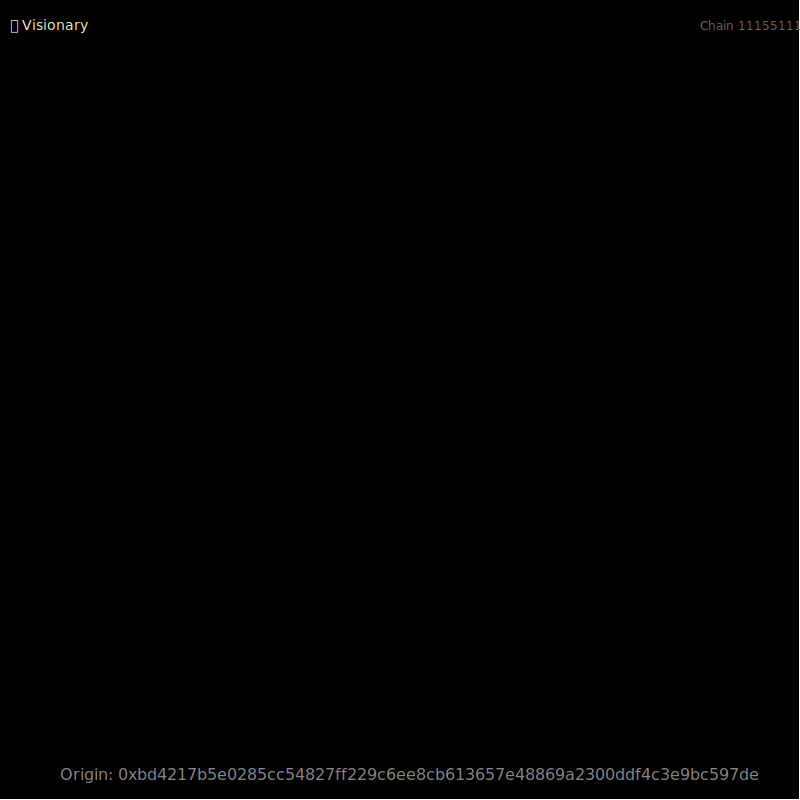
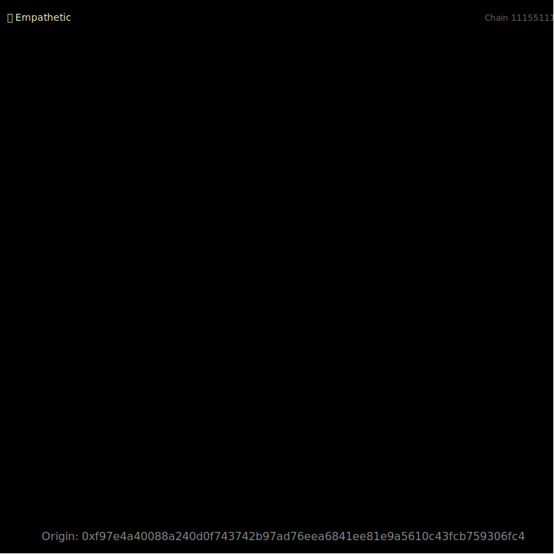
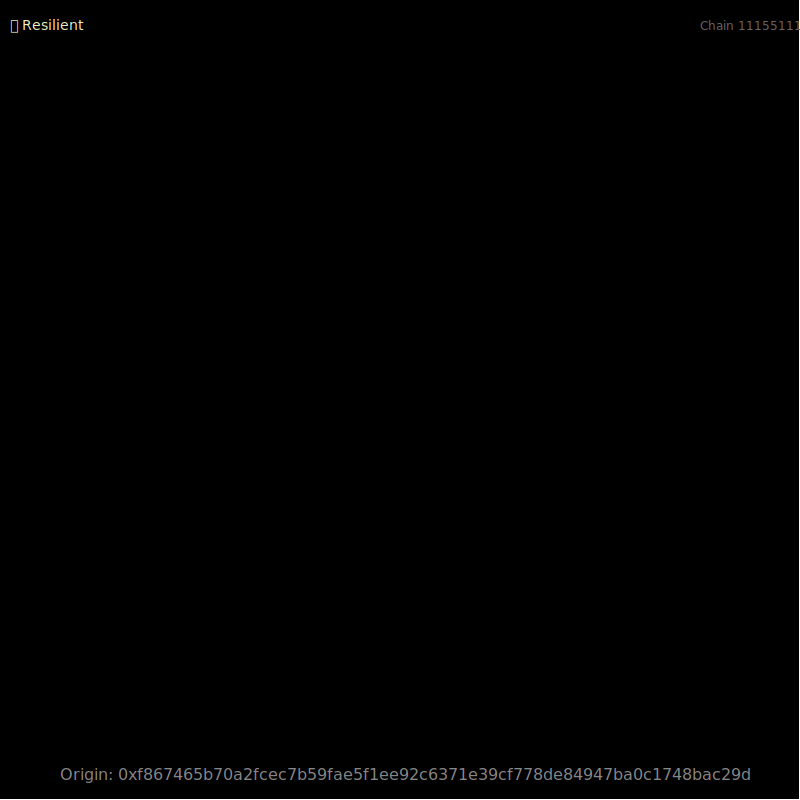

<div style="display: flex; justify-content: space-around; align-items: center;">
  
  
  
</div>

## **Crypto《Flatland》 Character Guide**

Welcome to the world of **Crypto《Flatland》**! Here, every character is a unique geometric being with its own shape, color, social status, and attributes. By participating in the game and interacting with the ecosystem, your character can evolve and unlock new possibilities!

Below is a detailed guide to help you understand the attributes and gameplay of your character.

---

### **1. Character Attributes**

Each character has the following attributes:

#### **1.1 Name**
- Every character has a unique name, randomly generated by the system.
- Example: `"John"`, `"Emma"`

---

#### **1.2 Gender**
- The gender of the character can be:
  - **Male**
  - **Female**
- Example: `"Male"`

---

#### **1.3 Social Status**
- Social status determines the character's profession and ability range.
- **Social Status List**:
  - **King**: The highest ruler of Flatland.
  - **Noble**: A high-ranking aristocrat.
  - **Leader**: A religious or political leader.
  - **Official**: An administrator of Flatland affairs.
  - **Merchant**: A trader in Flatland.
  - **Scholar**: A researcher of geometry and science.
  - **Guard**: A protector of Flatland's safety.
  - **Farmer**: A hardworking laborer.

- Example: `"Noble"`

---

#### **1.4 Shape**
- The shape of a character is determined by the number of edges. The more edges, the higher the shape's rank.
- **Shape List**:
  - **Triangle**: 0-50 edges.
  - **Square**: 51-70 edges.
  - **Polygonal**: 71-90 edges.
  - **Circle**: 91+ edges.

- Example: `"Circle, 95 edges"`

---

#### **1.5 Color**
- Each character has a unique color.
- **Color List** (partial examples):
  - **greenpink**
  - **paleviolet**
  - **sandybrown**
  - **yellow**
  - **deepskybule**
  - **mediumpurple**

- Example: `"mediumpurple"`

---

#### **1.6 Core Attributes**
- Each character has three core attributes:
  - **Courage**: Represents bravery and decisiveness.
  - **Perception**: Represents insight and sharpness.
  - **Wisdom**: Represents knowledge and intelligence.

- **Attribute Ranges**:
  - Courage: 10-99
  - Perception: 7-99
  - Wisdom: 10-99

- Example: `"Courage: 65, Perception: 80, Wisdom: 90"`

---

#### **1.7 DNA**
- DNA is the unique identifier of a character, determining its rarity and potential.
- **DNA Levels**:
  - **Brave**: 1-58
  - **Wise**: 59-116
  - **Perceptive**: 117-174
  - **Resilient**: 175-232
  - **Creative**: 233-290
  - **Strategic**: 291-348
  - **Empathetic**: 349-406
  - **Visionary**: 407-464
  - **Adaptable**: 465-522
  - **Legendary**: 523-580

- Example: `"DNA Level: Legendary, DNA Value: 540"`

---

#### **1.8 Hobbies**
- Each character has hobbies that reflect their personality and social status.
- **Hobby Categories**:
  - **General Hobbies**:
    - Studying Shapes
    - Comparing Angles
    - Shape Dancing
  - **High-Status Hobbies** (King, Noble, Leader, Official):
    - Shape Art Appreciation
    - Geometric Theorems
  - **Middle-Status Hobbies** (Merchant, Scholar):
    - Trade Negotiations
    - Mathematical Puzzles
  - **Worker Hobbies** (Guard, Farmer):
    - Angle Combat Training
    - Practical Geometry

- Example: `"Hobby: Shape Art Appreciation"`

---

#### **1.9 Biography**
- Each character has a biography that describes their background and traits.
- Example:
  ```plaintext
  John is a male Noble with a mediumpurple circle shape. He has 95 edges and excels in wisdom. He enjoys Shape Art Appreciation. This character's unique DNA level is Legendary, with a DNA value of 540.
  ```

---

### **2. Gameplay**

#### **2.1 Character Evolution**
- By participating in the game and interacting with the ecosystem (e.g., DNA matching reward market), characters can gain experience points (EXP).
- When EXP reaches a certain threshold, the character's edges will increase, and the shape will evolve to a higher rank.

#### **2.2 DNA Matching**
- Select two characters to perform DNA matching and unlock rewards.
- The higher the matching power (`power` value), the greater the rewards.

#### **2.3 Hobby Exploration**
- Unlock special tasks or rewards based on the character's hobbies.

---

### **3. Example Character**

```plaintext
Name: John
Gender: Male
Social Status: Noble
Shape: Circle, 95 edges
Color: Mediumpurple
Core Attributes:
  - Courage: 65
  - Perception: 80
  - Wisdom: 90
DNA:
  - Level: Legendary
  - Value: 540
Hobby: Shape Art Appreciation
Biography:
  John is a male Noble with a mediumpurple circle shape. He has 95 edges and excels in wisdom. He enjoys Shape Art Appreciation. This character's unique DNA level is Legendary, with a DNA value of 540.
```

---

### **4. How to Join**

#### **Step 1: Describe Your Ideal Character**
- Provide a description of your ideal character.
- Example:
  ```plaintext
  "I want a wise and noble character, preferably a circle."
  ```

#### **Step 2: Generate Your Character**
- The system will generate a unique character based on your description.

#### **Step 3: Explore and Evolve**
- Participate in the ecosystem to gain EXP, evolve your character, and unlock rewards!
