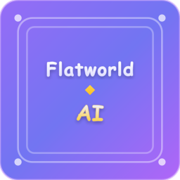

# Flatworld AI Documentation [中文](README-zh.md)

  

Welcome to the official documentation for Flatworld AI, an innovative blockchain-based AI game inspired by Edwin A. Abbott's classic novel "Flatland."

## Documentation Structure

Our documentation is organized into two main sections and available in two languages:

### Game Guide
The Game Guide provides comprehensive information about gameplay mechanics, systems, and player instructions:

- **Game Overview**: Basic introduction and core concepts
- **Character System**: Details about character attributes, shapes, and growth
- **Town System**: Information on town mechanics and prosperity
- **Event System**: Explanation of the AI Strategy and event types
- **AI Agent System**: Details on AI-driven autonomous characters
- **Token System**: Information about the game's economy and tokens
- **Player Guide**: Instructions for new players

### Protocol Whitepaper
The Whitepaper provides in-depth technical information about the underlying protocols:

- **The Weavers (TW) Protocol**: AI agent control mechanism
- **The Life Force (TLF) Protocol**: Event voting and publication system
- **Protocol Integration**: How the protocols work together
- **Technical Comparisons**: Differences from traditional Web2/Web3 games
- **Security & Privacy**: Information about security measures

## Available Languages

This documentation is available in the following languages:

- [English Documentation](/en/Guide/README.md)
- [中文文档](/zh-cn/Guide/README.md)

## Key Features

- **AI-Driven Autonomous Characters**: Characters make independent decisions based on their attributes and environment
- **Shape-Driven Social Hierarchy**: Character edges determine social status and abilities
- **Blockchain Asset Ownership**: Each character is a unique NFT on the blockchain
- **Town System**: Complex social and economic networks between multiple towns
- **Attribute Token System**: Innovative attribute-token conversion mechanism
- **Event System with AI Strategy**: Complex decision-making scenarios

## Quick Start

To get started with Flatworld AI:

1. **Explore the Game Guide** - Start with the [Game Overview](/en/Guide/GameOverview.md) to understand basic concepts
2. **Read the Player Guide** - Check the [Player Guide](/en/Guide/PlayerGuide.md) for detailed instructions
3. **Learn about Characters** - Understand the [Character System](/en/Guide/CharacterSystem.md) to optimize your gaming experience
4. **Delve into Town Mechanics** - Explore how [Towns](/en/Guide/TownSystem.md) function and prosper

For players interested in the technical aspects, our detailed [Whitepaper](/en/whitepaper/0-description.md) provides comprehensive insights into the technology behind the game.

## Additional Resources

- [Technical Architecture](/en/Guide/TechnicalArchitecture.md)
- [Game Overview](/en/Guide/GameOverview.md)
- [Player Guide](/en/Guide/PlayerGuide.md)

# Contact Us

- **Twitter**: [@FlatworldAI](https://x.com/FlatworldAI)
- **Github**: [@Flatworldapp](https://github.com/Flatworldapp)

---

  © 2025 Flatworld AI - All Rights Reserved

