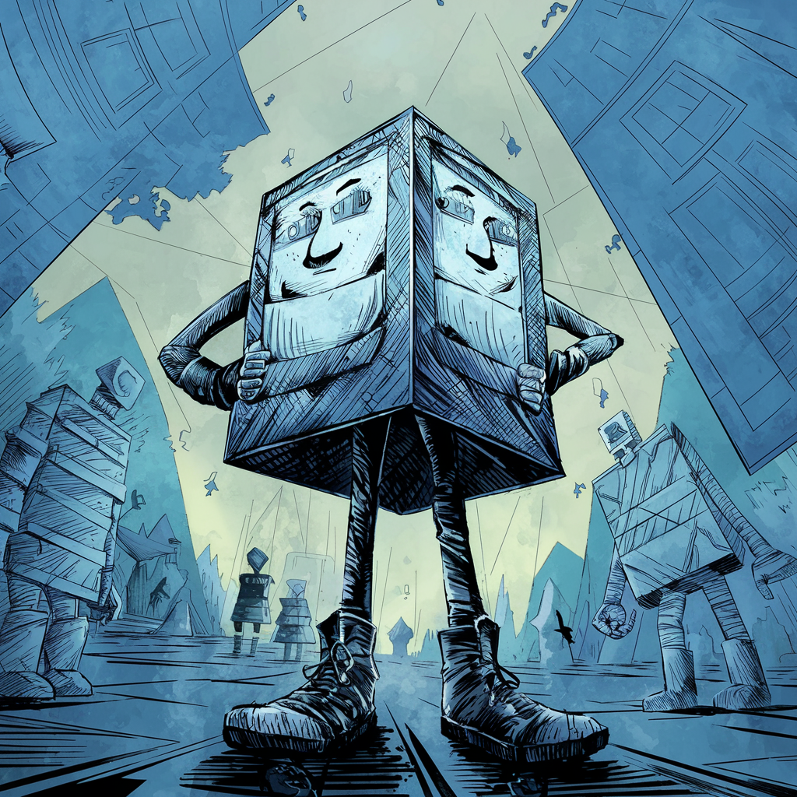

# **Crypto Flatland**

Welcome to **Crypto Flatland**, a groundbreaking NFT project that brings the legendary world of Flatland to life in the Web3 era. Inspired by Edwin A. Abbott's timeless novella *Flatland: A Romance of Many Dimensions*, this collection of unique 2D characters reimagines the geometric beings of Flatland in a vibrant, interactive, and ever-evolving digital universe.

Each NFT in the **Crypto Flatland** collection represents a distinct geometric character, shaped by its **attributes**, **profession**, and **personality**. From noble circles to hardworking triangles, every character tells a story of **courage**, **wisdom**, and **perception**, inviting you to explore the rich lore of Flatland while owning a piece of this extraordinary 2D world.

---

## **What is Crypto Flatland?**

**Crypto Flatland** is more than just an NFT collection—it's a dynamic ecosystem where geometry meets imagination. Each NFT is a unique 2D character with its own set of attributes, including:

- **Shape**: The foundation of every character, ranging from triangles to circles, representing their social status and role in Flatland society.
- **Attributes**: Key traits like **courage**, **wisdom**, and **perception**, which define the character's personality and abilities.
- **Profession**: From brave guards to wise scholars, each character has a role that reflects their place in the Flatland hierarchy.
- **DNA**: A unique identifier for each NFT, influencing gameplay, rewards, and interactions within the ecosystem.

As a holder of a **Crypto Flatland** NFT, you are not just an owner—you are a participant in the evolution of this geometric world. Your character can grow, evolve, and unlock new possibilities through interactions, rewards, and community-driven events.

---

## **The Lore of Flatland**

In the world of Flatland, geometry is destiny. Social status, intelligence, and even morality are determined by the number of sides a being possesses:

- **Triangles**: The working class, often farmers, guards, or laborers. Their sharp edges symbolize their resilience and determination.
- **Squares and Polygons**: The middle class, including merchants, scholars, and officials. Their increasing number of sides reflects their growing influence and intellect.
- **Circles**: The elite of Flatland society, representing perfection and authority. They are the rulers, nobles, and religious leaders of this geometric world.

As you explore Flatland, you will uncover stories of ambition, conflict, and harmony, all told through the unique lens of geometry. Will your NFT character rise through the ranks, evolve into a higher shape, or carve out a unique path in this 2D universe?

---

## **Key Features**

### **1. Unique NFT Characters**
Each NFT in the **Crypto Flatland** collection is procedurally generated, ensuring that no two characters are alike. Attributes such as shape, color, profession, and DNA make every NFT a one-of-a-kind digital asset.

### **2. Dynamic Evolution**
Your NFT character is not static—it evolves based on your interactions within the ecosystem. Earn **EXP** (experience points) through activities like DNA matching, staking, and participating in community events. Once your character accumulates enough EXP, you can upgrade its shape, unlocking new abilities and increasing its value.

### **3. DNA Matching and Rewards**
Engage in the innovative **DNA Matching** gameplay, where two NFTs can combine their unique DNA to unlock rewards. The closer the DNA match, the higher the **power** value, which determines the quality of the rewards. Use this feature to earn tokens, unlock rare items, or even evolve your character faster.

### **4. Rent and Earn with the DNA Rental Market**
Don't own two NFTs? No problem! The **DNA Rental Market** allows users to rent NFTs for DNA matching. As a renter, you can pay a fee to borrow an NFT and participate in the matching gameplay. As a lender, you can stake your NFT, set a rental fee, and earn passive income while your NFT remains in the market.

### **5. Community-Driven Events**
Join the **Flatland Revolution** through community-driven events, challenges, and story-driven campaigns. Collaborate with other NFT holders to shape the future of Flatland, unlock new chapters of the lore, and earn exclusive rewards.

---

## **Gameplay Mechanics**

### **1. Shape Evolution**
Every NFT starts with a basic shape (e.g., triangle) and can evolve into more complex shapes (e.g., square, polygonal, circle) as it gains EXP. Shape evolution not only enhances the character's attributes but also increases its rarity and value.

### **2. DNA Matching**
DNA is the unique identifier for each NFT, influencing its compatibility with other NFTs. When two NFTs are matched:
- **Power** is calculated based on their DNA compatibility.
- Rewards are distributed dynamically, with higher power values yielding better rewards.

### **3. EXP System**
Earn EXP through:
- Participating in DNA Matching.
- Completing community challenges.
- Staking your NFT in the DNA Rental Market.

Once your EXP reaches a threshold, you can choose to upgrade your NFT's shape, unlocking new possibilities.

### **4. DNA Rental Market**
The DNA Rental Market introduces a new layer of strategy and collaboration:
- **Lenders**: Stake your NFT in the market, set a rental fee, and earn passive income.
- **Renters**: Pay a fee to borrow an NFT, match it with your own NFT, and unlock rewards.

A 10% management fee is deducted from all rental transactions, ensuring the sustainability of the ecosystem.

---

## **Tokenomics**

The **Crypto Flatland** ecosystem is powered by a native utility token, used for:
- DNA Matching rewards.
- Staking and governance.
- Purchasing in-game items and upgrades.

Token distribution is designed to reward active participants while maintaining long-term sustainability.

---

## **Roadmap**

### **Phase 1: Launch**
- Release the first generation of **Crypto Flatland** NFTs.
- Deploy the DNA Matching and EXP systems.
- Launch the DNA Rental Market.

### **Phase 2: Expansion**
- Introduce new gameplay mechanics, including quests and story-driven campaigns.
- Expand the lore of Flatland through community-driven events.
- Integrate with other NFT ecosystems for cross-project collaborations.

### **Phase 3: Governance**
- Enable token holders to participate in governance decisions.
- Allow the community to vote on future updates, features, and events.

---

## **Why Choose Crypto Flatland?**

1. **Innovative Gameplay**:
   - Experience a unique blend of storytelling, strategy, and rewards in the NFT space.

2. **Dynamic Evolution**:
   - Watch your NFT grow and evolve, increasing its value and rarity over time.

3. **Community-Driven**:
   - Join a passionate community of collectors, gamers, and storytellers shaping the future of Flatland.

4. **Sustainability**:
   - With carefully designed tokenomics and gameplay mechanics, **Crypto Flatland** ensures long-term engagement and growth.

---

## **Join the Flatland Revolution**

Are you ready to explore the legendary world of Flatland and shape its future? Whether you're a collector, a gamer, or a storyteller, **Crypto Flatland** offers endless possibilities for creativity, collaboration, and rewards.

Start your journey today and become part of the Flatland Revolution!

---

## **Get Started**

1. **Mint Your NFT**:
   - Visit our [official website](https://flatland.app) to mint your unique **Crypto Flatland** NFT.

2. **Join the Community**:
   - Follow us on [Twitter](https://x.com/Flatland_dev) and [Discord](#) to stay updated on the latest news and events.

3. **Explore the Ecosystem**:
   - Dive into DNA Matching, stake your NFT, and unlock the full potential of Flatland.

---

## **Contact Us**

For inquiries, collaborations, or support, please reach out to us at:
- **Email**: support@flatland.app
- **Twitter**: [@Flatland_dev](https://x.com/Flatland_dev)
- **Discord**: [Join our community](#)

