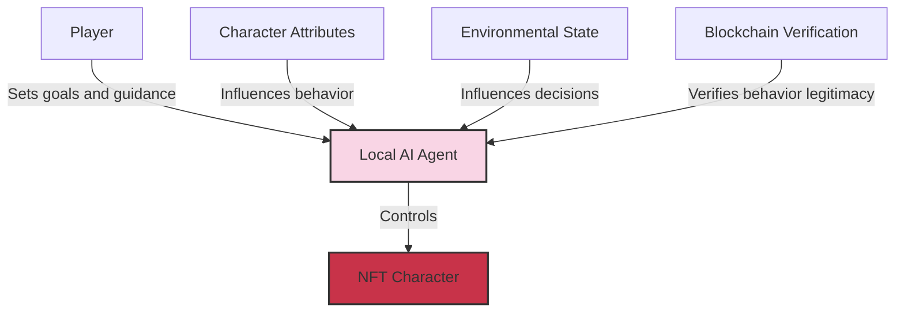

# Flatworld AI Agent System

## 🤖 AI Agent Overview

In Flatworld AI, each NFT character is controlled by an autonomous AI agent ("Weaver") rather than being directly operated by players. These AI agents run on the TW protocol (The Weavers Protocol), creating an AI agent-driven autonomous society.

### Core Concepts

The AI agent system revolutionizes traditional game control modes, achieving the following core concepts:

- **Character Autonomy**: Characters act autonomously based on their attributes and environment, driven by AI agents
- **Player Role Transformation**: Players transform from controllers to observers and guides
- **Decentralized Logic**: Game logic runs locally on players' devices, independent of central servers
- **Real Virtual Life**: Creates an experience of "virtual life" with continuity and consistency



## 🧠 AI Agent Operation Mechanism

### Decision System

AI agents control character behavior through a complex decision system:

1. **Attribute-Driven Behavior**: Character's basic attributes (courage, wisdom, perception) directly influence AI decision tendencies
2. **Environmental Awareness**: AI agents analyze the character's environment and context
3. **Goal Orientation**: Formulate action plans based on long-term goals and current state
4. **Behavior Verification**: Generated behaviors are verified for legitimacy through smart contracts

#### Decision Process Example

```
1. Perceive environment → Character is in Town A with low prosperity, nearby is Town B with high prosperity
2. Evaluate status → Character has perception value 35, courage value 42, maximum migration step length 4
3. Analyze options → Can choose to stay in Town A or migrate to Town B
4. Decision → Based on character traits, decide to migrate to Town B seeking better opportunities
5. Execute action → Submit migration request to smart contract
6. Result verification → Contract verifies behavior legitimacy and executes migration
```

### Personalized Performance

AI agents of different characters will display different "personalities" and behavior patterns:

- **High courage characters**: More inclined toward exploration, adventure, and proactive social interaction
- **High wisdom characters**: More inclined toward thinking, analysis, and strategic decision-making
- **High perception characters**: More sensitive to environmental changes, responding more quickly

This personalization ensures that even in similar environments, different characters will exhibit unique behaviors and decision patterns.

## 🔍 Player Interaction with AI Agents

### From Control to Guidance

In Flatworld AI, the player's role shifts from direct control to guidance and cultivation:

| Players in Traditional Games | Players in Flatworld AI |
|-----------------|---------------------|
| Directly control every character action | Set goals and intentions, observe AI acting autonomously |
| Focus on micro-operations and skill performance | Focus on macro strategy and character development |
| Character serves as player's tool or avatar | Character exists as an independent virtual life form |
| Gaming experience comes from sense of control | Gaming experience comes from observation and guidance |

### Guidance Mechanisms

Players guide AI agent behavior through the following methods:

1. **Attribute Cultivation**: Guide character development direction by enhancing specific attributes
2. **Environment Selection**: Choose suitable towns and social environments
3. **Goal Setting**: Set long-term goals and value orientations for characters
4. **Migration Decisions**: Decide whether characters should migrate to new towns

This guidance is indirect, giving AI agents sufficient autonomy while ensuring character development aligns with player expectations.

## 🔄 AI Behavior and Blockchain Verification

### Behavior Verification System

To ensure consistency and fairness in the game world, all behaviors generated by AI agents must be verified through blockchain smart contracts:

1. **Behavior Generation**: AI agents generate character behavior locally
2. **Parameter Check**: Smart contracts verify whether behavior parameters are within valid ranges
3. **Rule Verification**: Ensure behavior complies with game rules (such as migration distance not exceeding character abilities)
4. **State Update**: Verified behaviors are applied to the game world, updating on-chain state

### Security Mechanisms

To prevent cheating and abnormal behavior, the system implements multi-layer security mechanisms:

- **On-Chain Verification**: All key behaviors must be verified through on-chain smart contracts
- **Consistency Check**: Ensure character behavior is consistent with their attributes and history
- **Anomaly Detection**: Identify and reject behaviors that don't conform to normal patterns

## 💾 AI Agent Memory and Learning

### Memory System

AI agents have "memory" functionality, allowing them to remember past experiences and decisions:

- **Short-Term Memory**: Records recent events and interactions
- **Long-Term Memory**: Saves important experiences and relationships
- **Contextual Memory**: Understands and remembers adaptation strategies for specific environments

This memory system ensures continuity and logical development of character behavior.

### Learning and Adaptation

AI agents can learn and adapt from experience:

1. **Environmental Adaptation**: Adjust behavior to adapt to different town environments
2. **Social Learning**: Learn from interactions with other characters
3. **Outcome Evaluation**: Evaluate results of past decisions to optimize future decisions
4. **Character Growth**: Display more mature decision patterns as experience accumulates

## 📱 Technical Implementation

### Local Computation Model

The AI agent system is implemented based on a local computation model:

- **Decentralization**: AI logic runs locally on player devices, not dependent on central servers
- **Responsiveness**: Local computation ensures quick responses, unaffected by network latency
- **Privacy**: Detailed character behavior patterns and decision processes remain local
- **Autonomy**: AI can continue developing the character's "life" even offline

### MCP Tool Interface

AI agents securely interact with blockchain through MCP (Model Context Protocol) tools:

- **Secure Channel**: Provides secure interaction channel between AI and blockchain
- **Data Validation**: Ensures integrity and authenticity of interaction data
- **Behavior Submission**: Securely submits locally generated behaviors to the chain
- **State Synchronization**: Maintains synchronization between local AI state and on-chain state

## 🎭 Role-Playing and Character Development

### Role-Playing

AI agents enable a true role-playing experience:

- **Personality Consistency**: AI maintains long-term consistency in character behavior
- **Appropriate Reactions**: Responds to events appropriately based on character traits
- **Relationship Building**: Establishes and maintains relationships with other characters
- **Character Growth**: Shows personality development and changes as experiences accumulate

### Narrative Generation

AI agents collectively create a continuously developing narrative:

- **Personal Stories**: Each character has their unique life trajectory and story
- **Social Interactions**: Interactions between characters create complex social networks
- **Historical Events**: Important decisions and interactions are recorded as town history
- **Collective Narrative**: All characters collectively create the world's overall narrative

## 🔮 Future Development

The AI agent system is designed as an expandable framework, with the following features potentially added in the future:

### Advanced Features

- **Deep Learning Models**: More complex learning mechanisms enabling characters to learn from broader experiences
- **Emotion System**: Simulating emotional states and their impact on decision-making
- **Social Network**: More complex social relationship networks and group dynamics
- **Cultural Transmission**: Simulating how cultural elements propagate and evolve between characters

### Player Interaction Extensions

- **Enhanced Guidance Mechanisms**: Richer ways for players to influence character development
- **Narrative Participation**: Allowing players to participate in shaping important moments in world narrative
- **AI-Player Co-Creation**: AI and players jointly creating the gaming experience
- **Community Interaction**: Characters from multiple players forming complex social interaction networks

Through this experimental AI agent system, Flatworld AI creates a truly autonomous virtual society, challenging the boundaries of traditional games and pioneering a new field at the intersection of AI agents, blockchain, and gaming.
