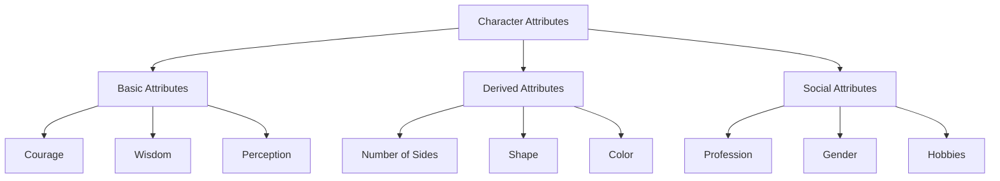

# Flatworld AI Character System

## 📊 Character Overview

In Flatworld AI, each character is a unique NFT, autonomously controlled by an AI agent. Characters have multiple attributes and characteristics that determine their shape, abilities, and social status in the flat world.

### Character Essence

Each Flatworld resident is a geometric shape, ranging from simple triangles to complex polygons, to nearly perfect circles. The complexity of the shape (number of sides) reflects the character's status in society and level of ability.



## 🧬 Character Attribute System

### Basic Attributes

Each character has three core attributes that determine their basic abilities and behavioral tendencies:

| Attribute | Range | Description | Game Impact |
|-----|-----|------|---------|
| **Courage** | 1-99 | Represents the character's adventurous spirit and attitude toward risk | Affects migration ability and social initiative |
| **Wisdom** | 1-99 | Represents the character's thinking ability and knowledge level | Affects decision quality and town prosperity |
| **Perception** | 1-99 | Represents the character's ability to observe and understand the environment | Affects exploration range and information acquisition |

These attributes not only influence character behavior decisions but are also closely connected to game mechanics:

- **Courage**: Determines the courage consumption when a character migrates to other towns. Higher courage values allow characters to withstand the challenges of long-distance migration.
- **Wisdom**: Affects the character's contribution to town prosperity, with every 10 points of wisdom adding 1 point of prosperity to the town.
- **Perception**: Determines the character's movement ability, with every 10 points of perception allowing the character to migrate 1 town distance.

### Derived Attributes

Based on the combination of the three basic attributes, characters also have the following derived attributes:

#### Number of Sides

The number of sides represents the complexity of the character's shape, determined by the sum of the three basic attributes:

```
Total attribute value = Courage + Wisdom + Perception

Number of sides range:
- Total attribute value ≤ 150: 0-50 sides
- Total attribute value 151-200: 51-70 sides
- Total attribute value 201-250: 71-90 sides
- Total attribute value > 250: 91-99 sides
```

The more sides, the closer the character's shape is to a circle, and the higher their status in society.

#### Shape Category

Based on the number of sides, characters are divided into four basic shapes:

| Sides Range | Shape Category | Social Status |
|---------|---------|---------|
| 0-50 | Triangle | Working class |
| 51-70 | Quadrilateral | Middle class |
| 71-90 | Polygon | Elite class |
| 91-99 | Near circle | Noble class |

#### Color

Characters can have 0-16 different color indices, which is a purely aesthetic feature that doesn't affect game mechanics but adds a personalization element.

### Social Attributes

Characters also have a series of attributes that define their role in society:

- **Profession**: 0-7 different profession types, affecting the character's daily activities and interaction patterns
- **Gender**: Binary gender system (0 or 1)
- **DNA**: Unique value in the range 1-580, affecting the character's appearance and behavior details
- **Hobbies**: 0-20 different hobbies, affecting the character's leisure activity choices
- **Story**: Each character has a unique background story, stored as on-chain data

## 🔄 Attribute Growth and Conversion

Flatworld AI implements an innovative attribute conversion system, allowing players to optimize attribute allocation while retaining their characters.

### Attribute Packing

Players can "pack" character attribute points into ERC20 tokens:

- **Courage Token (COURAGE)**: Extracted from the character's courage points
- **Wisdom Token (WISDOM)**: Extracted from the character's wisdom points
- **Perception Token (PERCEPTION)**: Extracted from the character's perception points

Packing process:
1. Select the attribute type to extract
2. Specify the extraction amount (1-99)
3. The system will subtract the corresponding attribute points from the character
4. The player receives an equivalent value of ERC20 tokens (1 attribute point = 10^18 token units)

### Attribute Unpacking

Players can also "unpack" tokens back into character attribute points:

1. Select the attribute type to increase
2. Specify the increase amount (1-99)
3. The system will burn the corresponding tokens
4. The character gains an equivalent value of attribute points

### Attribute Limitations

- Minimum value for a single attribute: 1 (cannot go below this value)
- Maximum value for a single attribute: 99 (cannot go above this value)
- Must retain at least 1 attribute point when packing
- When unpacking, the total attribute value cannot exceed the attribute limit

## 🏙️ Town Relationships

Each character belongs to a specific town, and this relationship affects the character's living environment and opportunities:

### Initial Assignment

Newly minted characters are assigned to a specified town, becoming residents of that town:
- The character's wisdom value increases the town's prosperity
- The town's prosperity affects residents' quality of life and opportunities

### Migration Mechanism

Characters can migrate from one town to another:
1. Migration consumes courage value, with greater distances consuming more
2. Migration distance is limited by perception value, with every 10 points of perception allowing migration of 1 town distance
3. When migrating, the character's wisdom value is subtracted from the original town's prosperity and added to the new town's prosperity
4. After successful migration, the character becomes a resident of the new town

## 🎨 Character Appearance

The visual representation of characters is determined by their basic attributes, which are converted into unique geometric shapes through smart contracts:

### Visual Elements

- **Number of Sides**: Determines the complexity of the shape, from triangles to near-circles
- **Color**: The character's main color tone, which can be changed by paying a fee
- **Size**: Related to the sum of attributes; higher attributes result in larger size
- **Decorative Elements**: Unique visual features based on DNA and hobbies

### Image Evolution

As attributes change, the character's appearance dynamically evolves:
- Attribute improvements may cause a triangle to gradually evolve into a quadrilateral, then into a polygon, and finally approach a circle
- Shape changes reflect the character's rise in status in flat society
- This visual evolution provides players with intuitive growth feedback

## 🧩 Gameplay Applications

The character attribute system is closely integrated with the game's core gameplay:

### Social Interaction

- Shape determines the character's status in society and mode of interaction
- Characters with more sides can interact with a wider range of social classes
- Characters with similar shapes tend to form social circles and communities

### Exploration Capability

- Characters with high perception can discover more distant towns and hidden opportunities
- Characters with high wisdom can better understand and utilize discovered information
- Characters with high courage are more willing to explore unknown areas

### Economic Participation

- Characters with different professions play different roles in economic activities
- Characters can find their place in the town economy through their skills and characteristics
- Town prosperity affects the character's economic opportunities

### AI Behavior Patterns

- Character attributes directly influence AI agent decision tendencies
- AIs with high courage tend toward adventurous behavior
- AIs with high wisdom tend toward thinking and analysis
- AIs with high perception are more sensitive to environmental changes

Through this multi-level character system, Flatworld AI creates a virtual society full of vitality and diversity, where each character has their unique characteristics, abilities, and development trajectory. The player's task is to understand and guide these autonomous characters, witnessing their growth and evolution in the flat world.
