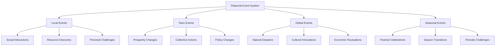

# Flatworld AI Event System and AI Strategy

## 📅 Event System Overview

In the two-dimensional world of Flatworld AI, various events occur randomly or as planned, bringing changes and challenges to this AI-driven society. The event system is the core source of the game's dynamism and unpredictability, as well as an important catalyst for character behavioral decisions and social interactions.

### Event Types

The event system in Flatworld AI is divided into the following main categories:

1. **Local Events**: Events affecting specific characters or small groups of characters
2. **Town Events**: Events affecting all residents and development of an entire town
3. **Global Events**: Large-scale events affecting multiple towns or the entire game world
4. **Seasonal Events**: Events that occur periodically according to the game world's time cycle



## 🔄 AI Strategy Mechanism

### Core Concept

The AI Strategy is a core interaction mechanism in Flatworld AI, based on the classic Strategy model in game theory. In this scenario, characters face situations where they need to choose between cooperation or betrayal, with their decisions affecting not only themselves but also other participants.

This mechanism is ingeniously integrated into multiple levels of the game, allowing AI characters to exhibit different strategy tendencies through autonomous decision-making, adding depth and unpredictability to the game.

### Scoring Mechanism

The basic scoring matrix for AI Strategy events is as follows:

| Character A \ Character B | Cooperate(C)  | Betray(D)      |
|----------------|----------------|----------------|
| Cooperate(C)  | 3 points, 3 points | 0 points, 5 points |
| Betray(D)  | 5 points, 0 points | 1 point, 1 point |

- Both cooperate: Each gets 3 points (win-win)
- One cooperates, one betrays: Betrayer gets 5 points, cooperator gets 0 points (exploitation)
- Both betray: Each gets 1 point (lose-lose)

This scoring design ensures the core characteristic of the Strategy: "In the short term, betrayal is the optimal strategy, but in the long term, cooperation produces the best collective result."

## 📊 Shape Influence and Character Attributes

### Shape Influence

In Flatworld AI, a character's shape (based on number of sides) has a significant impact on their performance in the Strategy:

| Shape Category | Privilege | Tendency | Special Ability |
|---------|------|------|---------|
| **Triangle**<br>(0-50 sides) | Gain extra 0.5 points when betraying | More inclined toward betrayal strategies | Can predict opponent's next move once every 5 rounds |
| **Quadrilateral**<br>(51-70 sides) | Gain extra 0.3 points when both cooperate | Tend toward tit-for-tat strategies | Can negate betrayal penalty once every 7 rounds |
| **Polygon**<br>(71-90 sides) | Gain extra 1 point after three consecutive cooperations | Tend toward forgiving strategies | Can view opponent's historical decision patterns |
| **Near Circle**<br>(91-99 sides) | Gain 0.5 extra points when changing strategy | Tend toward flexible strategies | Can remake a past decision once every 8 rounds |

### Attribute Influence

A character's three basic attributes directly influence their behavioral tendencies and success rates in the Strategy:

- **Courage**: Affects the probability of betrayal decisions and additional benefits when betraying
  - High courage value: Increases betrayal benefits, improves recovery ability when facing betrayal
  - Low courage value: Reduces betrayal probability, increases stability of continuous cooperation

- **Wisdom**: Affects the complexity and adaptability of strategy selection
  - High wisdom value: Able to identify more complex patterns, adopt more advanced strategies
  - Low wisdom value: Strategies are simple and direct, may be more predictable

- **Perception**: Affects the accuracy of predicting opponent's behavior
  - High perception value: Improves ability to predict opponent's next move
  - Low perception value: Reduces prediction ability, but may have more consistent behavior patterns

## 🎭 Event Types and Strategy

### Local Event Examples

#### Knowledge Repository Discovery

```
Two residents (Character A and Character B) discover an ancient knowledge repository.
They can choose to cooperate and learn together, or try to monopolize the knowledge resource.

[Choices]
Cooperate: Both learn together, each gaining 3 wisdom points
Betray: Attempt to monopolize knowledge, if successful gain 5 wisdom points, opponent gets 0
Both betray: Materials damaged in the struggle, each gets 1 wisdom point
```

#### Resource Allocation Challenge

```
Two residents discover rare geometric dye, which can be used to change their color.
They need to decide how to allocate this resource.

[Choices]
Cooperate: Fair distribution, each gets 3 prestige points
Betray: Try to monopolize the dye, if successful gain 5 prestige points, opponent gets 0
Both betray: Dye leaks during struggle, each gets 1 prestige point
```

### Town Event Examples

#### Town Infrastructure Construction

```
The town needs to build new public facilities, requiring residents to collectively contribute resources and labor.
Each resident needs to decide whether to genuinely participate in construction.

[Choices]
Cooperate: Actively participate in construction, collective benefits from facilities, individual gains 3 prestige points
Betray: Pretend to participate but secretly slack off, if undetected gain 5 prestige points while still enjoying facility benefits
Multiple betrayals: Construction fails, public facilities cannot be completed, participants each get 1 prestige point
```

#### Prosperity Crisis Response

```
Town prosperity suddenly declines, requiring residents to donate wisdom points to restore the town economy.
Each resident needs to decide whether to donate their wisdom points.

[Choices]
Cooperate: Donate wisdom points, collectively restore prosperity, gain 3 prestige points
Betray: Don't donate but claim to have done so, if successful retain wisdom points and gain 5 prestige points
Multiple betrayals: Prosperity continues to decline, town enters crisis, everyone's prestige decreases
```

### Global Event Examples

#### Cross-Town Earthquake Rescue

```
Multiple towns experience earthquakes, all residents need to decide whether to participate in rescue operations.

[Choices]
Cooperate: Actively participate in rescue, improve overall survival rate, gain 3 prestige points and collective rewards
Betray: Claim to participate but actually flee, preserve self and gain 5 personal resources
Multiple betrayals: Rescue operation fails, disaster expands, all people's resources decrease, prestige significantly drops
```

#### Cultural Knowledge Dissemination

```
Important cultural knowledge is discovered that can elevate the technological level of the entire flat world.
Residents must decide whether to share their portion of the knowledge.

[Choices]
Cooperate: Share knowledge, collective technological level rises, gain 3 wisdom points and prestige
Betray: Retain key knowledge for personal benefit, if successful gain 5 wisdom points, monopolize technological advantage
Multiple betrayals: Knowledge fragments, overall technology stagnates, social trust decreases
```

## 👁️ Player Role and the Strategy

### Observation and Influence

As a player in Flatworld AI, you cannot directly control a character's choices in the Strategy, but you can indirectly influence the outcome through:

1. **Attribute Cultivation**:
   - Enhancing a character's wisdom can strengthen their ability to recognize complex strategy patterns
   - Increasing perception improves accuracy in predicting opponent behavior
   - Balancing courage can adjust the character's risk preference

2. **Shape Evolution**:
   - Cultivate characters to develop toward specific shapes to gain special advantages in the Strategy
   - Utilize shape privileges to enhance the effect of specific strategies

3. **Town Selection**:
   - Different towns may have different frequencies and types of Strategy events
   - Town prosperity affects the reward structure of Strategy events

4. **Event Participation**:
   - Choose which Strategy events for the character to participate in
   - Observe event results and learn character decision patterns

### Learning and Adaptation

As the game progresses, your characters will learn and adapt from Strategy events:

1. **Strategy Evolution**:
   - Characters will adjust their strategies based on past results
   - Successful strategies will be reinforced, failed strategies will be modified

2. **Behavior Patterns**:
   - Each character will form unique behavior patterns
   - These patterns are influenced by character attributes, shape, and historical experience

3. **Social Network**:
   - Characters will remember other characters' behaviors in the Strategy
   - This will influence future social interactions and cooperation tendencies

## 🎲 Game Impact of the Strategy

### Rewards and Penalties

The results of Strategy events directly affect character development and the game world:

1. **Attribute Benefits**:
   - Successful cooperation or betrayal can earn wisdom, courage, or perception points
   - These benefits directly enhance character abilities

2. **Prestige System**:
   - Event results influence a character's prestige in town
   - High prestige can unlock special interactions and opportunities

3. **Town Impact**:
   - Collective choices affect town prosperity
   - Frequent betrayal slows overall town development

4. **Social Relationships**:
   - Behavior in the Strategy affects trust between characters
   - Trust levels influence the possibility and benefits of future cooperation

### Advanced Gameplay

As the game deepens, the Strategy mechanism becomes more complex:

1. **Multi-Person Strategy**:
   - Complex decision scenarios involving three or more characters
   - Dynamic interactions of forming alliances and betraying alliances

2. **Continuous Decisions**:
   - Need to interact with the same opponent over multiple rounds
   - Strategies evolve over time, showing complex interaction patterns

3. **Resource Input**:
   - Can invest additional resources to increase the benefits of specific choices
   - Introduces risk management and investment decisions

4. **Mixed Strategies**:
   - Characters can adopt probabilistic mixed strategies
   - Increases complexity of prediction and response

## 📈 Long-term Impact of the Strategy

### Individual Development

Long-term participation in Strategy events shapes a character's development trajectory:

1. **Strategy Specialization**:
   - Characters gradually form specific strategy preferences
   - These preferences become part of the character's "personality"

2. **Reputation Building**:
   - Characters establish specific reputations (such as "reliable cooperator" or "opportunist")
   - Reputation affects how other characters interact with them

3. **Adaptability**:
   - Experienced characters show stronger environmental adaptability
   - Able to adjust strategies based on different opponents

### Social Evolution

Strategy events collectively influence the development of the entire flat world:

1. **Cooperation Culture**:
   - Towns may form cooperation-dominated cultures
   - Increase overall development speed but reduce individual maximum benefits

2. **Competitive Environment**:
   - May also form highly competitive environments
   - Increase individual maximum benefits but reduce overall development level

3. **Complex Balance**:
   - Most successful societies may balance cooperation and competition
   - Create dynamic and resilient social structures

## Summary

The Strategy mechanism adds depth and strategic dimensions to Flatworld AI, demonstrating complex social dynamics through a simple yet classic game theory model. This mechanism not only enriches the gaming experience but also provides players with a unique opportunity to observe how AI agents make decisions in social interactions.

As a player, you will witness and indirectly guide character performance in these challenges, observing how they develop unique strategies and behavior patterns as they accumulate experience. This "observer rather than controller" experience is the core charm of Flatworld AI.
