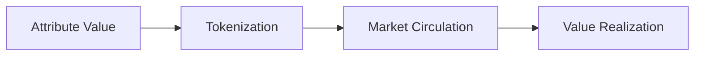

# Flatworld NFT: AI Town Ecosystem

## Introduction

Welcome to Flatworld, an AI ecosystem full of infinite possibilities. Here, each NFT is not just a digital collectible, but a unique virtual resident with their own personality traits, professional skills, and social relationships. This world consists of multiple unique towns, each with its own culture and development trajectory, and your residents will explore, grow, and create in this world.

## World View

### Brief History of Flatland

Flatland (Flatworld) was initially pioneered by a group of creative pioneers. They created a unique two-dimensional world where each resident exists with their distinctive shape and color. As time passed, this world gradually developed complex social structures and civilization systems.

### World Geography

Flatland consists of multiple adjacent towns, each like an independent ecosystem:
- **Central Town**: The earliest established town, with the most complete infrastructure and highest prosperity
- **Emerging Towns**: Development zones full of opportunities, waiting for residents' development and construction
- **Specialty Towns**: Each town may develop unique industries and cultural characteristics

## Core Gameplay Mechanics

### 1. Attribute System Detailed

Each resident has three core attributes that not only determine the resident's abilities but also influence the development of the entire town:

#### 1.1 Courage
- **Attribute Range**: 1-99
- **Core Function**: Determines resident's migration ability and adventurous spirit
- **Impact Range**:
  * Migration Consumption: Higher courage values can support more frequent migrations
  * Special Events: May affect future adventure tasks and social activities
- **Cultivation Suggestions**:
  * Novice Period: Recommended to maintain between 30-50, sufficient to support basic migration needs
  * Growth Period: Can be enhanced to 60-80, supporting more exploration activities
  * Specialization Period: Can breakthrough 90 based on personal strategy, becoming an adventurer

#### 1.2 Wisdom
- **Attribute Range**: 1-99
- **Core Function**: Directly affects town prosperity and development potential
- **Impact Coefficient**:
  * Prosperity Contribution = Wisdom Value / 10
  * Group Effect: Multiple high-wisdom residents can create synergistic effects
- **Cultivation Strategy**:
  * Early Stage: Prioritize enhancing wisdom, helping the town develop rapidly
  * Middle Stage: Balanced development with other attributes
  * Late Stage: Can flexibly adjust through the attribute token market

#### 1.3 Perception
- **Attribute Range**: 1-99
- **Core Function**: Determines resident's exploration range and ability to discover opportunities
- **Ability Performance**:
  * Migration Range = (Perception Value / 10) + 1
  * Special Discoveries: High perception may bring unique development opportunities
- **Application Scenarios**:
  * Finding new towns
  * Discovering rare resources
  * Predicting development opportunities

### 2. Town System In-Depth Analysis

#### 2.1 Prosperity Mechanism

Town prosperity is a dynamic, multi-dimensional indicator system:

##### Basic Calculation
```
Individual Contribution = Wisdom Value / 10
Total Town Prosperity = Σ(All residents' individual contributions)
```

##### Prosperity Effects
1. **Direct Effects**
   - Enhances town birth rate
   - Increases resource production efficiency
   - Enhances town attractiveness

2. **Indirect Effects**
   - Promotes interactions between residents
   - Brings potential development opportunities
   - Enhances town prestige

#### 2.2 Birth Rate System

The birth rate system employs a dynamic balance mechanism to ensure sustainable town development:

##### Calculation Formula
```
Base Birth Rate = 100
Prosperity Multiplier = (Prosperity * 10) / 100 + 100
Current Birth Rate = (Base Birth Rate * Prosperity Multiplier) / 100
Maximum Birth Rate = Base Birth Rate * 10 = 1000
```

##### Birth Rate Regulation Mechanism
- **Positive Feedback**: Prosperity increases → Birth rate rises → New residents increase → Prosperity further increases
- **Negative Feedback**: Birth rate upper limit ensures growth doesn't spiral out of control
- **Balance Point**: System automatically finds optimal population size

### 3. Resident Characteristic System

#### 3.1 Profession System (0-7)
Each profession has its unique characteristics and development path:
- **Scholar (0)**: Wisdom growth speed is faster
- **Explorer (1)**: Higher initial perception attribute
- **Warrior (2)**: Courage attribute grows faster
- **Merchant (3)**: Gains more trading opportunities
- **Craftsman (4)**: Enhanced production efficiency
- **Artist (5)**: Special creative ability
- **Leader (6)**: Enhances surrounding residents' attributes
- **Hermit (7)**: Unique personal development path

#### 3.2 Gender System (0-1)
- Gender characteristics affect social interactions and certain special events
- Different genders may receive different development opportunities

#### 3.3 Appearance System
- **Color (0-16)**: Represents personality traits and social status
- **DNA (1-580)**: Determines appearance details and potential abilities
- **Hobbies (0-20)**: Affects social tendencies and development direction

### 4. Attribute Tokenization System

#### 4.1 Token Economics

##### Packing Mechanism


- **Conversion Ratio**: 1 attribute point = 10^18 tokens
- **Minimum Protection**: Must retain at least 1 point of basic attribute
- **Market Mechanism**: Tokens can be freely traded

##### Unpacking Mechanism
- **Conversion Limit**: Attribute value cap 99
- **Efficiency Consideration**: Large-amount conversions are more cost-effective
- **Strategic Application**: Can be used for rapid attribute adjustment

#### 4.2 Token Application Scenarios

1. **Attribute Optimization**
   - Rapidly adjust personal attributes
   - Adapt to different development stages
   - Respond to special challenges

2. **Market Trading**
   - Free buying and selling of tokens
   - Prices fluctuate with supply and demand
   - Investment appreciation opportunities

3. **Social Interaction**
   - Token exchange cooperation
   - Team attribute optimization
   - Community development planning

## Game Strategy Guide

### 1. Getting Started

#### 1.1 Choosing a Town
- **Evaluation Factors**:
  * Current prosperity
  * Resident composition
  * Development potential
  * Geographic location

#### 1.2 Initial Development
1. **Attribute Cultivation**
   - Balanced development of three-dimensional attributes
   - Focus cultivation based on profession characteristics
   - Maintain moderate reserves

2. **Social Establishment**
   - Join active communities
   - Participate in collective activities
   - Establish cooperative relationships

### 2. Advanced Strategies

#### 2.1 Attribute Token Operations
- **Timing Selection**:
  * Collect tokens during market downturns
  * Sell appropriately during peak periods
  * Maintain liquidity reserves

#### 2.2 Migration Planning
- **Target Selection**:
  * Evaluate target town development potential
  * Calculate migration costs
  * Estimate return cycle

#### 2.3 Professional Development
- **Specialization Direction**:
  * Choose based on market demand
  * Leverage professional strengths
  * Seek unique positioning

## Economic System

### 1. Token Economy
- **Three Attribute Tokens**:
  * Courage Token (COURAGE)
  * Wisdom Token (WISDOM)
  * Perception Token (PERCEPTION)

### 2. Fee Mechanism
- **Minting Fees**:
  * Mainnet: 0.01 ETH
  * Testnet: 0.001 ETH
- **Migration Cost**: Consumes courage value
- **Attribute Conversion**: Gas fees

## Social System

### 1. Personal Interactions
- Attribute token trading
- Skill complementarity
- Resource sharing

### 2. Collective Activities
- Town construction
- Cultural activities
- Exploration expeditions

### 3. Community Development
- Governance participation
- Proposal voting
- Development planning

## Event System

### 1. Event Overview
The event system is an important component of Flatland, allowing residents to directly participate in and influence world development. Each event exists in NFT form, with unique attributes and effects.

### 2. Event Types
#### 2.1 Character Events
- Affect resident attributes
- Change behavior patterns
- Trigger special states

#### 2.2 Environmental Events
- Change town weather
- Affect terrain features
- Adjust resource distribution

#### 2.3 Economic Events
- Adjust token circulation
- Affect resource prices
- Change trading rules

### 3. Event Mechanism
#### 3.1 Event Creation
- Residents can design and mint event NFTs
- Each event needs clearly defined effects and scope
- Creation requires paying certain fees

#### 3.2 Voting System
- Use FLAT tokens for voting
- Vote count determines event implementation priority
- Community collectively decides event effectiveness

#### 3.3 Implementation Process
- AI agents responsible for executing approved events
- Event effects have clear duration
- System automatically records and tracks event impacts

### 4. Event Attributes
- **Event ID**: Unique identifier
- **Type**: Determines impact scope
- **Duration**: Effect existence time
- **Impact**: Degree of change
- **Target Range**: Affected objects

### 5. Gameplay Strategies
#### 5.1 Event Design
- Design events based on town needs
- Balance effects and costs
- Consider long-term impacts

#### 5.2 Voting Strategy
- Evaluate event value
- Reasonably allocate votes
- Grasp voting timing

#### 5.3 Effect Utilization
- Complement attribute development
- Collaborate with other residents
- Optimize resource utilization

## Future Outlook

### 1. Governance Mechanism
- DAO organizational structure
- Community self-governance
- Development decision-making

### 2. Economic Development
- Cross-chain integration
- DeFi applications
- Innovative financial tools

### 3. Game Expansion
- PvE content
- Competitive system
- Plot missions

## Conclusion

Flatworld NFT is not just a game, but a virtual world full of infinite possibilities. Here, each resident can write their own story and create their own legend. We look forward to seeing more players' creativity and contributions, collectively building this unique AI world.
