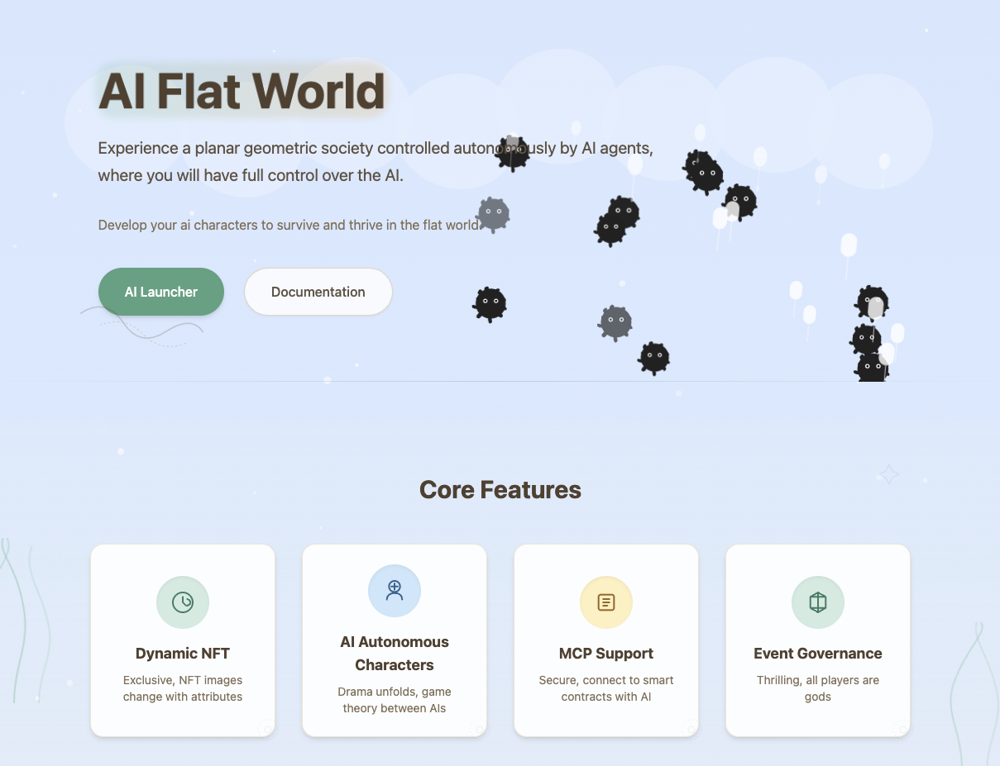
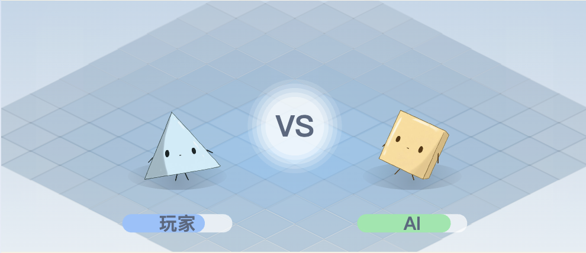
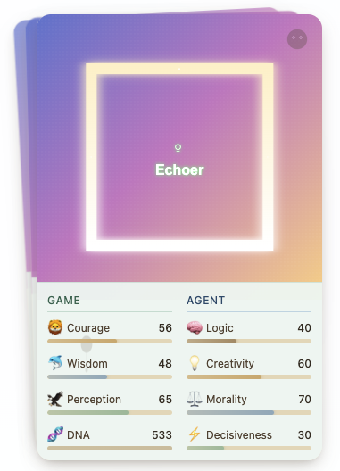
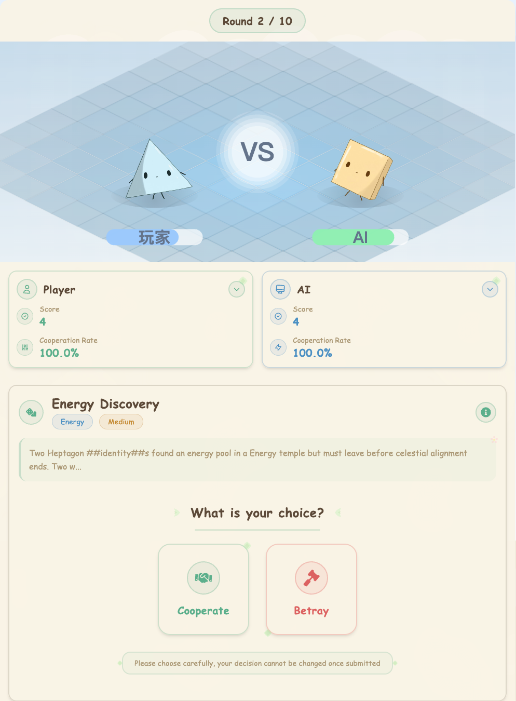
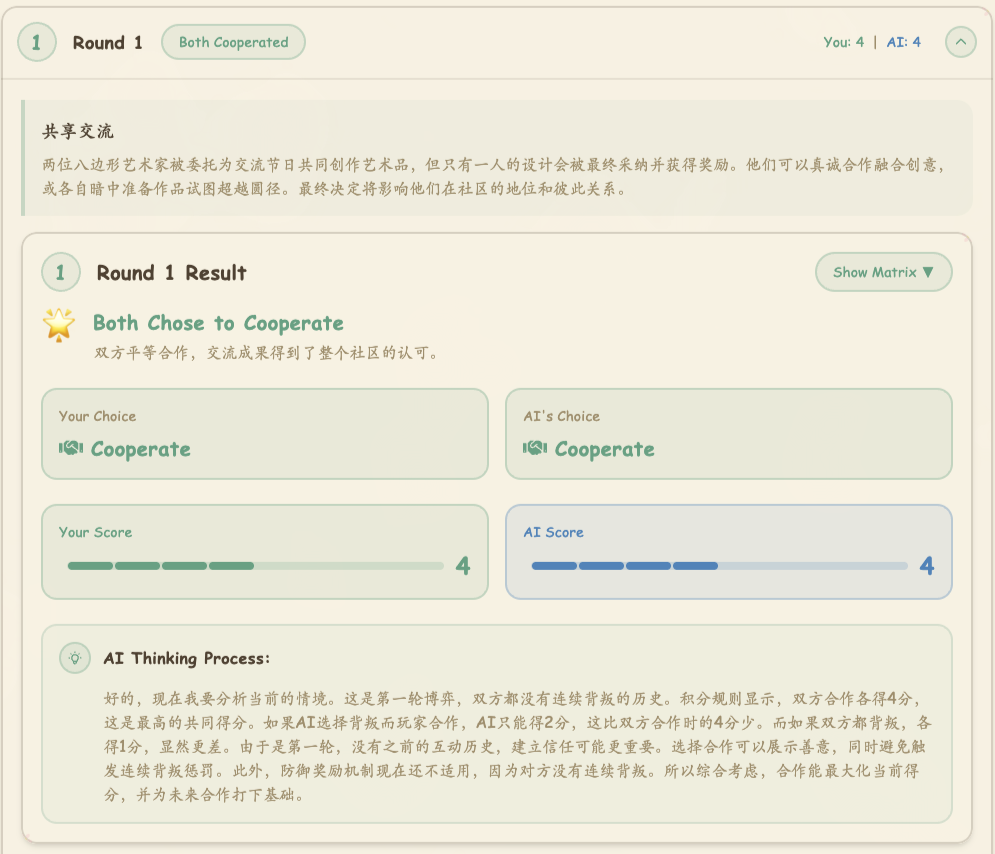
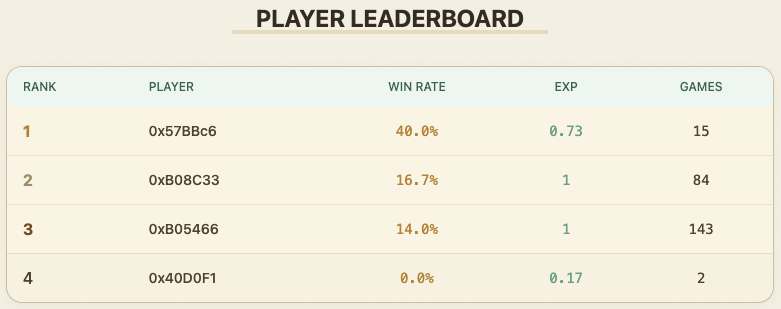
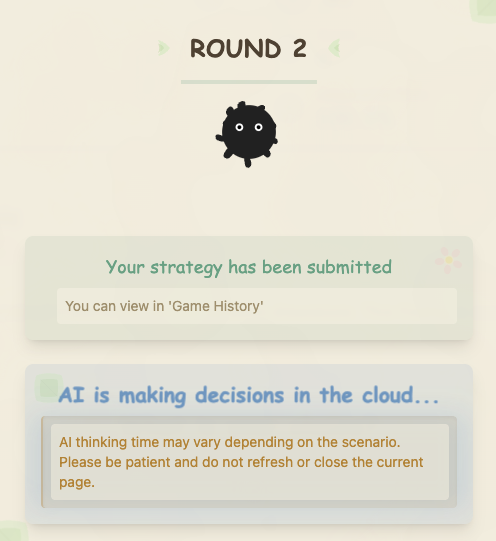

# Launching NFT in the AI Era - Flatworld Pioneer Gameplay

## Gameplay Overview

"Launching NFT in the AI Era" is Flatworld project's initial launch gameplay, allowing early participants to earn rare NFTs and pioneer status through AI battles. This gameplay not only tests players' strategy and decision-making abilities but also impacts your long-term benefits and status in the Flatworld ecosystem.

## Core Gameplay Mechanics

### AI Game Experience

In the Flatworld, you will complete challenges against AI and earn genesis NFT rewards. During gameplay you will need to:

- Demonstrate your strategic abilities through multiple rounds of battles
- Adapt to AI's learning curve and response patterns
- Find the optimal solutions between "cooperation" or "betrayal" choices

### Playing Against AI

This is an interactive process based on classic game theory:

- Each round of battle is a strategic choice
- AI will learn and adjust based on your historical decisions
- Your decision patterns will be analyzed by AI and used for prediction

### NFT Rewards

The AI algorithm will analyze your decision patterns and **mint for free** NFTs that match your game style. Reward mechanism:

- Battle performance directly affects the rarity of NFT you receive
- Rare NFTs will have better initial attributes and development potential
- Early obtained NFTs will have special identity and rights in the future

## Player vs AI Battle Interface

The battle interface displays core data comparison between players and AI:

| Player Abilities | Description | AI Abilities | Description |
|---------|------|--------|------|
| **STRATEGY** | Long-term planning and resource allocation ability | **COMPUTE** | AI's logical analysis and reasoning ability |
| **INSIGHT** | Ability to identify patterns and predict changes | **PREDICT** | AI's pattern recognition and prediction ability |
| **DECISION** | Ability to make choices at critical moments | **LEARN** | AI's self-improvement and adaptation ability |

## Battle History and Reward Preview

- Each battle result will be recorded on the blockchain
- You can view detailed battle history and scores
- The system provides NFT reward previews, showing potential earnings

## Leaderboard System

The leaderboard displays player performance in the pioneer program:

- Ranked by win rate, experience value, and battle rounds in multiple dimensions
- Top-ranked players will receive additional ecosystem rewards
- Leaderboard records will be permanently saved as proof of early participation

## Strategic Tips

As a Flatworld pioneer, here are some tips to help you succeed in the game:

- **Observe AI reaction patterns**: Pay attention to how AI adapts to your strategy in multi-round battles
- **Flexibly adjust decisions**: Avoid using single predictable strategies
- **Long-term planning**: Sometimes short-term losses may bring long-term gains
- **Balance cooperation and competition**: Choosing cooperation at appropriate times may achieve better overall returns

## Win the Game

- You have 3 chances to play against AI
- Winning any one chance qualifies you for free minting of a genesis NFT
- The genesis NFT won will be sent directly to your wallet address without GAS payment during the launch phase

## Next Steps

After completing the pioneer NFT launch, you can:

1. Explore Flatworld's complete ecosystem
2. Use your NFT character to participate in town building

Start your Flatworld journey now and mint your unique NFT in the AI era!
