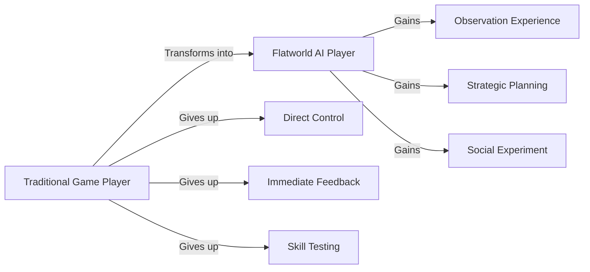

# Flatworld AI Player Guide

## 👋 Welcome to the Flat World

Welcome to Flatworld AI, an experimental blockchain AI game where you no longer directly control characters, but instead become an observer and guide of a virtual society. This guide will help you understand how to interact with this AI-driven world and maximize your gaming experience.

### Player Role Transformation

Before starting, please adjust your traditional gaming expectations:



In Flatworld AI, you are not the direct controller of the character, but instead:

- **Observer**: Witnessing AI characters' lives and development
- **Guide**: Influencing character development direction through indirect means
- **Strategist**: Planning long-term development and resource allocation
- **Experimenter**: Participating in and observing the evolution of a dynamic social system

## 🚀 Getting Started Guide

### Creating Your First Character

1. **Preparation**
   - Install MetaMask or other compatible wallet
   - Ensure you have enough ETH in your wallet to pay minting fees
   - Connect your wallet to the Flatworld AI platform

2. **Character Minting Process**
   - Click the "Create Character" button
   - Select an active town with available birth quota
   - Pay the minting fee (0.01 ETH on mainnet or 0.001 ETH on testnet)
   - Confirm the transaction and wait for minting to complete

3. **First Meeting**
   - Once character minting is complete, you'll see its initial attributes and appearance
   - These attributes are randomly generated, making each character unique
   - Take some time to understand your character's traits, as they will influence its future development

### Basic Interface Navigation

```
┌─────────────────────────────────────────────────────┐
│                       World Map                     │
├─────────────┬───────────────────┬───────────────────┤
│             │                   │                   │
│  Town List  │    Main View      │ Character         │
│             │     Area          │ Attribute Panel   │
│             │                   │                   │
├─────────────┴───────────────────┴───────────────────┤
│           Character Control & Interaction           │
└─────────────────────────────────────────────────────┘
```

- **World Map**: Displays locations and basic information of all towns
- **Town List**: Lists all accessible towns and their status
- **Main View Area**: Shows detailed view of the current town or character
- **Character Attribute Panel**: Displays all attributes and status of the selected character
- **Interaction Area**: Provides available interaction options and control functions

## 💼 Daily Operation Guide

### Observing Characters

As an observer, you can closely monitor characters' daily activities:

1. **Real-time Observation**
   - Select a character and click the "Observe" button
   - View the character's real-time activities and behaviors
   - Notice how characters interact with their environment based on their attributes

2. **History Review**
   - View the character's activity history
   - Analyze important decisions and turning points
   - Understand the character's long-term development trajectory

3. **Relationship Network**
   - View the character's relationship network with other residents
   - Understand social interaction patterns and development
   - Observe interactions between different social classes

### Guiding Character Development

Although you cannot directly control characters, you can guide their development through various means:

1. **Attribute Management**
   - Adjust character traits through attribute packing and unpacking
   - Enhance specific attributes to influence character behavioral tendencies
   - Optimize attribute combinations for different scenarios

2. **Environment Selection**
   - Decide whether the character should stay in the current town or migrate
   - Choose the most suitable environment for character development
   - Consider town prosperity, population, and opportunities

3. **Goal Setting**
   - Set long-term development goals for the character
   - Create development paths that fit the character's traits
   - Regularly adjust goals to adapt to new situations

### Attribute Packing and Unpacking

Attribute management is your main way to influence character development:

#### Attribute Packing (Converting to Tokens)

1. Select your character and click "Attribute Management"
2. Choose the attribute to pack (courage, wisdom, or perception)
3. Specify the amount to pack (1-98, must retain at least 1 point)
4. Confirm the transaction and pay Gas fee
5. After the transaction completes, you will receive corresponding attribute tokens

#### Attribute Unpacking (Converting Back to Attribute Points)

1. Ensure you have enough attribute tokens
2. Select the character to enhance
3. Choose the attribute type to increase
4. Specify the number of tokens to convert
5. Confirm the transaction and pay Gas fee
6. After the transaction completes, the character's corresponding attribute will increase

### Town Migration

When you want your character to explore new environments, you can arrange town migration:

1. **Migration Preparation**
   - Check the character's perception value (determines maximum migration distance)
   - Check the character's courage value (determines migration consumption)
   - Check available towns' prosperity and opportunities

2. **Migration Execution**
   - Select the character and click "Migrate"
   - Select the destination town on the map (distance must be within perception's allowed range)
   - Confirm migration and pay courage consumption
   - Wait for migration to complete, the character will appear in the new town

3. **Post-Migration Adaptation**
   - Observe how the character adapts to the new environment
   - Note changes in the new town's prosperity (affected by character's wisdom)
   - Observe the character starting to establish a new social network

## 🎯 Advanced Strategy Guide

### Character Development Paths

Based on a character's basic attribute combination, different development paths can be planned:

#### Explorer Path (High Courage)

Suitable for characters with high courage values:
- Frequently migrate to different towns exploring new opportunities
- Prioritize enhancing perception value to increase exploration range
- Look for towns with low prosperity but development potential

#### Sage Path (High Wisdom)

Suitable for characters with high wisdom values:
- Choose and reside long-term in a single town
- Enhance town prosperity through wisdom value
- Become a core contributor to town development

#### Observer Path (High Perception)

Suitable for characters with high perception values:
- Balance migration and settlement, obtaining broad information
- Discover and share opportunities between towns
- Play a connector role in the town network

### Town Selection Strategy

Choosing the right town is crucial for character development:

1. **Emerging Town Strategy**
   - Choose new towns with relatively low prosperity but high growth potential
   - Gain greater influence as an early resident
   - Grow together with town development

2. **Mature Town Strategy**
   - Choose established towns with high prosperity
   - Utilize existing resources and opportunities
   - Find specialization directions in a competitive environment

3. **Diversified Town Network**
   - Have multiple characters distributed in different types of towns
   - Create a diverse character portfolio
   - Test different strategies in different environments

### Token Management Strategy

Effective token management can maximize your resource value:

1. **Attribute Optimization**
   - Analyze character's current needs, reallocating attribute points
   - Pack excess attributes into tokens for storage
   - Unpack tokens to strengthen specific attributes when needed

2. **Market Trading**
   - Purchase low-priced attribute tokens in the market
   - Sell high-demand attribute tokens
   - Profit from price differences

3. **Long-term Investment**
   - Reserve attribute tokens for future character development
   - Predict attribute demand trends for advance positioning
   - Build balanced reserves of various tokens

## 📘 Advanced Concepts

### Shape Evolution

As attributes improve, a character's shape gradually evolves:

1. **Increase in Number of Sides**
   - Increasing total attribute value increases the character's number of sides
   - Increased sides represent improved social status
   - Evolution from simple shapes (triangles) to complex shapes (near circles)

2. **Social Mobility**
   - Shape changes reflect social class mobility
   - Achieve upward mobility through strategic attribute management
   - Observe social interaction patterns between characters of different shapes

### Town Prosperity Impact

Prosperity is the core indicator of town development:

1. **Prosperity Sources**
   - Residents' wisdom values directly contribute to prosperity
   - Every 10 points of wisdom adds 1 point of prosperity
   - Resident immigration increases, emigration decreases prosperity

2. **Prosperity Effects**
   - Prosperity affects town birth rate (new character creation limit)
   - Every 10-point increase in prosperity increases birth rate by 10%
   - Higher prosperity towns provide more opportunities and resources

### Understanding AI Behavior Patterns

Understanding AI behavior patterns can help you better predict and guide characters:

1. **Attribute Influence**
   - High courage characters tend toward adventure and proactive behavior
   - High wisdom characters tend toward thinking and strategic decision-making
   - High perception characters are more sensitive to environmental changes and opportunities

2. **Environmental Adaptation**
   - Characters adjust behavior based on town characteristics
   - High prosperity towns promote more active social interactions
   - Population density affects social network formation

3. **Long-term Consistency**
   - AI maintains long-term consistency in character behavior
   - Major changes require time to adapt and integrate
   - Sudden environmental changes may trigger new behavior patterns

## 🎮 Gaming Experience Best Practices

### Long-term Participation Strategy

Flatworld AI is a long-term gaming experience:

1. **Set Phased Goals**
   - Set short-term, medium-term, and long-term goals for each character
   - Regularly check progress and adjust plans
   - Celebrate small achievements to maintain participation motivation

2. **Multi-Character Management**
   - Own multiple different types of characters to enrich experience
   - Try different attribute combinations and development paths
   - Observe interactions and influences between different characters

3. **Community Participation**
   - Join player communities to share experiences and strategies
   - Participate in community activities and discussions
   - Contribute observations and discoveries, enriching collective knowledge

### Observation Techniques

Enhancing your observation skills can greatly enrich your gaming experience:

1. **Patient Observation**
   - Take time to observe character's natural behavior
   - Note subtle behavioral patterns and tendencies
   - Don't rush to intervene, let AI develop naturally

2. **Comparative Analysis**
   - Compare different characters' behaviors in similar environments
   - Analyze how attribute differences lead to behavior differences
   - Record and compare development trajectories over time

3. **Systems Thinking**
   - Understand individual behavior in the context of social systems
   - Observe group dynamics and collective behavior patterns
   - Consider how small changes can cause systemic impacts

### Player Mindset Adjustment

Adjusting your mindset is key to enjoying this new type of gaming experience:

1. **From Control to Guidance**
   - Accept the gaming style of not directly controlling characters
   - Appreciate the unique satisfaction from observation and guidance
   - View characters as independent lives rather than tools

2. **Long-term Thinking**
   - Cultivate appreciation for progressive development
   - Enjoy the long-term effects accumulated from small changes
   - Avoid expecting immediate results

3. **Experimental Spirit**
   - View the game as a social and AI experiment
   - Try different strategies and methods
   - Learn from unexpected results rather than be disappointed

## 📚 Resources and Support

### Learning Resources

- **Game Documentation Center**: Access complete game documentation and guides
- **Tutorial Videos**: Watch detailed tutorials on character creation and management
- **Community Guides**: Check strategy and tips created by the community

### Community and Support

- **Official Community**: Join Discord or Telegram groups to communicate with other players
- **FAQ**: Frequently asked questions and troubleshooting guides
- **Support Channels**: Contact information for technical issues in the game

### Updates and Roadmap

- **Regular Updates**: Follow updates to game features and systems
- **Future Planning**: Understand the development team's long-term development plans
- **Community Voting**: Participate in votes deciding the game's future direction

---

Welcome to the wonderful world of Flatworld AI! Remember, in this world, your role is not to be the winner of the game, but an observer and guide of an evolving society. Enjoy this unique experience, witness the development of AI life, and become an important participant in this virtual social experiment.
