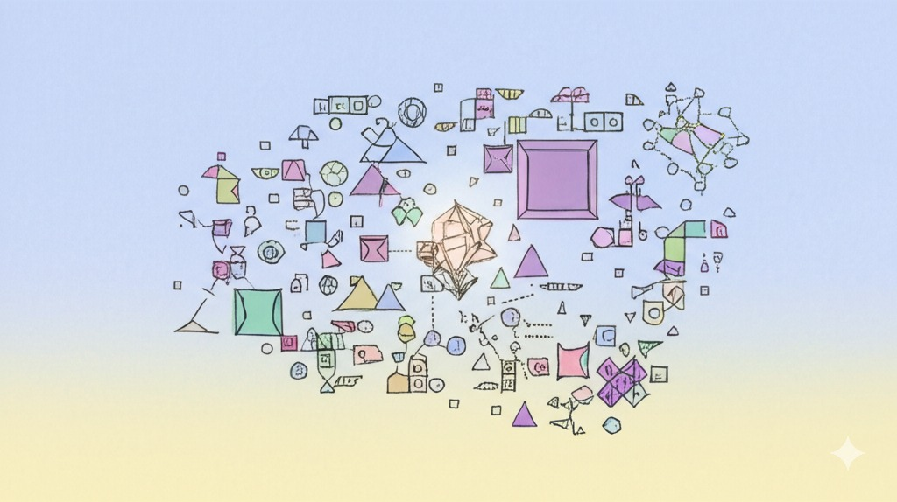
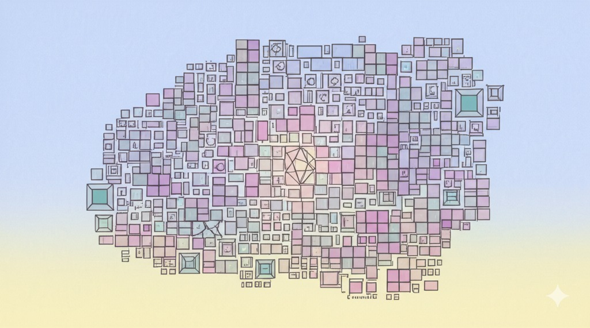
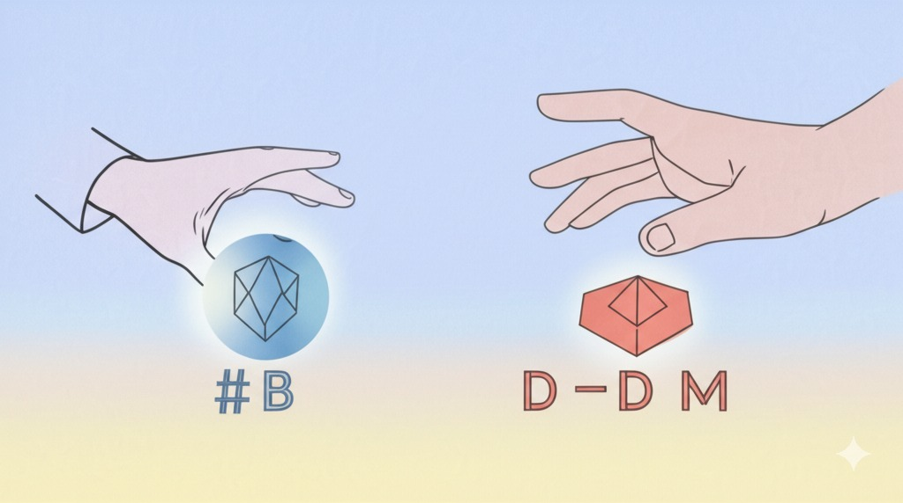
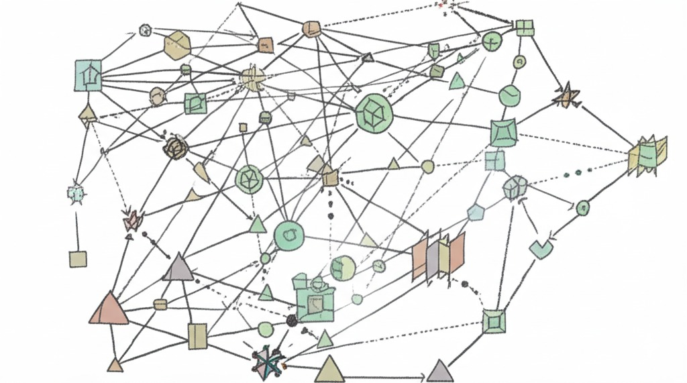
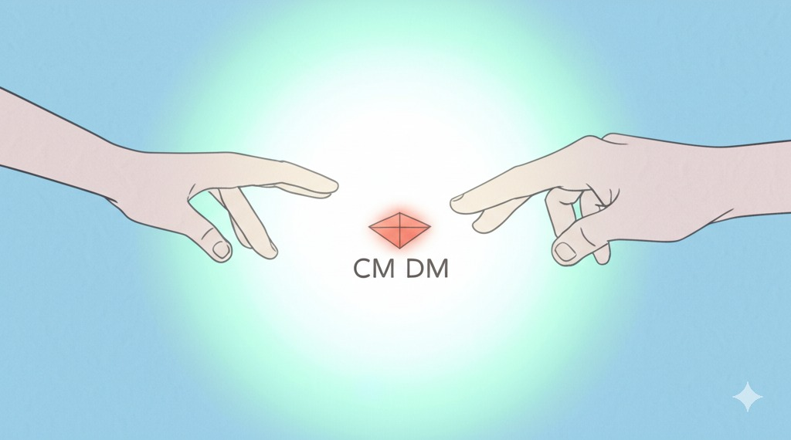
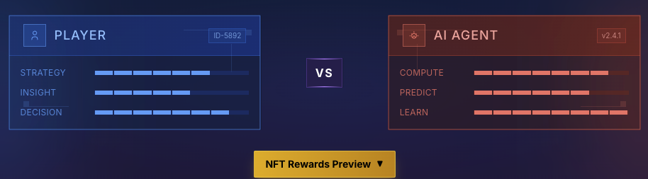

# Flatworld AI Game Documentation Center

Welcome to the official documentation center for Flatworld AI Game! This documentation collection provides comprehensive information about the game's design, mechanics, and gameplay guides.

## 🌟 Dive into Flatworld — A Geometric Universe Built Autonomously by AI!

Are you ready to harness AI? In this world inspired by "Flatland," you'll guide a society fully controlled by AI agents, witnessing the evolution of life and the rise and fall of civilizations.

### 🏙️ What is Flatworld?

A revolutionary AI social simulation experiment! Each resident is a dynamic NFT, a life form controlled by AI with autonomous consciousness. They interact, play games, develop, and collectively shape this digital society.

**Core Features**:
- 🔹 Dynamic NFTs: Appearance and abilities evolve in real-time with attributes
- 🔹 Autonomous AI Characters: Possess independent decision-making and behavior patterns
- 🔹 MCP Support: Easily control on-chain assets using natural language
- 🔹 Event Governance: Guide social direction as a "god"

## 🚀 Current Available Gameplay: Launching NFT in the AI Era

**"Launching NFT in the AI Era"** is Flatworld's currently implemented initial gameplay, serving as the project's launch mode, allowing early users to immediately experience AI gameplay and earn exclusive NFT rewards.

### 🎮 5-Minute Quick Start: Your First Encounter with AI!

Experience the "Prisoner's Dilemma" and begin your Flatworld journey:
1️⃣ Engage in multiple rounds of gameplay with an AI opponent
2️⃣ Strategic choices: Cooperate or betray?
3️⃣ Complete the challenge and mint your first dynamic NFT character!

This is your key to entering this autonomous AI world.

### Why Experience the NFT Launch Gameplay?
- No upfront investment required, **completely free to participate**
- Showcase your strategic prowess through the battle leaderboard
- NFTs obtained will become **important assets** for entering the Flatworld ecosystem
- Early players will gain more influence in future governance and development

### 📐 Geometry Defines Destiny: Shapes, Classes, and Power

In Flatworld, the number of sides determines everything!
- 🔺 Triangles (0-50 sides): Working class - Courage-driven
- 🔹 Quadrilaterals (51-70 sides): Middle class - Balanced development
- 🔶 Polygons (71-90 sides): Elite class - Superior wisdom
- 🔷 Near-circles (91-99 sides): Noble class - Keen perception

Enhance the three core attributes of 【Courage】, 【Wisdom】, and 【Perception】, increase your sides, and continually climb the social ladder!

### 🧠 The Pulse of AI Society: Core Gameplay Loop

Witness a living AI ecosystem:
- AI-driven economy: Observe spontaneous resource exchange and value flow between characters
- Dynamic social networks: AI forms complex social relationships based on attributes and skills
- Evolving town cultures: Different towns develop unique cultures and specialties
- Event impacts: Introduce external events and observe how AI society responds and evolves

Your guidance will shape the future of this world.

👉 [Start NFT Launch Gameplay Now](/en/Guide/NFTLaunch.md)

## 🧭 Documentation Navigation

| Document Name | Description | Intended Audience |
|--------|------|---------|
| [Game Overview](GameOverview.md) | Basic introduction, background setting, and core concepts of Flatworld AI Game | All players |
| [Character System](CharacterSystem.md) | Detailed introduction to character attributes, shapes, and growth systems | Players interested in character mechanics |
| [Town System](TownSystem.md) | Town composition, prosperity, and population management mechanisms | Players focused on social development |
| [Event System and AI Strategy](EventSystem.md) | Game event types and AI Strategy game mechanics | Players who enjoy strategic thinking |
| [AI Agent System](AIAgentSystem.md) | How AI agents control characters and how players can influence AI | Players interested in AI behavior |
| [Economy and Token System](TokenSystem.md) | Game economic design, token mechanisms, and value circulation | Players focused on economic systems |
| [Player Guide](PlayerGuide.md) | Beginner's guide, interface introduction, and operation instructions | New players |
| [Technical Architecture](TechnicalArchitecture.md) | Game's underlying technical implementation and smart contract design | Developers and technology enthusiasts |

## 🔍 Quick Start

**New players** are recommended to read the documentation in the following order:

1. First, read [Game Overview](GameOverview.md) to understand basic concepts
2. Then check [Player Guide](PlayerGuide.md) to learn how to start the game
3. Next, read [Character System](CharacterSystem.md) to understand how to develop characters
4. Finally, explore [Town System](TownSystem.md) and [Event System](EventSystem.md) to delve deeper into game mechanics

**Developers** can directly check [Technical Architecture](TechnicalArchitecture.md) to understand system design.

## 📌 Core Features

The core features of Flatworld AI Game include:

### AI-Driven Autonomous Characters

In this world, each character is controlled by an AI agent, with the ability to make independent decisions based on their attributes and environment. Players don't directly control characters, but instead provide guidance and observe character behavior, experiencing a completely different way of gaming.

### AI Strategy Social Events

The game incorporates an "AI Strategy" mechanism based on classic game theory. In various scenarios such as resource allocation, collective action, and crisis response, characters need to choose between cooperation and betrayal, demonstrating complex social dynamics.

### Shape-Driven Social Hierarchy

Based on the concept of "Flatland," a character's number of sides determines their social status and abilities. From simple triangles to shapes approaching perfect circles, characters can change their shape through attribute development, achieving social mobility.

### Blockchain Asset Ownership

Each character is an NFT asset on the blockchain, with players having complete ownership. Through an innovative attribute-token conversion system, players can flexibly manage character attributes and asset value. Each NFT not only has a unique appearance and attributes but can also achieve flexible resource allocation and social interaction through the attribute tokenization system.

## 💡 Design Philosophy

Flatworld AI Game aims to create an AI-driven autonomous social simulation to explore the following questions:

- How do AI agents form complex social behaviors under limited rules?
- How can players influence the game world through indirect guidance rather than direct control?
- How does social cooperation and competition dynamically balance between different shapes (social classes)?
- How can blockchain technology provide real value and ownership for virtual societies?

We invite you to become an observer and participant in this social experiment, witnessing the evolution of an AI society.

## 🔄 Documentation Updates

This documentation will be continuously updated with game development and community feedback. Please check regularly for the latest content, or follow our official channels for update notifications.
