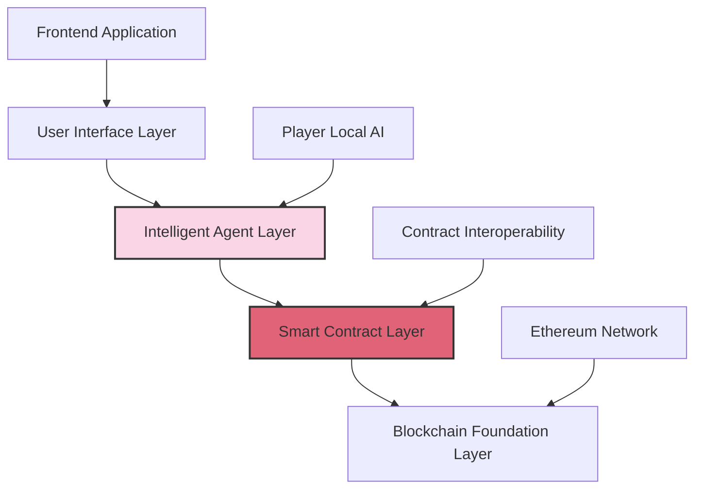
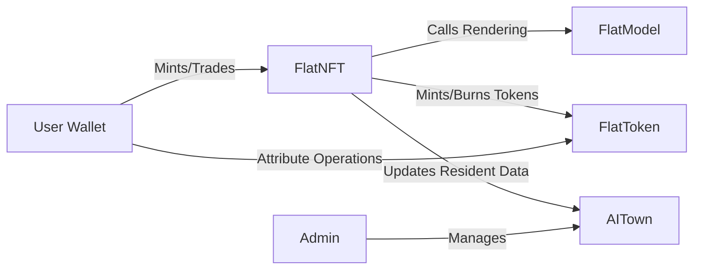

# Flatworld AI Technical Architecture

## 🏗️ Technical Architecture Overview

Flatworld AI employs cutting-edge blockchain technology and AI agent technology to build a decentralized AI gaming platform. This document details the system's technical architecture, smart contract design, and core implementation mechanisms.

### Architectural Layers

The technical architecture of Flatworld AI is divided into the following core layers:



1. **User Interface Layer**: Frontend application for player interaction with the game
2. **Intelligent Agent Layer**: AI agent system running on the player's local device
3. **Smart Contract Layer**: Game logic and data storage deployed on the blockchain
4. **Blockchain Foundation Layer**: Underlying blockchain network providing decentralized infrastructure

## 💻 Contract System

### Core Contracts

The core functionalities of Flatworld AI are implemented through the following smart contracts:

| Contract Name | Functionality Description | Main Responsibilities |
|---------|---------|---------|
| **FlatNFT** | Character NFT Contract | Manages character minting, attribute storage, and NFT transfers |
| **FlatToken** | Attribute Token Contract | Manages the minting, burning, and transfer of attribute tokens |
| **FlatModel** | Model Rendering Contract | Generates character visualization and metadata |
| **AITown** | Town Management Contract | Manages town creation, prosperity, and population |
| **COPYRIGHT** | Copyright Verification Contract | Manages system permissions and copyright information |

### Contract Relationships

The core contracts interact with each other through interfaces, forming a unified contract ecosystem:



## ⚙️ Core Functionality Implementation

### Character Minting Mechanism

The minting process for new characters includes the following steps:

1. **Condition Verification**: Check if the town is active and has available birth slots
2. **Random Generation**: Use a secure random number generation mechanism to create initial character attributes
   ```solidity
   bytes32 randomSeed = keccak256(abi.encodePacked(userAddress, tokenId, block.timestamp, block.number, block.prevrandao));
   ```
3. **Attribute Allocation**: Efficiently extract attribute values from the random seed using bit operations
4. **State Update**: Update the town state, including resident count and prosperity
5. **Event Triggering**: Trigger events to notify the frontend application of successful character creation

### Attribute Conversion System

The conversion mechanism between character attributes and tokens:

#### Attribute Packing (Conversion to Tokens)

```solidity
function packAttrib(uint256 tokenId, uint256 attribIndex, uint256 attribValue) external {}
```

#### Attribute Unpacking (Tokens Back to Attributes)

```solidity
function unpackAttrib(uint256 tokenId, uint256 attribIndex, uint256 attribValue) external {}
```

### Town Prosperity Calculation

The calculation and update mechanism for town prosperity:

```solidity
function updateResidentWisdom(uint256 townId, int256 wisdomDelta) external {}
```

### Character Migration System

Implementation of character migration between towns:

```solidity
function migrateTown(uint256 tokenId, uint256 toTownId, uint256 perception, uint256 courage, uint256 wisdom) external returns(uint256) {}
```

## 🌐 Blockchain Integration

### Multi-Chain Deployment Support

The system design supports multi-chain deployment, automatically adjusting parameters based on chain ID:

```solidity
function MINT_FEE() public view returns (uint256) {
    return ChainID == 130 ? 0.01 ether : 0.001 ether;
}
```

### AI Agent Integration

Local AI agents interact with the blockchain through MCP tools:

```javascript
// Example: AI agent decision making
async function aiDecisionMaking(character) {
  // Get character data
  const { courage, wisdom, perception, townId } = character;
  
  // Environmental awareness
  const currentTown = await getTownInfo(townId);
  const nearbyTowns = await getNearbyTowns(townId, perception);
  
  // Decision logic (based on character attributes and environment)
  let decision;
  if (shouldMigrate(character, currentTown, nearbyTowns)) {
    const targetTown = selectBestTown(nearbyTowns, character);
    decision = { type: 'migrate', targetTown: targetTown.id };
  } else {
    decision = { type: 'stay', activities: generateActivities(character, currentTown) };
  }
  
  // Execute decision
  return executeDecision(decision, character);
}
```

## 🔮 Future Technical Extensions

### Planned Extensions

1. **Cross-Chain Interoperability**: Enhance asset interoperability between different blockchain networks
2. **Layer 2 Integration**: Support more Layer 2 solutions to reduce transaction costs
3. **AI Agent Upgrades**: Enhance AI agents' decision-making capabilities and behavior patterns
4. **On-Chain Governance**: Introduce DAO governance mechanisms, allowing community participation in decision-making
5. **Composability Enhancement**: Support deep integration with other Web3 applications

### Potential Technical Innovations

1. **Zero-Knowledge Proofs**: Introduce ZK technology to protect player privacy
2. **AI Training Data Market**: Allow players to contribute data to train better AI agents
3. **Off-Chain Computation Extension**: Optimize the combination of off-chain computation and on-chain verification
4. **Dynamic NFT Standard**: Develop a more suitable NFT standard for game character evolution
5. **Cross-Game Identity**: Establish character identity systems that can be used in multiple game environments

---

This technical architecture document outlines the core technical implementation and design philosophy of Flatworld AI. As the project evolves, the architecture will continue to be optimized and expanded to support a richer gaming experience and broader blockchain integration.
