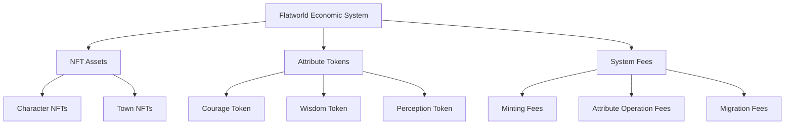
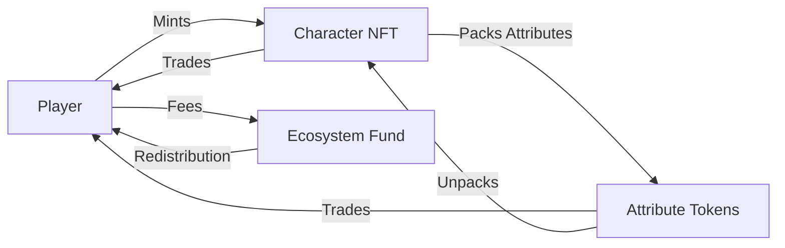

# Flatworld AI Economy and Token System

## 💰 Economic System Overview

The economic system of Flatworld AI is an innovative multi-level structure that seamlessly integrates in-game assets with blockchain tokens, creating a dynamic and sustainable game economy.

### Core Economic Concepts

The Flatworld economic system is designed based on the following core concepts:

- **Asset Embodiment**: Various elements in the game (characters, attributes, abilities) exist in the form of blockchain assets
- **Value Fluidity**: Value can flow and convert between different forms of assets
- **Player Autonomy**: Players have complete ownership and disposal rights over their assets
- **Intrinsic Value Foundation**: All assets have real utility and in-game functions, rather than being purely speculative tools

## 🪙 Token System

Multiple types of tokens exist in the Flatworld AI economy, each with its own role, collectively forming a complete economic ecosystem.

### Main Token Types

#### 1. Character Attribute Tokens (ERC20)

The game implements three ERC20 tokens corresponding to character basic attributes:

| Token Name | Corresponding Attribute | Contract Abbreviation | Function |
|---------|---------|---------|------|
| **Courage Token** | Courage | COURAGE | Used for character migration, social interaction, and adventure activities |
| **Wisdom Token** | Wisdom | WISDOM | Used to enhance town prosperity, decision quality, and learning ability |
| **Perception Token** | Perception | PERCEPTION | Used for expanding exploration range, information acquisition, and environmental adaptation |

These tokens have the following characteristics:

- **Equivalent to Attributes**: 1 attribute point = 10^18 token units (maintaining precision consistency)
- **Secure Supply Cap**: Maximum supply for each token is 1,000,000 (including 18 decimal places)
- **Free Transfer**: Tokens can be freely transferred between players
- **Market Trading**: Tokens can be traded in the open market, forming market value

#### 2. Character NFTs (ERC721)

Each character is a unique NFT with the following characteristics:

- **Uniqueness**: Each NFT represents a unique flat resident
- **Attribute Encapsulation**: All character attributes and states are encapsulated within the NFT
- **Dynamic Metadata**: NFT metadata updates dynamically as the character develops
- **Cross-Platform Application**: Can be used in different platforms and applications for interoperability

### Token Interoperability

Flatworld AI implements an innovative attribute-token conversion system:

1. **Attribute Packing**: Character attribute points can be "packed" into ERC20 tokens
   - Extract specific attribute points from the character
   - Receive equivalent ERC20 tokens
   
2. **Token Unpacking**: ERC20 tokens can be "unpacked" back into character attribute points
   - Burn a specific amount of ERC20 tokens
   - Add corresponding attribute points to the character

This two-way conversion mechanism creates a seamless connection between in-game attributes and blockchain assets.

## 🏦 Minting and Fee Structure

### NFT Minting Mechanism

The minting of new character NFTs follows this process:

1. **Pay Minting Fee**: User pays Ethereum as minting fee
   - Mainnet fee: 0.01 ETH
   - Other network fee: 0.001 ETH
   
2. **Choose Town**: User selects the town for character birth
   - Town must be active
   - Town must have available birth quota
   
3. **Character Generation**: System randomly generates character's initial attributes
   - Basic attributes: courage, wisdom, perception (range 1-89)
   - Social attributes: profession, gender, DNA, hobbies, etc.
   
4. **On-Chain Registration**: Character is registered on the blockchain and associated with the specified town

### Fee Structure

The system charges the following fees to maintain economic balance:

| Operation Type | Fee | Purpose |
|---------|------|------|
| **Character Minting** | 0.01/0.001 ETH | Used for ecosystem development and maintenance |
| **Color Change** | Same as minting fee | Character appearance personalization |
| **Attribute Packing** | Gas fee | Converting attributes to tokens |
| **Attribute Unpacking** | Gas fee | Converting tokens back to attributes |
| **Town Migration** | Courage consumption | Character movement between towns |

All collected fees flow to a designated donation address (Donate), used for the continuous development and maintenance of the project.

## 💹 Value Creation and Circulation

### Value Creation Mechanisms

Value in the Flatworld AI economy is created through multiple channels:

1. **Character Growth**: As characters develop, their NFT value may increase
2. **Attribute Optimization**: Strategically allocating attribute points can enhance character value
3. **Town Prosperity**: Enhancing town prosperity increases character opportunities and value
4. **Rare Combinations**: Characters with rare attribute combinations may be more valuable
5. **Social Network**: Relationships and status established in the game also constitute value

### Value Circulation Paths

Value circulates within the system through the following paths:

This circular flow ensures continuous value creation and reasonable distribution, avoiding economic system inflation or deflation.

## 🛡️ Security and Anti-Cheating Mechanisms

To ensure the healthy operation of the economic system, multi-level security mechanisms are implemented:

### Attribute Operation Restrictions

- **Minimum Value Protection**: Must retain at least 1 point of base value when packing attributes
- **Maximum Value Limit**: Individual attributes cannot exceed 99 points
- **Operation Verification**: All attribute operations require verification of NFT ownership
- **Safety Checks**: Token minting and burning have multiple verification steps

### Supply Cap Control

To prevent inflation, strict supply cap controls are implemented:

- **Token Supply Cap**: Each attribute token has a supply cap of 1,000,000
- **Minting Verification**: Each token minting checks whether it exceeds the safe supply limit
- **Dynamic Adjustment**: System can adjust various parameters based on economic conditions

### Trading Security

- **Smart Contract Audit**: All contracts undergo professional auditing
- **Permission Management**: Strict permission control and access restrictions
- **Re-entrancy Attack Protection**: All critical functions have re-entrancy protection
- **Exception Handling**: Comprehensive exception handling and rollback mechanisms

## 📈 Sustainable Economic Model

Flatworld AI adopts a sustainable economic model, ensuring the long-term healthy development of the game economy:

### Inflation Control

- **Limited Supply**: Attribute tokens have a hard cap on total supply
- **Token Burning**: Tokens are burned when unpacking attributes, maintaining supply-demand balance
- **Fee Mechanism**: Some operations charge fees, reducing circulation

### Value Anchoring

- **Practical Value**: All tokens have clear in-game utility
- **Intrinsic Demand**: Character development creates ongoing demand for attribute tokens
- **Function Binding**: Token value is tightly bound to game functionality

### Long-term Incentives

- **Continuous Participation**: Design encourages players' long-term participation in the game
- **Progressive Development**: Character and town development is gradual, requiring time investment
- **Community Contribution**: Player activities directly impact game world development

## 🔗 Cross-Chain Interoperability

Flatworld AI has designed cross-chain interoperability mechanisms, expanding the boundaries of the economic system:

### Multi-Chain Deployment

- **Mainnet Deployment**: Ethereum mainnet is the primary deployment network
- **L2 Expansion**: Support deployment on various Layer 2 solutions
- **Chain ID Awareness**: Contracts have built-in chain ID recognition, automatically adapting to different networks

### Asset Interoperability

- **NFT Portability**: Character NFTs can be used in different platforms and games
- **Token Bridging**: Attribute tokens are designed to be transferable between different chains through bridges
- **Metadata Standards**: Adopt universal metadata standards to ensure cross-platform compatibility

## 🔮 Future Economic Expansion

The Flatworld AI economic system is designed as an expandable framework, with the following features potentially added in the future:

### Economic Expansion Plans

- **Attribute Advancement**: Introduce more advanced attribute and ability systems
- **Goods and Services**: Allow characters to provide virtual goods and services
- **Land Ownership**: Introduce town land subdivision and ownership systems
- **Governance Tokens**: Introduce tokens for community governance
- **Cross-Game Assets**: Establish asset interoperability with other games and platforms

### Player Economic Roles

- **Developers**: Create tools and applications extending town functionality
- **Merchants**: Intermediaries focusing on character and token trading
- **Trainers**: Help other players optimize character development paths
- **Explorers**: Discover and share secrets and opportunities in the town world
- **Community Leaders**: Organize and guide community activities and development

Through this multi-level economic system, Flatworld AI not only creates a virtual economy within the game, but also builds a value network that interfaces with the real economy, providing players with rich economic participation and value creation opportunities.
