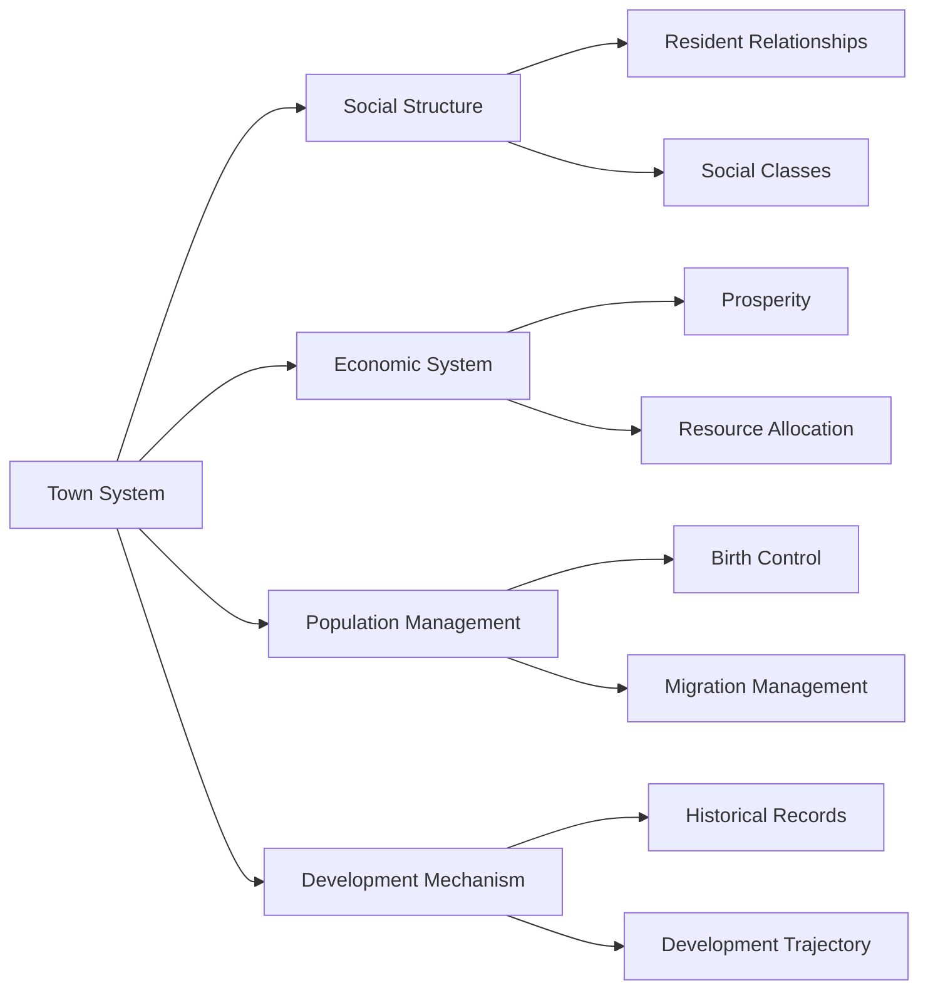

# Flatworld AI Town System

## 📍 Town Overview

In the two-dimensional world of Flatworld AI, towns are the basic social units where residents live, communicate, and develop. Each town has its unique characteristics and development state, collectively forming a complex and dynamic social network.

### The Essence of Towns

A town is an independent geographic and social unit, managed by smart contracts, with the following core features:

- **Identity**: Each town has a unique ID and metadata
- **Active Status**: Towns can be in an active or inactive state
- **Resident Population**: Records the current number of characters living in the town
- **Prosperity**: Reflects the town's development level and quality of life
- **Birth Rate**: Determines the maximum number of new characters that can be created in the town



## 🏗️ Town Core Mechanisms

### Prosperity System

Prosperity is the core indicator measuring a town's development level, directly affecting residents' quality of life and opportunities:

- **Contribution Sources**: Residents' wisdom values directly translate to town prosperity, with every 10 points of wisdom adding 1 point of prosperity
- **Dynamic Changes**: Resident immigration increases prosperity, emigration decreases prosperity
- **Impact Range**: Prosperity affects the town's birth rate, resource allocation, and resident opportunities

### Birth Rate Control

Towns control population growth through the birth rate mechanism, ensuring sustainable development:

- **Base Birth Rate**: Each town's basic birth rate is 100
- **Prosperity Bonus**: Every 10-point increase in prosperity increases the birth rate by 10%
- **Birth Rate Cap**: Maximum can reach 10 times the base birth rate (i.e., 1000)
- **Historical High Value**: A town's birth rate will not fall below its historical highest value, ensuring stable development

Calculation formula:
```
Current Birth Rate = min(Base Birth Rate × (100 + Prosperity × 10%) ÷ 100, Base Birth Rate × 10)
```

### Birth Quota Management

A town's birth quota determines the number of characters that can be created in that town:

- **Available Quota Calculation**: Current Birth Rate - Total Born
- **Quota Verification**: Before creating a new character, the system verifies if the town still has available quotas
- **Dynamic Adjustment**: As prosperity increases, available quotas automatically increase

## 🔄 Town Interaction System

### Resident Migration

Residents can migrate between different towns, which is the main way towns' populations and prosperity change:

#### Migration Conditions

1. **Town Active Status**: Both source and destination towns must be active
2. **Perception Requirement**: Resident's perception value determines the maximum migration distance
   - Calculation formula: Maximum Step Length = (Perception Value ÷ 10) + 1
3. **Courage Consumption**: Migration consumes courage value, with greater distances consuming more
   - Calculation formula: Courage Consumption = 1 + (Town Distance × 2)

#### Migration Impact

1. **Prosperity Transfer**: Resident's wisdom value is subtracted from the source town's prosperity and added to the destination town's prosperity
2. **Population Change**: Source town population decreases, destination town population increases
3. **Social Network**: Residents establish new social relationships in the new town

### Town Contribution

Residents contribute to town development in various ways:

1. **Wisdom Contribution**: Residents' wisdom values directly enhance town prosperity
2. **Activity Participation**: Residents' behaviors and interactions enrich the town's social life
3. **Attribute Changes**: Changes in residents' attributes affect town prosperity in real-time
   - For example: Reducing wisdom value through attribute packing decreases town prosperity
   - Increasing wisdom value through attribute unpacking increases town prosperity

## 📊 Town Information System

### Town Status Query

Players can query detailed town status at any time:

| Information Type | Description | Query Method |
|---------|------|---------|
| **Active Status** | Whether the town is active | Direct smart contract query |
| **Current Population** | Current number of residents in the town | Direct smart contract query |
| **Birth Rate** | Current maximum population capacity of the town | Calculated based on prosperity |
| **Total Born** | Total number of characters created in the town's history | Cumulative record in smart contract |
| **Available Birth Quota** | Number of new characters that can still be created | Birth Rate - Total Born |
| **Prosperity** | Town's development level | Accumulated based on residents' wisdom values |

### Town Metadata

Each town has associated metadata containing descriptive information and visual presentation:

- **Name and Description**: Official name and background story of the town
- **Geographic Features**: Description of the town's location, climate, and terrain
- **Visual Identity**: Town's emblem, representative colors, and architectural style
- **Historical Records**: Town's establishment time and important historical events
- **URI Link**: External link to detailed town information

## 🏛️ Town Management

### Town Creation

Town creation is a controlled process executed by system administrators:

1. Generate a unique town ID
2. Set the town's initial state (active, population 0, prosperity 0)
3. Configure the town's metadata URI
4. Add the town to the global town registry

### Town Management Functions

Administrators can perform the following management operations:

- **Set Active Status**: Activate or deactivate specific towns
- **Batch Add Towns**: Add multiple new towns at once
- **Update Metadata**: Update town descriptions and visual information
- **System Configuration**: Adjust town's basic parameters and rules

## 💼 Gameplay Applications

### Strategic Choices

The town system provides players with rich strategic choices:

- **Town Selection**: Choose suitable birth towns for new characters
- **Migration Planning**: Plan optimal migration paths based on character attributes and town characteristics
- **Attribute Investment**: Optimize character attributes to adapt to specific town needs
- **Community Building**: Coordinate activities of multiple characters to collectively enhance town prosperity

### Social Experiment

The town system is also a social simulation experiment platform:

- **Population Dynamics**: Observe the relationship between population flow and town development
- **Social Stratification**: Witness the distribution and interaction of characters of different shapes (social classes) in towns
- **Prosperity Development**: Analyze which factors promote town prosperity and which lead to decline
- **Collective Behavior**: Study AI characters' collective decision-making and behavior patterns in different environments

## 🔮 Future Extensions

The town system is designed as an expandable framework, with the following features possibly added in the future:

### Town Specialization

Each town may develop unique characteristics and advantages:

- **Specialized Industries**: Towns may develop expertise in specific areas
- **Cultural Features**: Towns may develop unique cultures and customs
- **Education Systems**: Different towns may offer different types of learning opportunities
- **Political Systems**: Towns may develop different governance models

### Town Alliances

More complex relationship networks may form between towns:

- **Trade Alliances**: Establish economic cooperation between towns
- **Cultural Exchange**: Cultural and knowledge exchange between towns
- **Joint Governance**: Multiple towns jointly manage regional resources
- **Competition Mechanisms**: Healthy competition between towns driving overall development

Through this multi-level town system, Flatworld AI creates a dynamic, complex, and constantly evolving virtual society, providing players with rich observation and participation opportunities. Towns are not just spaces where characters live, but also stages for social experiments and cores of game strategy.
