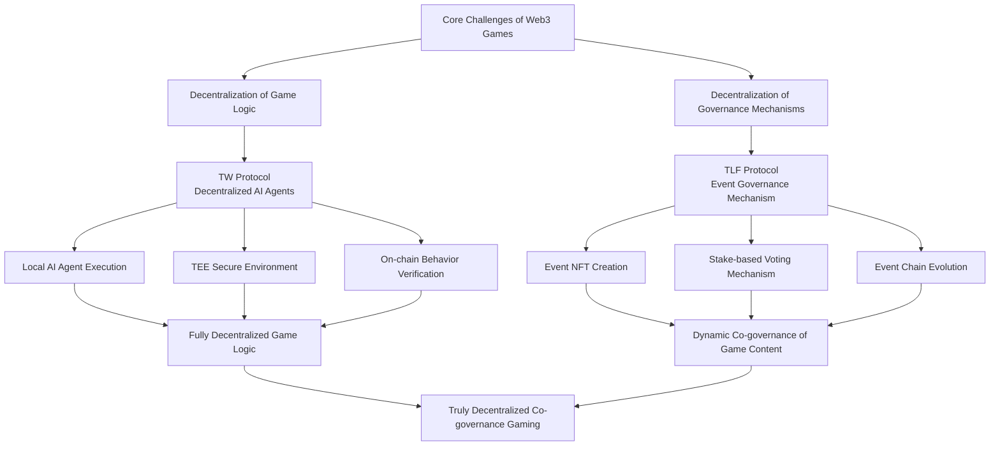

# 1.3 Introduction of TW and TLF Protocols

Addressing the limitations of Web2 games and the shortcomings of existing Web3 games, we propose two innovative protocols: **The Weavers Protocol (TW)** and **The Loom of Fate Protocol (TLF)**, aiming to achieve truly decentralized co-governance gaming.

## Solution Framework of TW and TLF Protocols

- **TW Protocol** migrates game character behavior logic from centralized servers to players' local devices, achieving decentralized game logic execution through decentralized AI agents ("Weavers"), while ensuring security and fairness using TEE technology.

- **TLF Protocol** enables players to collectively decide the dynamic changes of the game world through event NFTs and voting mechanisms, realizing decentralized governance of game content. The event chain system allows the game world to continuously evolve based on players' collective decisions.

The combination of these two protocols provides a new technical framework and governance model for next-generation Web3 games, achieving comprehensive decentralization from asset ownership to game logic and governance mechanisms.
