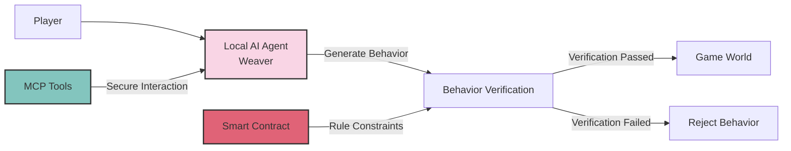

# 2.1 Core Concept

The core concept of the TW Protocol (The Weavers Protocol) is to migrate game character behavior logic from centralized servers to run locally on players' devices. In the TW Protocol, each player runs a decentralized AI agent (called "Weaver") locally, responsible for controlling their game character's behavior. Smart contracts then verify whether the behaviors generated by the AI agent are valid and apply valid behaviors to the game world.

This design fundamentally changes the traditional game operation model, achieving decentralization at the game logic level, solving the single point of failure risk brought by centralized servers, while ensuring high availability and continuity of the game.

## TW Protocol Conceptual Model

In this model:

1. **Player** starts the local AI agent ("Weaver").
2. **Local AI Agent** generates character behaviors based on character traits, game rules, and environmental states.
3. **Behavior Verification** is performed by smart contracts on the blockchain to ensure behaviors comply with game rules and character states.
4. **Verified Behaviors** are applied to the game world, updating the world state.
5. **Rejected Behaviors** have no impact on the game world.
6. **MCP Tools** provide a secure interaction channel between AI agents and the blockchain.

This architecture ensures decentralized operation of game logic while maintaining consistency and fairness of the game world through the blockchain's consensus mechanism.
