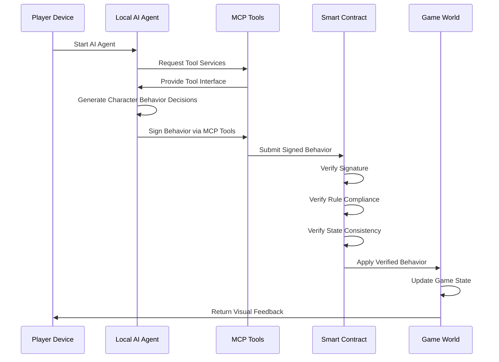

# 2.2 Technical Architecture

The technical architecture of the TW Protocol consists of three layers: AI Agent Layer (Local Execution Layer), Smart Contract Layer (Verification Layer), and Game World Layer (Execution Layer). This layered architecture ensures a balance between decentralization, security, and efficient execution.

## 2.2.1 Operation Architecture

```
+-------------------+      +----------------------+      +-------------------+
|   AI Agent Layer  |      |  Smart Contract Layer|      |  Game World Layer |
| (Local Execution) | ---> | (On-chain Verification)| ---> | (Execution)      |
+-------------------+      +----------------------+      +-------------------+
| - Behavior Generation |  | - Signature Verification |  | - State Update    |
| - Behavior Signing    |  | - Rule Compliance Check  |  | - Event Trigger   |
| - MCP Tool Interaction|  | - State Consistency Check|  | - Visual Rendering|
+-------------------+      +----------------------+      +-------------------+
```

## 2.2.2 Core Components

1. **AI Agent Layer (Local Execution Layer)**:
   - **Weaver AI**: Generates character behaviors based on character attributes, environmental states, and game rules
   - **Behavior Signing Module**: Signs behaviors using player's private key
   - **MCP Interaction Module**: Interacts with blockchain smart contracts through MCP tools

2. **Smart Contract Layer (Verification Layer)**:
   - **Signature Verification Module**: Verifies the authenticity of behavior signatures
   - **Rule Verification Module**: Verifies if behaviors comply with game rules
   - **State Verification Module**: Verifies if behaviors are consistent with current character state
   - **Incentive Distribution Module**: Calculates and distributes execution rewards

3. **Game World Layer (Execution Layer)**:
   - **State Update Module**: Updates game state based on verified behaviors
   - **Event Trigger Module**: Triggers game events related to behaviors
   - **Rendering Module**: Renders game state into visual interface

## 2.2.3 Data Flow



This data flow diagram shows the complete process from player starting the AI agent to final game state update. Throughout the process, behavior generation is done locally while verification is performed on the blockchain, ensuring a balance between decentralization and security. MCP tools serve as a bridge between local AI agents and the blockchain, providing a secure and efficient interaction channel.
