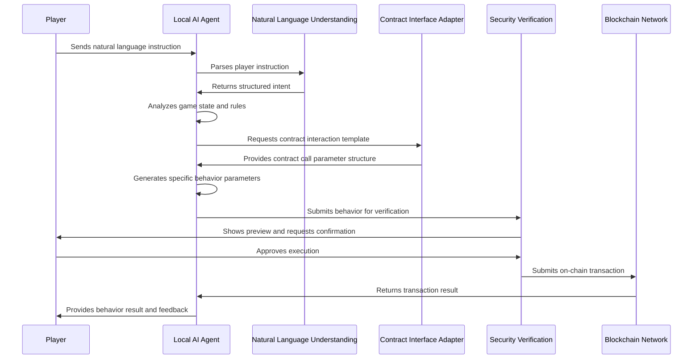

# 2.4 Application of MCP Tools

Unlike traditional TEE (Trusted Execution Environment) solutions, the TW Protocol innovatively introduces MCP (Model Context Protocol) tools as a bridge between AI agents and blockchain smart contracts. This design enables AI to seamlessly integrate into the Web3 ecosystem, truly becoming players' agents in the game world.

## 2.4.1 Why Choose MCP Tools

MCP tools provide the following key advantages for the TW Protocol:

| **Advantage Type** | **MCP Tool Implementation** | **Significance to TW Protocol** |
|--------------------|----------------------------|---------------------------------|
| **Natural Language Interaction** | Semantic understanding and intent recognition | Players can communicate with AI agents using natural language, reducing Web3 interaction complexity |
| **Smart Contract Integration** | Contract ABI parsing and call encapsulation | AI agents can directly read and call on-chain contracts without users needing to understand contract details |
| **Multi-chain Adaptability** | Cross-chain interface and protocol conversion | Supports seamless switching of AI agents between different blockchain networks, improving interoperability |
| **Intent Verification** | Operation preview and confirmation mechanism | Ensures AI agent behavior aligns with player intent, preventing potential risks |
| **Behavior Transparency** | Behavior logging and traceability | Provides complete behavior logs for auditing and verification |

## 2.4.2 MCP Tool System Architecture

The MCP tool system in the TW Protocol consists of the following core components:

1. **Natural Language Understanding Engine**:
   - Parses player instructions and extracts core intents
   - Converts complex instructions into specific on-chain operations

2. **Contract Interface Adapter**:
   - Dynamically loads ABIs of game-related smart contracts
   - Generates call templates for specific contracts

3. **Security Verification Module**:
   - Checks if AI-generated transactions comply with predefined security rules
   - Provides transaction previews and risk assessments

4. **Multi-chain Connector**:
   - Maintains connections with multiple blockchain networks
   - Handles signature and transaction format conversion across different chains

## 2.4.3 MCP Tool Workflow in TW Protocol



## 2.4.4 Natural Language to On-chain Behavior Conversion Example

The following demonstrates how player natural language instructions are converted into on-chain behavior:

1. **Player Input**:
   ```
   "Have my character explore the northern forest to search for rare herbs"
   ```

2. **Intent Recognition**:
   ```json
   {
     "action": "explore",
     "location": "north_forest",
     "purpose": "find_herbs",
     "priority": "rare_items"
   }
   ```

3. **Contract Interaction Parameter Generation**:
   ```json
   {
     "contract": "GameWorld",
     "method": "submitCharacterAction",
     "params": {
       "characterId": "0x1a2b...",
       "actionType": 3,
       "targetLocation": [2145, 873],
       "actionParams": {
         "searchFocus": 2,
         "timeAllocation": 4
       }
     }
   }
   ```

4. **Preview and Confirmation**:
   ```
   Ready to execute: Character moves to northern forest (2145,873) and performs herb search action
   Estimated cost: 2.3 energy points
   Expected rewards: ~34% chance of rare herbs, ~87% chance of common herbs
   Confirm execution?
   ```

Through this approach, MCP tools greatly simplify the interaction process between players and blockchain games, making complex on-chain operations intuitive and understandable while ensuring interaction security and transparency.
