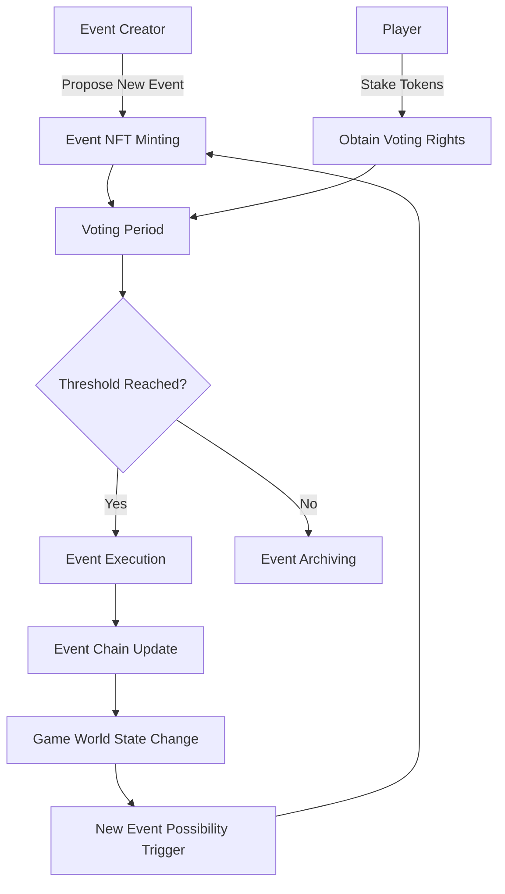

# 3.1 Core Concepts

The TLF Protocol (The Loom of Fate Protocol) enables players to collectively govern the dynamic changes in the game world through innovative event NFTs and voting mechanisms. In the TLF Protocol, each event is represented as an NFT, and players obtain voting rights by staking tokens to determine which events will be published to the game world.

This design not only achieves decentralized governance of game content but also provides the game world with continuous dynamism and self-evolution capabilities. The event chain system allows game narratives and world states to evolve based on players' collective decisions, creating a truly player-driven gaming experience.

## TLF Protocol Event Governance Process

In this process:

1. **Event Creators** (can be players, developers, or AI) propose new events and mint them as event NFTs.
2. **Players** obtain voting rights by staking tokens and vote on events.
3. After the **Voting Period** ends, the system determines whether to execute the event based on voting results.
4. Events that **Reach the Threshold** will be executed and affect the game world state.
5. **Event Chain Update** records the history and impact of executed events.
6. **Game World State Changes** may trigger new event possibilities, forming a continuous evolution cycle.

This design ensures decentralized governance of game content, allowing players to truly participate in shaping the future of the game world while maintaining the game's dynamism and unpredictability.
