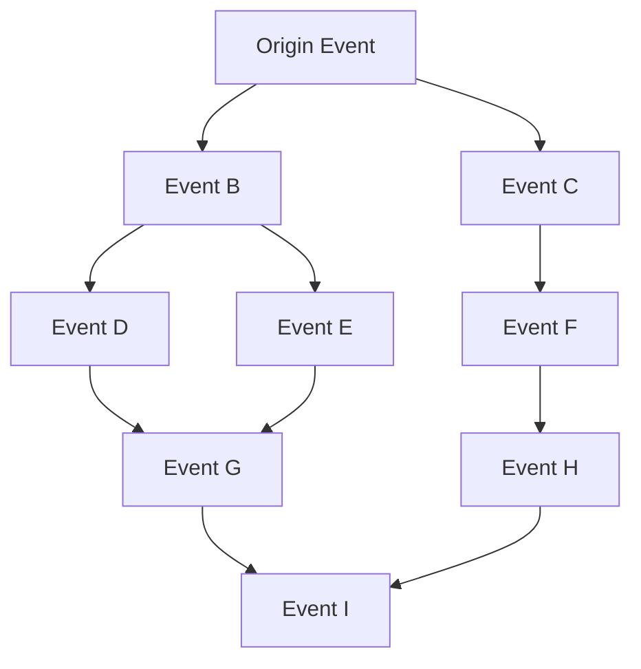

# 3.4 Event Chain and Evolution System

One of the core innovations of the TLF Protocol is the event chain system, which enables the game world to continuously evolve under player governance, forming a self-organizing dynamic narrative network.

## 3.4.1 Event Chain Structure

The event chain is a directed graph network formed by player-voted events in chronological and causal order:

Each event contains the following attributes:

1. **Preconditions**: Game state conditions required to trigger the event
2. **Event Content**: Describes the specific content, options, and outcomes of the event
3. **Impact Coefficient**: The degree of impact the event has on various aspects of the game world
4. **Subsequent Possibilities**: Set of potential follow-up events that may be triggered

## 3.4.2 Event Types and Paradigms

The TLF Protocol defines multiple event types to enrich the gaming experience:

| **Event Type** | **Description** | **Scope** | **Examples** |
|----------------|-----------------|-----------|--------------|
| **World Event** | Major changes affecting the entire game world | Global | Continental drift, discovery of new lands |
| **Regional Event** | Changes affecting specific regions | Regional | City establishment, natural disasters |
| **Faction Event** | Changes affecting specific factions or organizations | Organizational | Regime change, alliance formation |
| **Individual Event** | Changes affecting specific characters or small groups | Personal | Hero's rise, legendary birth |
| **Chaos Event** | Special events with high randomness | Random | Dimensional rifts, mysterious phenomena |

## 3.4.3 Event Evolution Algorithm

The TLF Protocol uses a complex evolution algorithm to generate new possible events based on occurred events and current game state:

$$P(E_{new}|S_t, E_{history}) = f(S_t, E_{history}, R, \theta)$$

Where:
- $P(E_{new}|S_t, E_{history})$ is the probability of new event $E_{new}$ occurring given current state $S_t$ and historical events $E_{history}$
- $f$ is a complex generation function considering multiple factors
- $S_t$ is the current game world state
- $E_{history}$ is the set of historical events
- $R$ is the game rules and constraints
- $\theta$ is the set of system parameters

This evolution algorithm intelligently proposes new events that align with the game world's worldview and logic based on its development history, while maintaining sufficient innovation and surprise.

## 3.4.4 Case Study: Event Chain Evolution Example

Here's a simplified example of event chain evolution, demonstrating how the TLF Protocol drives self-organizing evolution of the game world:

**Initial State**: Peaceful continent divided into three major kingdoms

**Event1** (voted by players): Northern Kingdom discovers mysterious minerals
- **Result**: Northern Kingdom experiences rapid technological development, economy increases by 20%
- **New State**: Regional power imbalance

**Event2** (voted by players): Central Kingdom and Southern Kingdom form an alliance
- **Result**: Formation of anti-Northern alliance, regional tensions escalate
- **New State**: Bipolar confrontation emerges

**Event3** (system generates multiple candidates, voted by players):
- Option A: War breaks out (30% selection rate)
- Option B: Trade blockade (45% selection rate)
- Option C: Peace negotiations (25% selection rate)

**Execute Event3B**: Trade blockade
- **Result**: Northern Kingdom faces resource shortages but continues technological development, begins maritime exploration
- **New State**: Regional cold war, maritime exploration emerges

Through this continuous evolution, the game world develops rich historical context and unique development paths. Each server's game world may evolve in completely different directions, creating diverse gaming experiences.

## 3.4.5 Long-term Impacts of Event Chains

Long-term operation of the event chain system will lead to the following characteristics:

1. **Historical Depth**: The game world accumulates real history, not scripted designs
2. **Cultural Formation**: Specific event combinations may lead to unique cultural emergence
3. **Emergent Complexity**: Simple rules and voting decisions produce complex, unpredictable world states
4. **Community Shaping**: Community voting behavior directly reflects in the game world's evolution direction

These characteristics give the TLF Protocol's game world real-world-like complexity and depth, creating an unprecedented immersive experience.
