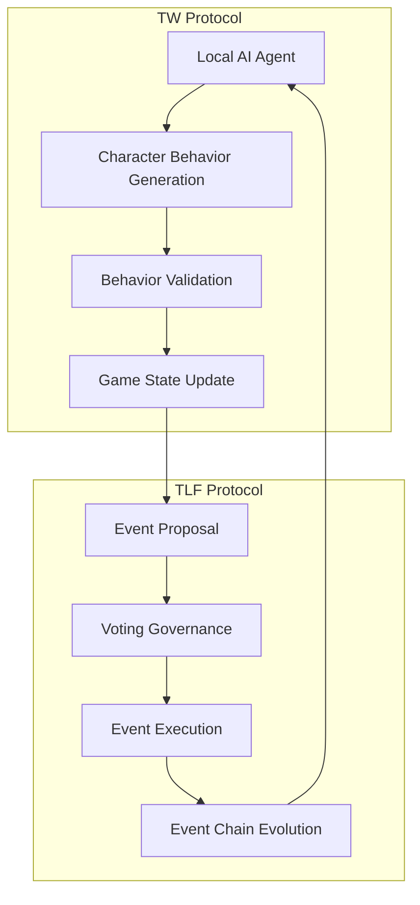

# 4.1 Protocol Interaction Model

The interaction between the TW and TLF protocols forms a self-reinforcing loop system, enabling the game world to continuously evolve in a highly decentralized environment.

## 4.1.1 Overall Architecture

In this combined model, the TW Protocol is responsible for decentralized behavior control of game characters, while the TLF Protocol handles decentralized governance of game events and content. The two protocols complement each other and work in synergy:

1. **TW → TLF**: Character behaviors influence game state, creating new event possibilities
2. **TLF → TW**: Event execution changes game world rules and environment, affecting AI agent behavior decisions

## 4.1.2 Data Flow and State Transition

The data flow between the two protocols can be represented by the following state transition equation:

$$S_{t+1} = F(S_t, A_t, E_t)$$

Where:
- $S_t$ is the game world state at time $t$
- $A_t$ is the set of character behaviors generated by the TW Protocol
- $E_t$ is the set of events selected by the TLF Protocol
- $F$ is the state transition function that defines how the game world evolves

This state transition model ensures consistency and continuity of the game world while allowing both protocols to operate independently in their respective domains.

## 4.1.3 Protocol Synchronization Mechanism

To ensure coordinated operation of the TW and TLF protocols, the system implements the following synchronization mechanisms:

| **Synchronization Level** | **Implementation** | **Function Description** |
|--------------|--------------|--------------|
| **State Synchronization** | Blockchain state synchronization | Ensures all AI agents and event systems are based on the same game world state |
| **Time Synchronization** | Consensus time window | Sets time windows for behavior submission and event execution to ensure sequence |
| **Rule Synchronization** | Smart contract validation | Ensures all behaviors and events comply with current game rules through on-chain validation |
| **Conflict Resolution** | Priority mechanism | Defines priority order for event execution and behavior application to resolve potential conflicts |

## 4.1.4 Interaction Case Flow

Here is a typical flow example of TW and TLF protocol interaction:

1. **Initial State**: The game world is in state $S_t$, containing multiple player-controlled characters and environmental elements.

2. **Character Behavior Generation**:
   - Player's local AI agent generates character behavior $a_i$ based on current state $S_t$
   - Behaviors are signed and submitted for on-chain validation
   - Validated behavior set $A_t = \{a_1, a_2, ..., a_n\}$ updates game state

3. **New Event Trigger**:
   - Character behaviors may trigger new event candidates $e_j$
   - These events are minted as NFTs and enter the voting pool

4. **Event Voting and Execution**:
   - Players vote on event candidates
   - Voting results determine the event set $E_t = \{e_1, e_2, ..., e_m\}$ to be executed
   - Event execution changes game world rules and environment

5. **AI Behavior Adaptation**:
   - AI agents perceive environmental changes and adjust behavior strategies
   - New behavior generation considers game rules after event execution

6. **State Update Loop**:
   - Game state evolves from $S_t$ to $S_{t+1}$
   - New state triggers a new round of behavior generation and event selection

This cyclic interaction model enables continuous evolution of the game world while maintaining decentralization, creating a self-organizing, self-evolving ecosystem.

## 4.1.5 Edge Case Handling

When combining TW and TLF protocols, several special edge cases require specific handling:

1. **Event and Behavior Conflict**:
   - When TLF executed events may invalidate some ongoing TW behaviors
   - Solution: Implement event priority system, where major events can interrupt current behaviors and trigger compensation mechanisms

2. **World State Fork**:
   - When network latency or partitioning causes different nodes to see different states
   - Solution: Implement consensus rollback and state merge algorithms to ensure eventual consistency

3. **Rapid State Changes**:
   - When large numbers of AI behaviors and events occur simultaneously in a short time
   - Solution: Implement batch processing and queuing mechanisms to ensure orderly processing

4. **Protocol Version Updates**:
   - When one of the protocols needs to be upgraded
   - Solution: Compatibility layer ensures coexistence of old and new versions for smooth transition

Through these mechanisms, the TW and TLF protocols can maintain coordinated operation in various situations, jointly supporting a truly decentralized game world.
