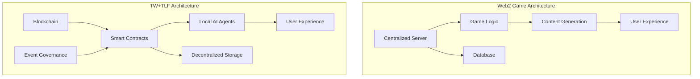

# 5.1 Differences from Web2 Games

The TW and TLF protocols differ fundamentally from traditional Web2 games in terms of architecture, technology, and user experience.

## 5.1.1 Core Architecture Comparison

The following diagram shows the architectural differences between TW+TLF and traditional Web2 games:

This architectural comparison clearly shows the fundamental differences between the two models: Web2 games are built around centralized servers, while TW+TLF games are built on blockchain and local AI agents.

## 5.1.2 Systemic Comparison

| **Feature** | **Web2 Games** | **TW+TLF Games** |
|----------|---------------|-----------------|
| **Server Architecture** | Centralized server clusters | Distributed node network |
| **Data Storage** | Centralized database | Blockchain + decentralized storage |
| **Execution Logic** | Server-side execution | Local AI agents + on-chain verification |
| **Content Updates** | Developer-determined | Player-governed voting |
| **Asset Ownership** | Company-owned | Truly player-owned |
| **Game Lifespan** | Depends on operating company | Community-driven, theoretically infinite |
| **Revenue Model** | Paid content + in-app purchases | Value capture + creator economy |
| **Data Privacy** | Company controls user data | Users control personal data |
| **Scalability** | Requires increasing server capacity | Distributed horizontal scaling |
| **Interoperability** | Closed ecosystem, difficult to interoperate | Open protocols, naturally interoperable |

## 5.1.3 User Experience Differences

Despite significant differences in technical architecture, TW+TLF games aim to provide a smooth user experience transition:

1. **Seamless Login**: Wallet connection and MCP tools enable one-click login
2. **Latency Optimization**: Local computation and state channels reduce blockchain confirmation wait times
3. **Simplified Complexity**: AI agents hide blockchain technical details, allowing users to focus on game content
4. **Progressive Adoption**: Supports varying degrees of decentralized participation, allowing new users to transition smoothly

## 5.1.4 Character Control Mode Transformation

Web2 games and TW+TLF games differ fundamentally in how players control game characters:

| **Control Dimension** | **Web2 Games** | **TW+TLF Games** |
|--------------|---------------|-----------------|
| **Direct Operation** | Players directly control character actions | AI agents execute actions based on player intent |
| **Decision Level** | Micro-operation decisions | Macro-strategic decisions |
| **Skill Requirements** | Depends on player reaction speed and operation skills | Depends on player strategic thinking and intent expression |
| **Immersion Mode** | Operational immersion | Observation and guidance immersion |
| **Interaction Rhythm** | Real-time feedback | Guide-observe-adjust loop |

## 5.1.5 Business Model Transformation

The business model of TW+TLF games is fundamentally different from traditional Web2 games:

1. **Value Distribution**:
   - Web2: Most value captured by developers and publishers
   - TW+TLF: Value fairly distributed among creators, players, and platform

2. **Revenue Sources**:
   - Web2: Upfront purchases, in-app purchases, subscriptions, ads
   - TW+TLF: Event creation rewards, governance participation rewards, asset appreciation

3. **Ecosystem Roles**:
   - Web2: Clear separation between developers, publishers, and players
   - TW+TLF: Fluid roles, players can become creators and governors

4. **Incentive Alignment**:
   - Web2: Developer and player incentives often misaligned
   - TW+TLF: All participant interests aligned through protocol mechanisms

This new business model is not only fairer but also creates greater overall value, incentivizing more innovation and participation.
