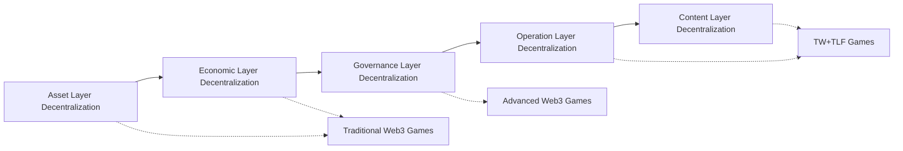

# 5.2 Differences from Existing Web3 Games

Compared to existing Web3 games, the TW+TLF protocol provides a deeper level of decentralized experience.

## 5.2.1 Decentralization Depth Comparison

As shown, traditional Web3 games mainly achieve decentralization at the asset level, advanced Web3 games add some degree of governance decentralization, while TW+TLF games achieve comprehensive decentralization including the operation and content layers.

## 5.2.2 Decentralization Level Comparison of Different Web3 Game Types

| **Decentralization Level** | **NFT Games** | **Chain Games/GameFi** | **DAO Games** | **TW+TLF Games** |
|------------------|--------------|----------------|--------------|-----------------|
| **Asset Ownership** | ★★★★☆ | ★★★★☆ | ★★★★★ | ★★★★★ |
| **Economic System** | ★☆☆☆☆ | ★★★★☆ | ★★★★☆ | ★★★★★ |
| **Governance Decisions** | ☆☆☆☆☆ | ★★☆☆☆ | ★★★★☆ | ★★★★★ |
| **Operation Logic** | ☆☆☆☆☆ | ★☆☆☆☆ | ★★☆☆☆ | ★★★★★ |
| **Content Creation** | ☆☆☆☆☆ | ★☆☆☆☆ | ★★☆☆☆ | ★★★★☆ |
| **Community Autonomy** | ★☆☆☆☆ | ★★☆☆☆ | ★★★☆☆ | ★★★★★ |

As shown in the table, TW+TLF games achieve a higher degree of decentralization in almost all aspects, especially making breakthrough progress in operation logic and content creation.

## 5.2.3 Core Innovations

Compared to existing Web3 games, the core innovations of the TW+TLF protocol are:

1. **AI Agent-driven Decentralized Operation**: Eliminates reliance on centralized servers
   - Existing Chain Games: Game logic still runs on centralized servers
   - TW+TLF: Game logic is executed locally by AI agents, with only verification on-chain

2. **Event NFTs and Voting Mechanism**: Achieves decentralized governance at the content level
   - Existing DAO Games: Governance mainly limited to parameter adjustments and resource allocation
   - TW+TLF: Governance extends to game content itself, with players collectively deciding the evolution of the game world

3. **MCP Tool Integration**: Simplifies complex blockchain interactions, improving user-friendliness
   - Existing Web3 Games: Users need to directly face complex blockchain operations
   - TW+TLF: MCP tools provide natural language interfaces, lowering the barrier to entry

4. **Self-organizing Evolution System**: Enables the game world to self-evolve based on player decisions
   - Existing Web3 Games: Content updates still rely on development teams
   - TW+TLF: Content updates are automatically generated by the event chain system based on player decisions

5. **Multi-layer Protocol Integration**: Improves system robustness through protocol layering and interoperability
   - Existing Web3 Games: Usually focus on single-layer blockchain integration
   - TW+TLF: Comprehensive integration of complete solutions from local computation to on-chain verification

## 5.2.4 User Experience Comparison

TW+TLF games also surpass existing Web3 games in user experience:

1. **Entry Barrier**:
   - Existing Web3 Games: Requires understanding concepts like crypto wallets and Gas fees
   - TW+TLF: MCP tools hide technical complexity, providing an experience closer to traditional games

2. **Game Pace**:
   - Existing Web3 Games: Block confirmation times limit game pace
   - TW+TLF: Local AI agents provide instant feedback, with state updates confirmed asynchronously

3. **Interaction Mode**:
   - Existing Web3 Games: Interactions are often interrupted by blockchain operations
   - TW+TLF: Natural language and intent expression create smooth interaction experiences

4. **Community Interaction**:
   - Existing Web3 Games: Communities are usually limited to trading and simple voting
   - TW+TLF: Deep content collaboration and event creation form stronger community bonds

## 5.2.5 Economic Model Innovation

TW+TLF games also feature significant economic model innovations:

1. **Value Source**:
   - Existing Web3 Games: Value mainly comes from scarcity and speculation
   - TW+TLF: Value mainly comes from creative contributions and governance participation

2. **Token Design**:
   - Existing Web3 Games: Simple utility tokens or governance tokens
   - TW+TLF: Multi-level token ecosystem, including main governance tokens, character tokens, event tokens, and resource tokens

3. **Incentive Mechanisms**:
   - Existing Web3 Games: Incentives often favor short-term speculation
   - TW+TLF: Design favors long-term participation and contribution

These economic model innovations enable TW+TLF games to establish more sustainable value creation and distribution systems, reducing speculative volatility and encouraging genuine participation.
