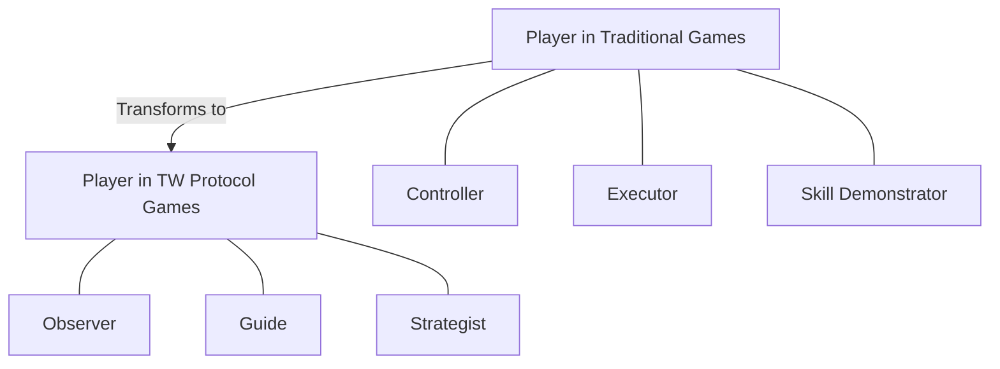

# 6.1 Core Concept: AI Agents Fully Control Characters

## 6.1.1 New Paradigm of Character Autonomy

In decentralized Web3 games based on the TW protocol, character behavior is entirely controlled by AI agents ("Weavers") running locally on players' devices. Players no longer directly control character actions but experience the game by observing the decisions made by AI agents based on character traits and the game environment.

This fundamental shift can be understood through the following comparison:

| **Traditional Game Mode** | **TW Protocol Game Mode** |
|----------------|--------------------|
| Players directly control character actions | AI agents act autonomously based on character traits |
| Characters are extensions of player will | Characters are independent virtual entities |
| Character behavior consistency depends on players | Character behavior consistency is ensured by AI |
| Character abilities limited by player skills | Character abilities determined by virtual attributes |
| Immersion comes from control | Immersion comes from story development and character growth |

The core objectives of this design include:

1. **Decentralization and Autonomy**: Character behavior logic does not rely on centralized servers, running entirely locally and independently.
2. **Character Independence**: Granting game characters true "virtual life" characteristics, with behaviors based on their own attributes and environmental context.
3. **Authentic Virtual World**: Creating a game environment closer to the real world, where each character has unique behavior patterns and decision logic.

## 6.1.2 Player Role Transformation

In TW protocol games, the player's role undergoes a fundamental transformation:

This transformation does not simply reduce player involvement but shifts the player's focus from micro-operations to macro-decision making and strategic planning, offering a new gaming experience:

1. **From "What to Do" to "What to Be"**: Player focus shifts from controlling specific actions to shaping the character's essence and traits.
2. **From "Reacting" to "Predicting"**: Players move from reacting to game events to predicting and guiding the development of the game world.
3. **From "Skill" to "Strategy"**: Game challenges shift from hand-eye coordination tests to thoughtful strategic planning.

## 6.1.3 AI Agent Decision Autonomy

In the TW protocol, AI agents have a high degree of decision-making autonomy, but this autonomy is within specific frameworks and constraints:

1. **Character Attribute Constraints**: AI agent decisions are constrained by preset character attributes, such as personality traits and skill levels.
2. **Player Intent Guidance**: Players influence AI agent decision tendencies through high-level intent expression.
3. **Environmental Feedback Adjustment**: AI agents dynamically adjust their decision strategies based on environmental feedback.
4. **Behavior Consistency Requirements**: AI agents need to maintain long-term consistency in character behavior.

This design creates a balance: AI agents have enough autonomy to make character behavior authentic and natural, while being sufficiently constrained to ensure game experience coherence and playability.

## 6.1.4 From Control to Cultivation

One of the most important transformations brought by the TW protocol is the fundamental change in the relationship between players and game characters: from direct control to cultivation and guidance.

In traditional games, characters are tools or avatars of players; in TW protocol games, characters are more like virtual lives cultivated by players, with their own "personalities" and "thoughts." Players influence character behavior by setting initial traits, long-term goals, and values, rather than directly controlling every specific action.

This relationship transformation creates deeper emotional connections and richer narrative possibilities, making the gaming experience more akin to cultivating a virtual companion or observing the growth of an independent life, rather than simple control and execution.
