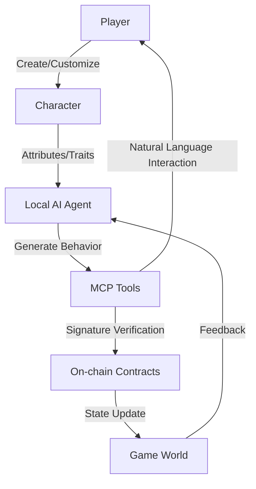

# 6.2 Technical Implementation

Achieving complete AI agent control over characters requires a complex and sophisticated technical architecture, particularly combining advanced MCP tools with smart contract verification mechanisms.

## 6.2.1 AI Agent Behavior Decision Mechanism

The AI agent's behavior decision process can be divided into the following key steps:

1. **Information Collection**: Gather data on character attributes, environmental state, historical behavior, etc.
2. **Intent Formation**: Form behavioral intentions based on collected information.
3. **Behavior Planning**: Convert intentions into specific behavior sequences.
4. **Execution Verification**: Check if behaviors comply with character capabilities and game rules.
5. **Behavior Submission**: Submit verified behaviors to the blockchain.

This decision process is implemented through a complex neural network model that integrates the following technologies:

- **Reinforcement Learning Algorithms**: Optimize character decision processes through reward mechanisms.
- **Context Awareness System**: Evaluate current game environment and character state.
- **Rule Constraint Layer**: Ensure all behaviors comply with the game world's physical and logical rules.
- **Personality Simulation Module**: Influence decision preferences based on preset character traits.

## 6.2.2 Key Role of MCP Tools

The Model Context Protocol (MCP) tools play a crucial role in the TW protocol, serving as the bridge between AI agents and blockchain smart contracts, while also being a key technology for ensuring AI behavior safety and consistency.



MCP tools provide the following core functionalities:

1. **Behavior Intent Recognition**:
   - Understand player's character development intentions expressed through natural language.
   - Convert natural language instructions into behavior constraints for AI agents.

2. **Blockchain Interface Abstraction**:
   - Simplify interaction processes with smart contracts.
   - Manage reading and writing of on-chain data.

3. **Behavior Verification and Signing**:
   - Ensure AI-generated behaviors comply with character capabilities and game rules.
   - Securely use player's private key to sign behaviors.

4. **Character Behavior Interpretation**:
   - Explain to players the reasons behind AI agent's specific decisions.
   - Provide interpretability analysis of character behaviors.

## 6.2.3 Comparison of MCP Tools with Traditional AI Systems

| **Feature** | **Traditional AI Systems** | **MCP Tool Enhanced AI Systems** |
|----------|----------------|-----------------------|
| **Blockchain Integration** | Limited or none | Native support for multi-chain interaction |
| **Smart Contract Interaction** | Requires dedicated interface | Built-in contract ABI parsing and invocation |
| **Privacy Protection** | Relies on centralized servers | Local computation and verification |
| **Intent Understanding** | Limited to predefined commands | Natural language understanding and intent extraction |
| **Multimodal Interaction** | Usually single modality | Supports text, voice, image, and other interaction modes |
| **Behavior Interpretability** | Limited or black box | Highly transparent decision explanation |
| **Scalability** | Fixed feature set | Dynamically expandable toolset |

## 6.2.4 Behavior Generation Model

The core of AI agent behavior generation is a complex multi-layer neural network with the following basic architecture:

```
Input Layer:
  - Character attribute vector [a₁, a₂, ..., aₙ]
  - Environment state vector [e₁, e₂, ..., eₘ]
  - Historical behavior sequence [b₁, b₂, ..., bₖ]
  - Player intent constraints [i₁, i₂, ..., iⱼ]

Hidden Layers:
  - Feature extraction layer
  - Context understanding layer
  - Behavior planning layer
  - Result prediction layer

Output Layer:
  - Behavior decision vector [d₁, d₂, ..., dₚ]
  - Decision confidence [c₁, c₂, ..., cₚ]
```

The mathematical model for behavior generation can be represented as:

$$B_t = f_{\theta}(A_t, E_t, H_{t-k:t-1}, I_t)$$

Where:
- $B_t$ is the behavior decision at time $t$
- $A_t$ is the character attribute vector
- $E_t$ is the environment state vector
- $H_{t-k:t-1}$ is the historical behavior sequence
- $I_t$ is the player intent constraints
- $f_{\theta}$ is the neural network model with parameters $\theta$

## 6.2.5 Natural Language to On-chain Behavior Conversion Process

Here is a complete example of the process where player's natural language interaction with AI agent is converted into on-chain behavior:

1. **Player Input**:
   ```
   "I want my character to focus more on exploring the northern mysterious ruins, seeking ancient magical knowledge, while remaining cautious to avoid danger"
   ```

2. **MCP Tool Intent Extraction**:
   ```json
   {
     "primary_goal": "knowledge_acquisition",
     "target_location": "northern_ruins",
     "focus_area": "ancient_magic",
     "risk_tolerance": "low",
     "time_horizon": "medium_term"
   }
   ```

3. **AI Agent Behavior Constraint Update**:
   ```json
   {
     "location_preference": {
       "northern_ruins": 0.85,
       "other_locations": 0.15
     },
     "action_weights": {
       "explore": 0.65,
       "study": 0.20,
       "combat": 0.05,
       "social": 0.10
     },
     "risk_avoidance": 0.75,
     "knowledge_priority": {
       "ancient_magic": 0.80,
       "other_knowledge": 0.20
     }
   }
   ```

4. **Specific Behavior Generation** (after 3 game days):
   ```json
   {
     "action_type": "EXPLORE",
     "target": {
       "location_id": "ruins_of_alzanir",
       "coordinates": [2145, 873]
     },
     "approach": "STEALTH",
     "focus": "MAGICAL_ARTIFACTS",
     "duration": 4,
     "contingency": {
       "if_danger": "RETREAT",
       "danger_threshold": 35
     }
   }
   ```

5. **MCP Tool On-chain Interaction**:
   ```json
   {
     "contract": "GameWorld",
     "method": "submitCharacterAction",
     "params": {
       "characterId": "0x7a2b...",
       "actionType": 3,
       "locationId": "0x45fa...",
       "approachMode": 2,
       "focusTarget": 7,
       "durationHours": 4,
       "contingencyPlan": [1, 35]
     },
     "gasLimit": 150000
   }
   ```

6. **Execution Result Feedback**:
   ```json
   {
     "success": true,
     "discovered": [
       {
         "item_id": "0x3f7c...",
         "name": "Charred Magic Scroll",
         "rarity": "uncommon"
       }
     ],
     "experience_gained": 45,
     "knowledge_increased": {
       "ancient_magic": 12,
       "ruins_lore": 8
     },
     "status_effects": [
       {
         "type": "minor_fatigue",
         "duration": 2
       }
     ]
   }
   ```

7. **MCP Tool Player Feedback**:
   ```
   Your character carefully explored the northern ruins of Alzanir. By proceeding cautiously, several dangerous traps were avoided, and a charred ancient magic scroll was discovered. Although the scroll is partially damaged, it still increased understanding of ancient magic. The exploration lasted four hours, leaving the character slightly fatigued but with valuable knowledge. Would you like to continue deeper exploration, or return to a safe area to study the discovered scroll?
   ```

This example demonstrates how MCP tools convert player's high-level intentions into AI agent behavior constraints, which then generate specific behaviors, ultimately executing through blockchain interaction and providing feedback in a complete process.
