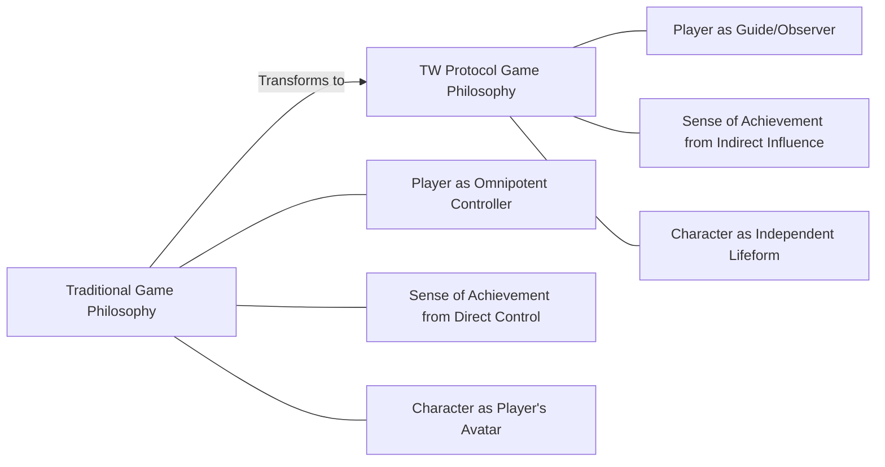

# 6.4 Philosophical Meaning: From Controller to Observer

The design of the TW protocol is not only a technological innovation but also represents a significant shift in game philosophy, challenging the fundamental assumption of "player as controller" in traditional games.

## 6.4.1 Philosophical Shift in Gaming Experience

This philosophical shift has profound impacts on game design and player experience:

1. **From "Control" to "Coexistence"**:
   - In traditional games, players fully control characters, while in TW protocol games, players establish an interactive coexistence relationship with characters.
   - The gaming experience shifts from domination to collaboration and guidance.

2. **From "Action" to "Observation"**:
   - Game enjoyment no longer solely comes from action execution but from observing characters make decisions based on their own traits.
   - Creates an immersive experience similar to watching movies or reading novels, but retains interactivity and influence.

3. **From "Skill Testing" to "Life Simulation"**:
   - Games no longer focus on testing players' reaction speed and operational skills.
   - Instead, they focus on authentic simulation and organic development of character life journeys.

## 6.4.2 Challenges to Traditional Game Theories

The TW protocol challenges several core game theory concepts:

1. **Player Immersion**:
   - Traditional theory suggests direct control enhances immersion.
   - The TW protocol proves that observing independent lifeforms can create new forms of immersion.

2. **Conflict Between Gameplay and Narrative**:
   - In traditional theory, gameplay and narrative are often seen as mutually constraining.
   - The TW protocol achieves natural unity of gameplay and narrative through AI agent behavior.

3. **Challenge and Sense of Achievement**:
   - In traditional games, challenges come from operational difficulty.
   - In the TW protocol, challenges come from strategic planning and character development.

4. **Player Freedom**:
   - Traditional theory equates freedom with the number of operational choices.
   - The TW protocol redefines freedom as the depth and breadth of influence.

## 6.4.3 Reflections on the Relationship Between Reality and Virtuality

The TW protocol game mode provokes deep thinking about the relationship between reality and virtual worlds:

1. **Creator and Created Relationship**:
   - Players create characters but do not directly control their behavior.
   - Similar to parent-child or creator-work relationships.
   - Raises thoughts about creative responsibility and free will.

2. **Simulation of Free Will**:
   - The "autonomy" exhibited by AI agents is a simulation of real free will.
   - Creates seemingly non-deterministic behavior in a deterministic system.
   - Sparks discussions about the nature of consciousness and free will.

3. **Observation Changes the Observed**:
   - Players' intentions and expectations indirectly shape character behavior.
   - Reflects how observation itself affects the observed object.
   - Resonates philosophically with the observer effect in quantum physics.

4. **Virtual Identity and Real Self**:
   - Characters are no longer direct mappings of players but independent entities.
   - Raises thoughts about virtual identity, self-extension, and digital existence.
   - Challenges the concept of player-character unity in traditional games.

## 6.4.4 From Simulation to Authentic Experience

The TW protocol fundamentally changes the concept of "authenticity" in games:

1. **Mechanical Simulation vs. System Authenticity**:
   - Traditional games pursue sensory and physical-level simulation.
   - The TW protocol pursues system-level authenticity and emergent behavior.

2. **Preset Narrative vs. Generated Experience**:
   - In traditional games, "authenticity" is an illusion carefully orchestrated by designers.
   - In the TW protocol, "authenticity" comes from the system's self-organization and emergent properties.

3. **Control Illusion vs. Influencing Reality**:
   - Traditional games provide the illusion of complete control.
   - The TW protocol provides limited but deep influence, closer to real life.

## 6.4.5 Significance of New Player-Character Relationships

The new player-character relationship pioneered by the TW protocol has profound cultural and social significance:

1. **From Possession to Respect**:
   - Game characters transform from tools possessed by players to respected subjects.
   - Cultivates ethical relationships with virtual entities, potentially influencing future AI ethics.

2. **From Performance to Co-creation**:
   - The gaming experience shifts from unilateral performance by players to co-creation between players and AI.
   - Pioneers a new paradigm of human-machine collaborative creativity.

3. **From Control to Adaptation**:
   - Games no longer reinforce the desire for control but cultivate adaptation and guidance abilities.
   - May help players develop useful skills in an increasingly uncertain real world.

These philosophical-level transformations make the TW protocol not just a gaming technology but a new paradigm of digital interaction, challenging our fundamental understanding of games, virtual worlds, and even subjectivity and free will.
