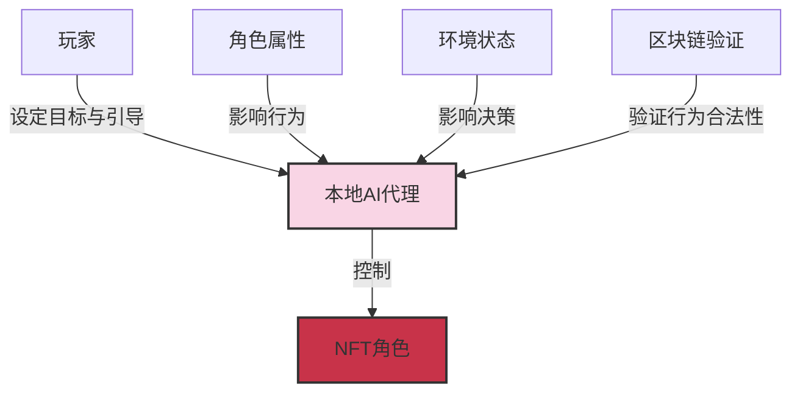

# Flatworld AI 代理系统

## 🤖 AI代理概述

在 Flatworld AI 中，每个 NFT 角色都由一个自主的 AI 代理（"织网者"）控制，而非由玩家直接操作。这些 AI 代理基于 TW 协议（The Weavers Protocol）运行，创造了一个由AI代理驱动的自主社会。

### 核心理念

AI 代理系统颠覆了传统游戏的控制模式，实现以下核心理念：

- **角色自主性**：角色由 AI 代理根据其属性和环境自主行动
- **玩家角色转变**：玩家从操控者转变为观察者和引导者
- **去中心化逻辑**：游戏逻辑在玩家本地运行，不依赖中心服务器
- **真实的虚拟生命**：创造具有持续性和一致性的"虚拟生命"体验



## 🧠 AI代理运行机制

### 决策系统

AI 代理通过复杂的决策系统来控制角色行为：

1. **属性驱动行为**：角色的基础属性（勇气、智慧、感知）直接影响 AI 的决策倾向
2. **环境感知**：AI 代理分析角色所处的环境和上下文
3. **目标导向**：基于长期目标和当前状态制定行动计划
4. **行为验证**：生成的行为通过智能合约验证其合法性

#### 决策流程示例

```
1. 感知环境 → 角色位于小镇A，繁荣度低，周围有小镇B，繁荣度高
2. 评估状态 → 角色感知值为35，勇气值为42，迁移最大步长为4
3. 分析选项 → 可选择留在小镇A或迁移到小镇B
4. 决策 → 基于角色特性，决定迁移到小镇B寻求更好机会
5. 执行行动 → 提交迁移请求到智能合约
6. 结果验证 → 合约验证行为合法性并执行迁移
```

### 个性化表现

不同角色的 AI 代理会展现不同的"性格"和行为模式：

- **勇气高的角色**：更倾向于探索、冒险和主动社交
- **智慧高的角色**：更倾向于思考、分析和策略性决策
- **感知高的角色**：更敏感于环境变化，反应更迅速

这种个性化确保了即使在相似环境中，不同角色也会展现出独特的行为和决策模式。

## 🔍 玩家与AI代理的交互

### 从操控到引导

在 Flatworld AI 中，玩家的角色从直接操控转变为引导和培养：

| 传统游戏中的玩家 | Flatworld AI 中的玩家 |
|-----------------|---------------------|
| 直接控制角色的每一个动作 | 设定目标和意图，观察 AI 自主行动 |
| 关注微观操作和技能表现 | 关注宏观策略和角色发展 |
| 角色作为玩家的工具或化身 | 角色作为独立的虚拟生命体 |
| 游戏体验来源于操控感 | 游戏体验来源于观察和引导 |

### 引导机制

玩家通过以下方式引导 AI 代理的行为：

1. **属性培养**：通过提升特定属性引导角色发展方向
2. **环境选择**：选择合适的小镇和社交环境
3. **目标设定**：为角色设定长期目标和价值取向
4. **迁移决策**：决定角色是否应该迁移到新的小镇

这种引导是间接的，给予 AI 代理足够的自主性，同时确保角色的发展符合玩家的期望。

## 🔄 AI行为与区块链验证

### 行为验证系统

为确保游戏世界的一致性和公平性，所有 AI 代理生成的行为都必须通过区块链智能合约的验证：

1. **行为生成**：AI 代理在本地生成角色行为
2. **参数检查**：智能合约验证行为参数是否在有效范围内
3. **规则验证**：确保行为符合游戏规则（如迁移距离不超过角色能力）
4. **状态更新**：验证通过的行为被应用到游戏世界，更新链上状态

### 安全机制

为防止作弊和异常行为，系统实施了多层安全机制：

- **链上验证**：所有关键行为必须通过链上智能合约验证
- **一致性检查**：确保角色行为与其属性和历史一致
- **异常检测**：识别和拒绝不符合正常模式的行为

## 💾 AI代理的记忆与学习

### 记忆系统

AI 代理具有"记忆"功能，能够记住过去的经历和决策：

- **短期记忆**：记录最近的事件和互动
- **长期记忆**：保存重要经历和关系
- **情境记忆**：理解并记住特定环境下的适应策略

这种记忆系统确保了角色行为的连贯性和发展的逻辑性。

### 学习与适应

AI 代理能够从经验中学习和适应：

1. **环境适应**：调整行为以适应不同小镇的环境
2. **社交学习**：从与其他角色的互动中学习
3. **结果评估**：评估过去决策的结果，优化未来决策
4. **角色成长**：随着经验积累表现出更成熟的决策模式

## 📱 技术实现

### 本地计算模型

AI 代理系统基于本地计算模型实现：

- **去中心化**：AI 逻辑在玩家设备本地运行，不依赖中央服务器
- **响应性**：本地计算确保反应迅速，不受网络延迟影响
- **私密性**：角色的详细行为模式和决策过程保留在本地
- **自主性**：即使离线，AI 也能继续发展角色的"生活"

### MCP工具接口

AI 代理通过 MCP（Model Context Protocol）工具与区块链安全交互：

- **安全通道**：提供 AI 与区块链的安全交互通道
- **数据验证**：确保交互数据的完整性和真实性
- **行为提交**：将本地生成的行为安全提交到链上
- **状态同步**：保持本地 AI 状态与链上状态的同步

## 🎭 角色扮演与角色发展

### 角色扮演

AI 代理实现了真正的角色扮演体验：

- **性格一致性**：AI 保持角色行为的长期一致性
- **适当反应**：根据角色特性对事件做出合适反应
- **关系建立**：与其他角色建立和维护关系
- **角色成长**：随着经历的积累展现性格的发展和变化

### 叙事生成

AI 代理共同创造了一个持续发展的叙事：

- **个人故事**：每个角色都有其独特的生活轨迹和故事
- **社会互动**：角色之间的互动创造出复杂的社会网络
- **历史事件**：重要决策和互动被记录为小镇的历史
- **集体叙事**：所有角色共同创造世界的总体叙事

## 🔮 未来发展

AI 代理系统设计为可扩展的框架，未来可能加入以下功能：

### 进阶功能

- **深度学习模型**：更复杂的学习机制使角色能够从更广泛的经验中学习
- **情感系统**：模拟情感状态及其对决策的影响
- **社交网络**：更复杂的社交关系网络和群体动态
- **文化传播**：模拟文化元素如何在角色间传播和演变

### 玩家互动扩展

- **引导机制增强**：更丰富的方式让玩家影响角色发展
- **叙事参与**：让玩家参与塑造世界叙事的重要时刻
- **AI-玩家共创**：AI 和玩家共同创造游戏体验
- **社区互动**：多个玩家的角色形成复杂的社会互动网络

通过这个实验性的 AI 代理系统，Flatworld AI 创造了一个真正自主的虚拟社会，挑战了传统游戏的界限，开创了AI代理、区块链和游戏交叉的全新领域。
