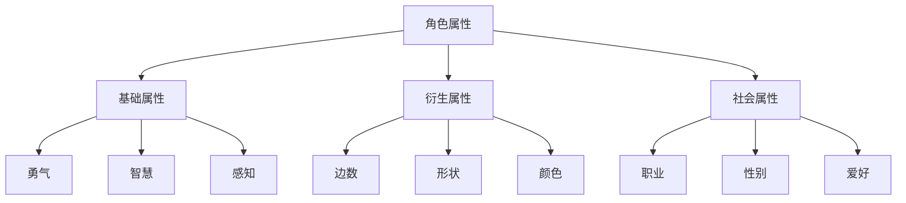

# Flatworld AI 角色系统

## 📊 角色概述

在 Flatworld AI 中，每个角色都是一个独特的 NFT，由 AI 代理自主控制。角色具有多个属性和特征，决定其在平面世界中的形状、能力和社会地位。

### 角色本质

每个 Flatworld 居民都是一个几何形状，从简单的三角形到复杂的多边形，再到接近完美的圆形。形状的复杂程度（边数）反映了角色在社会中的地位和能力水平。



## 🧬 角色属性系统

### 基础属性

每个角色都有三个核心属性，这些属性决定了角色的基本能力和行为倾向：

| 属性 | 范围 | 描述 | 游戏影响 |
|-----|-----|------|---------|
| **勇气** | 1-99 | 表示角色的冒险精神和面对风险的态度 | 影响迁移能力和社交主动性 |
| **智慧** | 1-99 | 表示角色的思考能力和知识水平 | 影响决策质量和小镇繁荣度 |
| **感知** | 1-99 | 表示角色观察和理解环境的能力 | 影响探索范围和信息获取 |

这些属性不仅影响角色的行为决策，还与游戏机制紧密相连：

- **勇气**：决定角色迁移到其他小镇时的勇气消耗。勇气值越高，角色越能承受远距离迁移的挑战。
- **智慧**：影响角色对小镇繁荣度的贡献，每10点智慧值为小镇增加1点繁荣度。
- **感知**：决定角色的移动能力，每10点感知能力允许角色迁移1个小镇距离。

### 衍生属性

基于三个基础属性的组合，角色还具有以下衍生属性：

#### 边数

边数是角色形状的复杂程度，由三个基础属性的总和决定：

```
总属性值 = 勇气 + 智慧 + 感知

边数范围：
- 总属性值 ≤ 150：0-50边
- 总属性值 151-200：51-70边
- 总属性值 201-250：71-90边
- 总属性值 > 250：91-99边
```

边数越多，角色的形状越接近圆形，在社会中的地位越高。

#### 形状类别

基于边数，角色被分为四种基本形状：

| 边数范围 | 形状类别 | 社会地位 |
|---------|---------|---------|
| 0-50 | 三角形 | 工人阶层 |
| 51-70 | 四边形 | 中产阶级 |
| 71-90 | 多边形 | 精英阶层 |
| 91-99 | 接近圆形 | 贵族阶层 |

#### 颜色

角色可以拥有0-16种不同的颜色指数，这是一种纯粹的美学特性，不影响游戏机制但增加了个性化元素。

### 社会属性

角色还具有一系列定义其在社会中角色的属性：

- **职业**：0-7种不同的职业类型，影响角色的日常活动和互动模式
- **性别**：二元性别系统（0或1）
- **DNA**：1-580范围内的唯一值，影响角色的外观和行为细节
- **爱好**：0-20种不同的爱好，影响角色的休闲活动选择
- **故事**：每个角色都有一个独特的故事背景，存储为链上数据

## 🔄 属性成长与转换

Flatworld AI 实现了一个创新的属性转换系统，允许玩家在保留角色的同时优化其属性分配。

### 属性封装

玩家可以将角色的属性点"封装"为ERC20代币：

- **勇气代币 (COURAGE)**：从角色中提取勇气点
- **智慧代币 (WISDOM)**：从角色中提取智慧点
- **感知代币 (PERCEPTION)**：从角色中提取感知点

封装过程：
1. 选择要提取的属性类型
2. 指定提取数量（1-99）
3. 系统将从角色中减去相应属性点
4. 玩家获得等值的ERC20代币（1属性点 = 10^18代币单位）

### 属性解封

玩家也可以将代币"解封"回角色属性：

1. 选择要增加的属性类型
2. 指定增加数量（1-99）
3. 系统将销毁相应代币
4. 角色获得等值的属性点

### 属性限制

- 单个属性最小值：1（不能低于此值）
- 单个属性最大值：99（不能高于此值）
- 封装时必须保留至少1点属性值
- 解封时总属性值不能超过属性上限

## 🏙️ 城镇关系

每个角色都属于一个特定的小镇，这种关系影响着角色的生活环境和机会：

### 初始分配

新铸造的角色被分配到指定的小镇，成为该小镇的居民：
- 角色的智慧值会增加小镇的繁荣度
- 小镇的繁荣度影响居民的生活质量和机会

### 迁移机制

角色可以从一个小镇迁移到另一个小镇：
1. 迁移消耗勇气值，距离越远消耗越大
2. 迁移距离受感知值限制，每10点感知值允许迁移1个小镇距离
3. 迁移时，角色的智慧值会从原小镇的繁荣度中减去，并添加到新小镇的繁荣度中
4. 成功迁移后，角色成为新小镇的居民

## 🎨 角色外观

角色的视觉表现由其基本属性决定，这些属性通过智能合约转换为独特的几何形状：

### 视觉元素

- **边数**：决定形状的复杂程度，从三角形到近似圆形
- **颜色**：角色的主色调，可以通过支付费用更改
- **尺寸**：与属性总和相关，属性越高，尺寸越大
- **装饰元素**：基于DNA和爱好的独特视觉特征

### 形象演变

随着属性的变化，角色的外观会动态演变：
- 属性提升可能使三角形逐渐演变为四边形，再到多边形，最终接近圆形
- 形状变化反映了角色在平面社会中地位的提升
- 这种视觉演变为玩家提供了直观的成长反馈

## 🧩 游戏玩法应用

角色属性系统与游戏核心玩法紧密结合：

### 社会互动

- 形状决定角色在社会中的地位和互动方式
- 拥有更多边的角色能够与更广泛的社会阶层互动
- 形状相似的角色倾向于形成社交圈子和社区

### 探索能力

- 感知值高的角色能够发现更远的小镇和隐藏机会
- 智慧值高的角色更容易理解和利用发现的信息
- 勇气值高的角色更愿意探索未知领域

### 经济参与

- 不同职业的角色在经济活动中扮演不同角色
- 角色可以通过其技能和特性在小镇经济中找到自己的位置
- 小镇的繁荣度影响角色的经济机会

### AI行为模式

- 角色的属性直接影响AI代理的决策倾向
- 高勇气值的AI更倾向于冒险行为
- 高智慧值的AI更倾向于思考和分析
- 高感知值的AI更敏感于环境变化

通过这个多层次的角色系统，Flatworld AI创造了一个充满活力和多样性的虚拟社会，其中每个角色都有其独特的特性、能力和发展轨迹。玩家的任务是了解并引导这些自主角色，见证他们在平面世界中的成长和演变。
