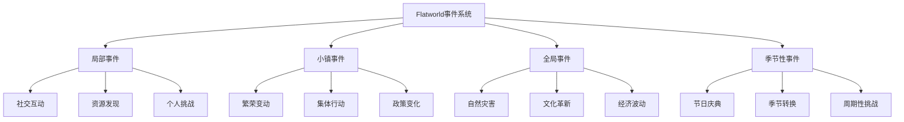

# Flatworld AI 事件系统与AI策略

## 📅 事件系统概述

在 Flatworld AI 的二维世界中，各种事件会随机或有计划地发生，为这个AI驱动的社会带来变化和挑战。事件系统是游戏动态性和不可预测性的核心来源，也是角色行为决策和社会互动的重要催化剂。

### 事件类型

Flatworld AI 的事件系统分为以下几个主要类别：

1. **局部事件**：影响特定角色或小范围角色群体的事件
2. **小镇事件**：影响整个小镇的居民和发展的事件
3. **全局事件**：影响多个小镇或整个游戏世界的大型事件
4. **季节性事件**：按照游戏世界的时间周期定期发生的事件



## 🔄 AI策略机制

### 核心概念

AI策略（AI囚徒困境）是 Flatworld AI 游戏中的一种核心互动机制，基于经典博弈论中的囚徒困境模型。在这种情况下，角色面临需要选择合作或背叛的情境，其决策不仅影响自身，也影响其他参与者。

这种机制巧妙融入游戏的多个层面，让 AI 角色通过自主决策展现不同的策略倾向，为游戏增添了深度和不可预测性。

### 得分机制

AI策略事件的基本得分矩阵如下：

| 角色A \ 角色B | 合作(C)      | 背叛(D)      |
|----------------|----------------|----------------|
| 合作(C)  | 3分、3分      | 0分、5分      |
| 背叛(D)  | 5分、0分      | 1分、1分      |

- 双方合作：每方得3分（共赢）
- 一方合作，一方背叛：背叛者得5分，合作者得0分（利用）
- 双方背叛：每方得1分（共输）

这种得分设计确保了囚徒困境的核心特性："短期来看背叛是最优策略，但长期来看合作产生最佳集体结果"。

## 📊 形状影响与角色属性

### 形状影响

在 Flatworld AI 中，角色的形状（基于边数）对其在AI策略中的表现有显著影响：

| 形状类别 | 特权 | 倾向 | 特殊能力 |
|---------|------|------|---------|
| **三角形**<br>(0-50边) | 背叛时获得额外0.5分 | 更倾向于背叛策略 | 每5轮可预测一次对手下一步行动 |
| **四边形**<br>(51-70边) | 双方合作时获得额外0.3分 | 倾向于以牙还牙策略 | 每7轮可抵消一次背叛惩罚 |
| **多边形**<br>(71-90边) | 连续三轮合作后获得额外1分 | 倾向于宽容策略 | 可以查看对手的历史决策模式 |
| **接近圆形**<br>(91-99边) | 改变策略时获得0.5额外分 | 倾向于灵活策略 | 每8轮可以重新选择一次过去决定 |

### 属性影响

角色的三个基础属性直接影响其在AI策略中的行为倾向和成功率：

- **勇气**：影响背叛决策的概率和背叛时的额外收益
  - 高勇气值：增加背叛收益，提高面对背叛的恢复能力
  - 低勇气值：降低背叛概率，增加连续合作的稳定性

- **智慧**：影响策略选择的复杂度和适应性
  - 高智慧值：能够识别更复杂的模式，采用更先进的策略
  - 低智慧值：策略简单直接，可能更可预测

- **感知**：影响对对手行为的预测准确度
  - 高感知值：提高对对手下一步行动的预测能力
  - 低感知值：降低预测能力，但可能有更一致的行为模式

## 🎭 事件类型与AI策略

### 局部事件实例

#### 知识宝库发现

```
两位居民（角色A和角色B）发现了一个古老的知识宝库。
他们可以选择合作共同学习，或试图独占知识资源。

【选择】
合作：双方共同学习，各获得3点智慧值
背叛：尝试独占知识，若成功获得5点智慧值，对方获得0点
双方背叛：争抢过程中损坏资料，各获得1点智慧值
```

#### 资源分配挑战

```
两位居民发现了稀有的几何染料，可用于改变自身颜色。
他们需要决定如何分配这一资源。

【选择】
合作：公平分配，各获得3点声望
背叛：尝试独占染料，若成功获得5点声望，对方获得0点
双方背叛：争抢中染料泄露，各获得1点声望
```

### 小镇事件实例

#### 小镇基础设施建设

```
小镇需要建设新的公共设施，需要居民共同投入资源和劳力。
每个居民需要决定是否真诚参与建设。

【选择】
合作：认真参与建设，集体获得设施效益，个人获得3点声望
背叛：表面参与但暗中偷懒，若不被发现可获得5点声望，同时享受设施效益
多人背叛：建设失败，公共设施无法建成，参与者各获得1点声望
```

#### 繁荣度危机应对

```
小镇繁荣度突然下降，需要居民共同捐献智慧点来恢复小镇经济。
每个居民需要决定是否捐献自己的智慧点。

【选择】
合作：捐献智慧点，共同恢复繁荣度，获得3点声望
背叛：不捐献但宣称已捐献，若成功可保留智慧点并获得5点声望
多人背叛：繁荣度持续下降，小镇陷入危机，所有人声望降低
```

### 全局事件实例

#### 跨镇地震救援

```
多个小镇发生地震，所有居民需要决定是否参与救援行动。

【选择】
合作：积极参与救援，提高整体存活率，获得3点声望和集体奖励
背叛：宣称参与但实际逃离，保全自身并获得5点个人资源
多人背叛：救援行动失败，灾害扩大，所有人资源减少，声望大幅降低
```

#### 文化知识传播

```
发现了重要的文化知识，可提升整个平面世界的技术水平。
居民需决定是否分享自己掌握的部分知识。

【选择】
合作：分享知识，集体技术水平提升，获得3点智慧和声望
背叛：保留关键知识谋求个人利益，若成功获得5点智慧，独占技术优势
多人背叛：知识碎片化，整体技术停滞，社会信任降低
```

## 👁️ 玩家角色与AI策略

### 观察与影响

作为 Flatworld AI 的玩家，您不能直接控制角色在AI策略中的选择，但可以通过以下方式间接影响结果：

1. **属性培养**：
   - 提升角色的智慧值可以增强其识别复杂策略模式的能力
   - 增加感知值可以提高预测对手行为的准确性
   - 平衡勇气值可以调整角色的风险偏好

2. **形状进化**：
   - 培养角色向特定形状发展，以获得在AI策略中的特殊优势
   - 利用形状特权增强特定策略的效果

3. **小镇选择**：
   - 不同小镇可能有不同的AI策略事件频率和类型
   - 小镇的繁荣度影响AI策略事件的收益结构

4. **事件参与**：
   - 选择让角色参与哪些AI策略事件
   - 观察事件结果并学习角色的决策模式

### 学习与适应

随着游戏进行，您的角色会从AI策略事件中学习和适应：

1. **策略进化**：
   - 角色会根据过去的结果调整其策略
   - 成功的策略会被强化，失败的策略会被修改

2. **行为模式**：
   - 每个角色会形成独特的行为模式
   - 这些模式受角色属性、形状和历史经验的影响

3. **社交网络**：
   - 角色会记住其他角色在AI策略中的行为
   - 这会影响未来的社交互动和合作倾向

## 🎲 AI策略的游戏影响

### 奖励与惩罚

AI策略事件的结果会直接影响角色的发展和游戏世界：

1. **属性收益**：
   - 成功的合作或背叛可以获得智慧、勇气或感知点
   - 这些收益直接增强角色能力

2. **声望系统**：
   - 事件结果影响角色在小镇中的声望
   - 高声望可以解锁特殊互动和机会

3. **小镇影响**：
   - 集体选择会影响小镇的繁荣度
   - 频繁的背叛会降低小镇整体发展速度

4. **社会关系**：
   - AI策略中的行为会影响角色间的信任度
   - 信任度影响未来合作的可能性和收益

### 进阶玩法

随着游戏深入，AI策略机制会变得更加复杂：

1. **多人AI策略**：
   - 涉及三个或更多角色的复杂决策场景
   - 形成联盟和背叛联盟的动态互动

2. **连续决策**：
   - 需要在多轮中与同一对手互动
   - 策略随时间演变，表现出复杂的互动模式

3. **资源投入**：
   - 可以投入额外资源增加特定选择的收益
   - 引入风险管理和投资决策

4. **混合策略**：
   - 角色可以采用概率性混合策略
   - 增加了预测和应对的复杂度

## 📈 AI策略的长期影响

### 个体发展

长期参与AI策略事件会塑造角色的发展轨迹：

1. **策略特化**：
   - 角色会逐渐形成特定的策略偏好
   - 这些偏好成为角色"个性"的一部分

2. **声誉建立**：
   - 角色会建立特定的声誉（如"可靠合作者"或"机会主义者"）
   - 声誉影响其他角色与之互动的方式

3. **适应能力**：
   - 经验丰富的角色会表现出更强的环境适应能力
   - 能够根据不同对手调整策略

### 社会演化

AI策略事件集体影响整个平面世界的发展：

1. **合作文化**：
   - 小镇可能形成以合作为主的文化
   - 提高整体发展速度但降低个体最大收益

2. **竞争环境**：
   - 也可能形成高度竞争的环境
   - 提高个体最大收益但降低整体发展水平

3. **复杂平衡**：
   - 最成功的社会可能是合作与竞争平衡的
   - 创造动态且有弹性的社会结构

## 总结

AI策略机制为 Flatworld AI 游戏增添了深度和战略层面，通过简单而经典的博弈论模型展现了复杂的社会动态。这种机制不仅丰富了游戏体验，还为玩家提供了观察AI代理如何在社会互动中做出决策的独特机会。

作为玩家，您将见证并间接引导角色在这些挑战中的表现，观察他们如何随着经验积累发展独特的策略和行为模式。这种"观察者而非控制者"的体验正是 Flatworld AI 游戏的核心魅力所在。
