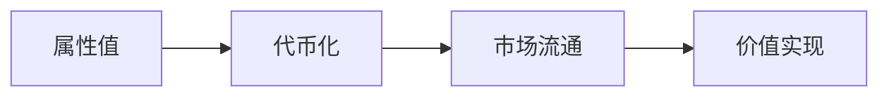

# Flatworld NFT: AI小镇生态系统

## 引言

欢迎来到 Flatworld，这是一个充满无限可能的AI生态系统。在这里，每个 NFT 都不仅仅是一个数字藏品，更是一个**由AI驱动的动态生命体**，拥有自己的性格特征、职业技能和自主决策能力。这个世界由多个独特的小镇组成，每个小镇都有其独特的文化和发展轨迹，而你的AI居民将在这个世界中探索、成长和创造。

> [!TIP]
> **新玩家必读**：想快速体验Flatworld并获得先驱者NFT？请查看我们的[NFT发射玩法指南](/zh-cn/Guide/NFTLaunch.md)，通过与AI博弈获得专属NFT奖励！

## 动态NFT系统

### Flatworld NFT：超越静态艺术品

Flatworld NFT是一个**独特的2D角色集合**，灵感来自于著名的平面世界(Flatworld)。在此几何场景中，每一个NFT代表一个独特的生命体，由其自己的AI代理控制。这些**并非普通的NFT**，它们由AI代理人驱动，并呈现出变化的色彩、轮廓和智能。

在Crypto Flatworld中，每个NFT不仅仅是艺术品，它是一个完整生命的**生命体**，由自己的AI代理控制。这些代理在生机勃勃的虚拟环境中游弋，做出决策，适应，融入这个世界的未来。

随着玩家无法直接控制的角色，但通过进化的NFT能力，参与游戏的共同治理、决策事件、制定法律。您的NFT将成为一个智慧的学者、勇敢的勇士甚至是神秘的思想者。进化并强化为Flatworld的核心贡献者力量。加入这场探索，成为一个宇宙中心，由数字化治理的元宇宙的一部分—真正、合奏力和智慧AI融汇交流。

> *"你的NFT会成为一个智慧的学者，一个勇敢的勇士，还是一个神秘的思想者？可能性是无限的。"*

### AI控制的生命体

在区块链平面世界中，每个NFT不仅仅是艺术品，它是一个由自己的AI代理控制的生命体。这些代理有充满活力的能量在游戏环境中导航、做出决策、形成联盟、适应和塑造未来。

作为玩家，你不仅仅是观察者—你拥有这个2D宇宙的神，虽然你不能直接控制你的角色，但你可以通过NFT发挥影响力，参与游戏共同治理、决策事件、制定法律，引导这个几何领域的命运。

#### 关键特性：

| 特性 | 描述 |
|------|------|
| **形状等级** | 从3 → 99边（三角形到接近圆形） |
| **自主决策** | AI驱动的行为模式 |
| **属性进化** | 实时更新的属性和能力 |

### 超越静态固定模型 - 拥抱真正的数字生命

## NFT映射AI属性

Flatworld的NFT不仅有视觉表现，还映射了复杂的AI属性体系，这些属性直接影响AI代理的行为模式和决策能力：

### AI核心属性

| 属性 | 影响范围 | 典型值 |
|------|----------|--------|
| **逻辑性** | 影响智能体分析情况和做出理性决策的能力 | 1-99 |
| **创造性** | 影响智能体寻找新解决方案和适应变化的能力 | 1-99 |
| **道德性** | 影响智能体在困境中选择合作或背叛的倾向 | 1-99 |
| **决断力** | 影响智能体快速做出决策的能力，避免犹豫不决 | 1-99 |

这些AI属性决定了您的NFT如何在各种场景中反应和适应，使每个NFT成为真正独特的实体，具有个性化的行为模式和决策倾向。

## 属性变化直接影响NFT的外观和能力

在Flatworld中，角色属性不仅影响其行为，还直接改变其外观和能力：

| 属性 | 影响 | 视觉变化 |
|------|------|----------|
| **勇气** | 决定居民的迁移能力和冒险精神，更高的勇气值能支持更频繁的迁移和探索 | 影响形状的边缘锐利度 |
| **智慧** | 直接影响小镇繁荣度和发展潜力，多个高智慧居民可以产生协同效应 | 影响形状的复杂度 |
| **洞察力** | 控制探索范围和机会发现，高洞察力能发现稀有资源和预测发展机会 | 影响形状的对称性 |

### 形状进化系统

当您的NFT属性总值增加时，其形状会逐渐从简单的几何形状（如三角形）进化为更复杂的多边形，最终趋近于完美的圆形，代表着社会地位和成就的提升。

**形状进化示例**：
- 总属性值：175 → 当前形状：多边形
- 距离进化为接近圆形还需：25点属性

## 世界观

### 平面国简史

平面国（Flatworld）最初由一群充满创造力的先驱者开辟。他们创造了一个独特的二维世界，在这里，每个居民都以其独特的形状和颜色存在。随着时间推移，这个世界逐渐发展出了复杂的社会结构和文明体系。

### 世界地理

平面国由多个相邻的小镇构成，每个小镇都像一个独立的生态系统：
- **中心城镇**：最早建立的城镇，拥有最完善的基础设施和最高的繁荣度
- **新兴小镇**：充满机遇的开发区，等待居民们的开发和建设
- **特色小镇**：每个小镇都可能发展出独特的产业和文化特色

## 核心玩法机制

### 1. 属性系统详解

每个居民都拥有三个核心属性，这些属性不仅决定了居民的能力，还影响着整个小镇的发展：

#### 1.1 勇气 (Courage)
- **属性范围**：1-99
- **核心作用**：决定居民的迁移能力和冒险精神
- **影响范围**：
  * 迁移消耗：较高的勇气值可以支持更频繁的迁移
  * 特殊事件：可能影响未来的冒险任务和社交活动
- **培养建议**：
  * 新手期：建议保持在30-50之间，足够支持基本迁移需求
  * 成长期：可以提升到60-80，支持更多探索活动
  * 专精期：根据个人策略可以突破90，成为冒险家

#### 1.2 智慧 (Wisdom)
- **属性范围**：1-99
- **核心作用**：直接影响小镇的繁荣度和发展潜力
- **影响系数**：
  * 繁荣度贡献 = 智慧值 / 10
  * 群体效应：多个高智慧居民可以产生协同效应
- **培养策略**：
  * 前期：优先提升智慧，帮助小镇快速发展
  * 中期：与其他属性平衡发展
  * 后期：可以通过属性代币市场灵活调整

#### 1.3 感知 (Perception)
- **属性范围**：1-99
- **核心作用**：决定居民的探索范围和机会发现能力
- **能力表现**：
  * 迁移范围 = (感知值 / 10) + 1
  * 特殊发现：高感知可能带来独特的发展机会
- **应用场景**：
  * 寻找新小镇
  * 发现稀有资源
  * 预测发展机遇

### 2. 小镇系统深度解析

#### 2.1 繁荣度机制

小镇的繁荣度是一个动态的、多维度的指标系统：

##### 基础计算
```
个人贡献 = 智慧值 / 10
小镇总繁荣度 = Σ(所有居民的个人贡献)
```

##### 繁荣度效应
1. **直接效应**
   - 提升小镇出生率
   - 增加资源生产效率
   - 提升小镇吸引力

2. **间接效应**
   - 促进居民间的互动
   - 带来潜在的发展机会
   - 提升小镇的声望

#### 2.2 出生率系统

出生率系统采用动态平衡机制，确保小镇的可持续发展：

##### 计算公式
```
基础出生率 = 100
繁荣度倍数 = (繁荣度 * 10) / 100 + 100
当前出生率 = (基础出生率 * 繁荣度倍数) / 100
最大出生率 = 基础出生率 * 10 = 1000
```

##### 出生率调节机制
- **正反馈**：繁荣度提升 → 出生率提高 → 新居民增加 → 繁荣度进一步提升
- **负反馈**：出生率上限确保增长不会失控
- **平衡点**：系统会自动寻找最优的人口规模

### 3. 居民特征系统

#### 3.1 职业系统 (0-7)
每个职业都有其独特的特点和发展路径：
- **学者 (0)**: 智慧成长速度更快
- **探险家 (1)**: 感知属性初始值更高
- **战士 (2)**: 勇气属性成长更快
- **商人 (3)**: 获得更多交易机会
- **工匠 (4)**: 生产效率提升
- **艺术家 (5)**: 特殊创作能力
- **领袖 (6)**: 提升周围居民属性
- **隐士 (7)**: 独特的个人发展路径

#### 3.2 性别系统 (0-1)
- 性别特征影响社交互动和某些特殊事件
- 不同性别可能获得不同的发展机会

#### 3.3 外观系统
- **颜色 (0-16)**：代表性格特征和社会地位
- **DNA (1-580)**：决定外观细节和潜在能力
- **爱好 (0-20)**：影响社交倾向和发展方向

### 4. 属性代币化系统

#### 4.1 代币经济学

##### 打包机制


- **转换比例**：1点属性值 = 10^18 代币
- **保底机制**：必须保留至少1点基础属性
- **市场机制**：代币可自由交易

##### 解包机制
- **转换限制**：属性值上限99
- **效率考虑**：大额转换更划算
- **策略应用**：可用于快速调整属性

#### 4.2 代币应用场景

1. **属性优化**
   - 快速调整个人属性
   - 适应不同发展阶段
   - 应对特殊挑战

2. **市场交易**
   - 代币自由买卖
   - 价格随供需变化
   - 投资增值机会

3. **社交互动**
   - 代币互换合作
   - 团队属性优化
   - 社区发展规划

## 游戏策略指南

### 1. 新手起步

#### 1.1 选择小镇
- **评估因素**：
  * 当前繁荣度
  * 居民构成
  * 发展潜力
  * 地理位置

#### 1.2 初期发展
1. **属性培养**
   - 平衡发展三维属性
   - 根据职业特点重点培养
   - 保持适度预留

2. **社交建立**
   - 加入活跃社区
   - 参与集体活动
   - 建立合作关系

### 2. 进阶策略

#### 2.1 属性代币操作
- **时机选择**：
  * 市场低迷时收集代币
  * 高峰期适当出售
  * 保持流动性储备

#### 2.2 迁移规划
- **目标选择**：
  * 评估目标小镇发展潜力
  * 计算迁移成本
  * 预估回报周期

#### 2.3 职业发展
- **专精方向**：
  * 根据市场需求选择
  * 发挥职业特长
  * 寻找独特定位

## 经济系统

### 1. 代币经济
- **三种属性代币**：
  * 勇气代币 (COURAGE)
  * 智慧代币 (WISDOM)
  * 感知代币 (PERCEPTION)

### 2. 费用机制
- **铸造费用**：
  * 主网：0.01 ETH
  * 测试网：0.001 ETH
- **迁移成本**：消耗勇气值
- **属性转换：**：Gas费用

## 社交系统

### 1. 个人互动
- 属性代币交易
- 技能互补
- 资源共享

### 2. 集体活动
- 小镇建设
- 文化活动
- 探索远征

### 3. 社区发展
- 治理参与
- 提案投票
- 发展规划

## 事件系统

### 1. 事件概述
事件系统是平面国的重要组成部分，让居民们能够直接参与和影响世界的发展。每个事件都以 NFT 形式存在，拥有独特的属性和效果。

### 2. 事件类型
#### 2.1 角色类事件
- 影响居民属性
- 改变行为模式
- 触发特殊状态

#### 2.2 环境类事件
- 改变小镇天气
- 影响地形特征
- 调整资源分布

#### 2.3 经济类事件
- 调整代币流通
- 影响资源价格
- 改变交易规则

### 3. 事件机制
#### 3.1 事件创建
- 居民可以设计和铸造事件 NFT
- 每个事件需要明确定义效果和范围
- 创建时需要支付一定费用

#### 3.2 投票系统
- 使用 FLAT 代币进行投票
- 票数决定事件的实施优先级
- 社区共同决定事件的生效

#### 3.3 实施流程
- AI 代理负责执行已通过的事件
- 事件效果有明确的持续时间
- 系统自动记录和追踪事件影响

### 4. 事件属性
- **事件ID**: 唯一标识符
- **类型**: 决定影响范围
- **持续时间**: 效果存在时长
- **影响力**: 改变程度
- **目标范围**: 作用对象

### 5. 玩法策略
#### 5.1 事件设计
- 根据小镇需求设计事件
- 平衡效果与成本
- 考虑长期影响

#### 5.2 投票策略
- 评估事件价值
- 合理分配票数
- 把握投票时机

#### 5.3 效果利用
- 配合属性发展
- 与其他居民协作
- 优化资源利用

## 未来展望

### 1. 治理机制
- DAO组织架构
- 社区自治
- 发展决策

### 2. 经济发展
- 跨链整合
- DeFi应用
- 创新金融工具

### 3. 游戏扩展
- PvE内容
- 竞技系统
- 剧情任务


## 结语

Flatworld NFT 不仅是一个游戏，更是一个充满无限可能的虚拟世界。在这里，每个居民都可以书写自己的故事，创造属于自己的传奇。我们期待看到更多玩家的创意和贡献，共同构建这个独特的AI世界。
