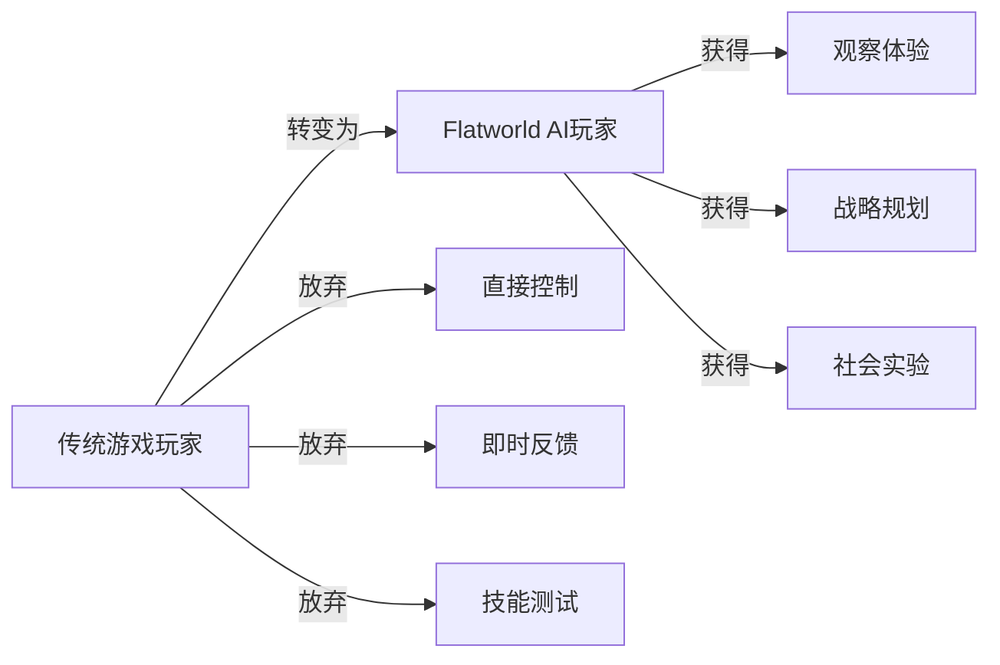

# Flatworld AI 玩家指南

## 👋 欢迎来到平面世界

欢迎来到 Flatworld AI，这是一个实验性的区块链AI游戏，您在这里不再直接控制角色，而是成为虚拟社会的观察者和引导者。本指南将帮助您了解如何与这个由 AI 驱动的世界互动，并最大化您的游戏体验。

### 玩家角色转变

在开始之前，请调整您对游戏的传统认知：



在 Flatworld AI 中，您不是角色的直接控制者，而是：

- **观察者**：见证 AI 角色的生活和发展
- **引导者**：通过间接方式影响角色的发展方向
- **策略家**：规划长期发展和资源分配
- **实验者**：参与和观察一个动态社会系统的演变

## 🚀 入门指南

### 创建您的第一个角色

1. **准备工作**
   - 安装 MetaMask 或其他兼容钱包
   - 确保钱包中有足够的 ETH 支付铸造费用
   - 连接钱包到 Flatworld AI 平台

2. **角色铸造流程**
   - 点击"创建角色"按钮
   - 选择一个活跃且有出生名额的小镇
   - 支付铸造费用（主网 0.01 ETH 或测试网 0.001 ETH）
   - 确认交易并等待铸造完成

3. **初次见面**
   - 角色铸造完成后，您将看到它的初始属性和外观
   - 这些属性是随机生成的，每个角色都是独特的
   - 花些时间了解您的角色特性，这将影响其未来发展

### 基本界面导航

```
┌─────────────────────────────────────────────────────┐
│                      世界地图                        │
├─────────────┬───────────────────┬───────────────────┤
│             │                   │                   │
│  小镇列表    │    主视图区域      │   角色属性面板    │
│             │                   │                   │
│             │                   │                   │
├─────────────┴───────────────────┴───────────────────┤
│                  角色控制与交互区                    │
└─────────────────────────────────────────────────────┘
```

- **世界地图**：显示所有小镇的位置和基本信息
- **小镇列表**：列出所有可访问的小镇及其状态
- **主视图区域**：显示当前小镇或角色的详细视图
- **角色属性面板**：展示选中角色的所有属性和状态
- **交互区**：提供可用的交互选项和控制功能

## 💼 日常操作指南

### 观察角色

作为观察者，您可以密切关注角色的日常活动：

1. **实时观察**
   - 选择一个角色点击"观察"按钮
   - 查看角色的实时活动和行为
   - 注意角色如何基于其属性与环境互动

2. **历史回顾**
   - 查看角色的活动历史记录
   - 分析重要决策和转折点
   - 了解角色发展的长期轨迹

3. **关系网络**
   - 查看角色与其他居民的关系网络
   - 了解社交互动的模式和发展
   - 观察不同社会阶层之间的互动

### 引导角色发展

虽然您不能直接控制角色，但可以通过多种方式引导其发展：

1. **属性管理**
   - 通过属性封装和解封调整角色特性
   - 提高特定属性以影响角色行为倾向
   - 为不同场景优化属性组合

2. **环境选择**
   - 决定角色应该留在当前小镇还是迁移
   - 为角色选择最适合其发展的环境
   - 考虑小镇繁荣度、人口和机会

3. **目标设定**
   - 设定角色的长期发展目标
   - 创建符合角色特性的发展路径
   - 定期调整目标以适应新情况

### 属性封装与解封

属性管理是您影响角色发展的主要方式：

#### 属性封装（转换为代币）

1. 选择您的角色并点击"属性管理"
2. 选择要封装的属性（勇气、智慧或感知）
3. 指定要封装的数量（1-98，必须保留至少1点）
4. 确认交易并支付 Gas 费用
5. 交易完成后，您将获得相应的属性代币

#### 属性解封（转换回属性点）

1. 确保您拥有足够的属性代币
2. 选择要增强的角色
3. 选择要增加的属性类型
4. 指定要转换的代币数量
5. 确认交易并支付 Gas 费用
6. 交易完成后，角色的对应属性将增加

### 小镇迁移

当您希望角色探索新环境时，可以安排小镇迁移：

1. **迁移准备**
   - 检查角色的感知值（决定最大迁移距离）
   - 检查角色的勇气值（决定迁移消耗）
   - 查看可用小镇的繁荣度和机会

2. **迁移执行**
   - 选择角色并点击"迁移"
   - 在地图上选择目标小镇（距离必须在感知允许范围内）
   - 确认迁移并支付勇气消耗
   - 等待迁移完成，角色将出现在新小镇

3. **迁移后适应**
   - 观察角色如何适应新环境
   - 注意新小镇繁荣度的变化（受角色智慧影响）
   - 观察角色开始建立新的社交网络

## 🎯 高级策略指南

### 角色发展路径

基于游戏角色的基础属性组合，可以规划不同的发展路径：

#### 探险者路径（高勇气）

适合勇气值高的角色：
- 频繁迁移到不同小镇探索新机会
- 优先提升感知值以增加探索范围
- 寻找繁荣度低但有发展潜力的小镇

#### 智者路径（高智慧）

适合智慧值高的角色：
- 选择并长期居住在单一小镇
- 通过智慧值提升小镇繁荣度
- 成为小镇发展的核心贡献者

#### 观察者路径（高感知）

适合感知值高的角色：
- 平衡迁移与定居，获取广泛信息
- 发现和分享小镇间的机会
- 在小镇网络中扮演连接者角色

### 小镇选择策略

选择合适的小镇对角色发展至关重要：

1. **新兴小镇策略**
   - 选择繁荣度较低但增长潜力大的新小镇
   - 作为早期居民获得更大影响力
   - 随着小镇发展共同成长

2. **成熟小镇策略**
   - 选择已有高繁荣度的成熟小镇
   - 利用现有资源和机会
   - 在竞争环境中寻找专业化方向

3. **差异化小镇网络**
   - 拥有多个角色分布在不同类型的小镇
   - 创建多元化的角色组合
   - 在不同环境中测试不同策略

### 代币管理策略

有效的代币管理可以最大化您的资源价值：

1. **属性优化**
   - 分析角色当前需求，重新分配属性点
   - 将过剩属性封装为代币储存
   - 在需要时解封代币强化特定属性

2. **市场交易**
   - 在市场上购买低价属性代币
   - 出售高需求的属性代币
   - 通过价格差异获取利润

3. **长期投资**
   - 储备属性代币用于未来角色发展
   - 预测属性需求趋势进行提前布局
   - 建立多种代币的平衡储备

## 📘 进阶概念

### 形状进化

随着属性的提升，角色的形状会逐渐演变：

1. **边数增加**
   - 总属性值增加会增加角色的边数
   - 边数增加代表社会地位的提升
   - 从简单形状（三角形）到复杂形状（接近圆形）的演变

2. **社会流动性**
   - 形状变化反映社会阶层的流动性
   - 通过战略性属性管理实现向上流动
   - 观察不同形状角色的社会互动模式

### 小镇繁荣度影响

繁荣度是小镇发展的核心指标：

1. **繁荣度来源**
   - 居民的智慧值直接贡献到繁荣度
   - 每10点智慧值增加1点繁荣度
   - 居民迁入增加，迁出降低繁荣度

2. **繁荣度效应**
   - 繁荣度影响小镇的出生率（新角色创建限制）
   - 繁荣度每增加10点，出生率增加10%
   - 繁荣度高的小镇提供更多机会和资源

### AI行为模式理解

了解AI行为模式可以帮助您更好地预测和引导角色：

1. **属性影响**
   - 高勇气角色更倾向于冒险和主动行为
   - 高智慧角色更倾向于思考和策略性决策
   - 高感知角色更敏感于环境变化和机会

2. **环境适应**
   - 角色会根据小镇特性调整行为
   - 繁荣度高的小镇促进更积极的社交互动
   - 人口密度影响社交网络的形成

3. **长期一致性**
   - AI保持角色行为的长期一致性
   - 重大变化需要时间适应和整合
   - 突然的环境变化可能触发新的行为模式

## 🎮 游戏体验最佳实践

### 长期参与策略

Flatworld AI 是一个长期发展的游戏体验：

1. **设定阶段性目标**
   - 为每个角色设定短期、中期和长期目标
   - 定期检查进展并调整计划
   - 庆祝小成就，保持参与动力

2. **多角色管理**
   - 拥有多个不同类型的角色以丰富体验
   - 尝试不同属性组合和发展路径
   - 观察不同角色间的互动和影响

3. **社区参与**
   - 加入玩家社区分享经验和策略
   - 参与社区活动和讨论
   - 贡献观察和发现，丰富集体知识

### 观察技巧

提升您的观察技能可以大大丰富游戏体验：

1. **耐心观察**
   - 花时间观察角色的自然行为
   - 注意细微的行为模式和倾向
   - 不要急于干预，让AI自然发展

2. **比较分析**
   - 比较不同角色在相似环境中的行为
   - 分析属性差异如何导致行为差异
   - 记录和对比随时间变化的发展轨迹

3. **系统思考**
   - 将个体行为放在社会系统背景下理解
   - 观察群体动态和集体行为模式
   - 思考小的变化如何引起系统性影响

### 玩家心态调整

调整心态是享受这种新型游戏体验的关键：

1. **从控制到引导**
   - 接受不能直接控制角色的游戏方式
   - 欣赏观察和引导带来的独特满足感
   - 将角色视为独立生命而非工具

2. **长期思维**
   - 培养对渐进式发展的欣赏
   - 享受微小变化积累带来的长期效果
   - 避免期待即时结果的心态

3. **实验精神**
   - 将游戏视为社会和AI实验
   - 尝试不同策略和方法
   - 从意外结果中学习而非失望

## 📚 资源与支持

### 学习资源

- **游戏文档中心**：访问完整的游戏文档和指南
- **教程视频**：观看角色创建和管理的详细教程
- **社区指南**：查阅社区创建的策略和技巧

### 社区与支持

- **官方社区**：加入Discord或Telegram群组与其他玩家交流
- **问题解答**：常见问题解答和故障排除指南
- **支持渠道**：游戏中遇到技术问题的联系方式

### 更新与路线图

- **定期更新**：关注游戏功能和系统的更新
- **未来规划**：了解开发团队的长期发展计划
- **社区投票**：参与决定游戏未来方向的投票

---

欢迎来到Flatworld AI的奇妙世界！记住，在这个世界中，您的角色不是游戏的胜利者，而是进化中的社会的观察者和引导者。享受这个独特的体验，见证AI生命的发展，并成为这个虚拟社会实验的重要参与者。
