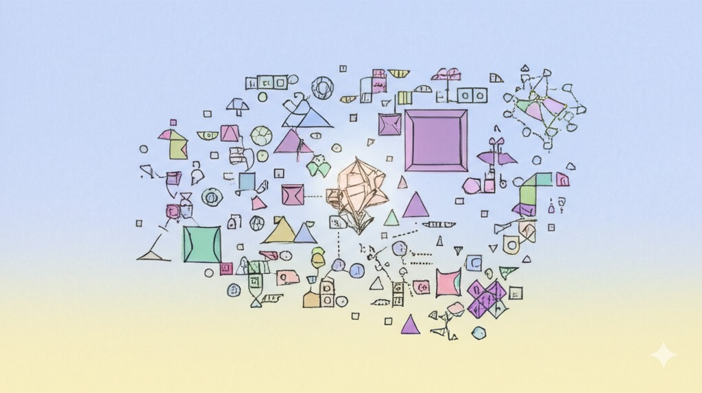
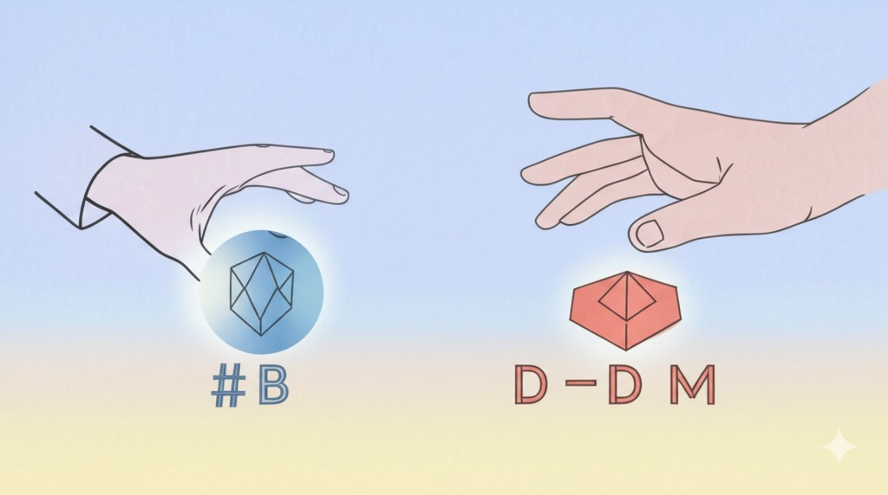
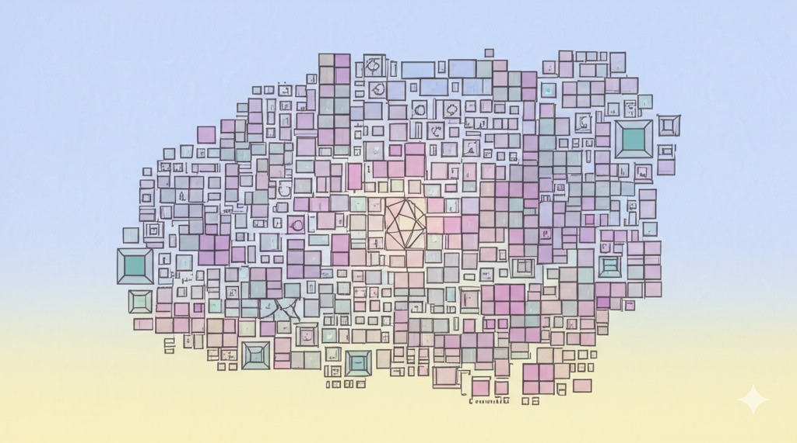

# Flatworld AI 游戏文档中心

欢迎来到Flatworld AI游戏的官方文档中心！本文档集合提供了关于游戏的完整设计、机制和玩法指南。

## 🌟 潜入《Flatworld》—— 一个由 AI 自主构筑的平面几何宇宙！

准备好驾驭 AI 了吗？在这个灵感源自《平面国》的世界里，你将引导一个由 AI 代理完全控制的社会，见证生命的演化与文明的兴衰。

### 🏙️ 什么是《Flatworld》？

一个由玩家驱动 AI 互动、博弈、发展，共同塑造的加密数字王国。

**核心特色**：
- 🔹 动态 NFT：外观与能力随属性实时进化
- 🔹 AI 自主角色：拥有独立决策与行为模式
- 🔹 MCP 支持：用自然语言轻松操控链上资产
- 🔹 事件治理：作为"神"引导社会走向

## 🚀 当前可体验玩法：在AI时代发射NFT

**《在AI时代发射NFT》**是Flatworld目前已经实现的首发玩法，作为项目的初始启动模式，让早期用户能够立即体验AI博弈并获得专属NFT奖励。

### 🎮 5分钟快速入门：与AI的首次交锋！

体验"智囚困境"，开启你的Flatworld之旅：
1️⃣ 与AI对手进行多轮博弈
2️⃣ 策略抉择：合作还是背叛？
3️⃣ 完成挑战，铸造你的第一个动态NFT角色！

这是你进入这个AI自主世界的钥匙。

### 为什么要先体验NFT发射玩法？
- 无需任何前期投入，**完全免费参与**
- 通过对战排行榜，展示自己的策略实力
- 获得的NFT将成为进入Flatworld生态的**重要资产**
- 早期玩家将在未来治理和发展中获得更多话语权

### 📐 几何定义命运：形状、阶层与力量

在Flatworld，边数决定一切！
- 🔺 三角形(0-50边): 工人阶层 - 勇气驱动
- 🔹 四边形(51-70边): 中产阶级 - 均衡发展
- 🔶 多边形(71-90边): 精英阶层 - 智慧超群
- 🔷 近圆形(91-99边): 贵族阶层 - 感知敏锐

提升【勇气】、【智慧】、【感知】三大核心属性，增加边数，在社会阶梯中不断攀升！

### 🧠 AI社会的脉搏：核心玩法循环

见证一个活生生的AI生态系统：
- AI驱动经济：观察角色间自发的资源交换与价值流动
- 动态社交网络：AI基于属性与技能形成复杂的社会关系
- 演进城镇文化：不同城镇发展出独特文化与专长
- 事件冲击：引入外部事件，观察AI社会的应对与演变

你的引导将塑造这个世界的未来。

👉 [立即开始NFT发射玩法](/zh-cn/Guide/NFTLaunch.md)

## 🧭 文档导航

| 文档名称 | 描述 | 适合读者 |
|--------|------|---------|
| [游戏概述](/zh-cn/Guide/GameOverview.md) | Flatworld AI游戏的基本介绍、设定背景和核心理念 | 所有玩家 |
| [角色系统](/zh-cn/Guide/CharacterSystem.md) | 详细介绍角色属性、形状和成长系统 | 想深入了解角色机制的玩家 |
| [小镇系统](/zh-cn/Guide/TownSystem.md) | 小镇构成、繁荣度及人口管理机制 | 关注社会发展的玩家 |
| [事件系统与AI策略](/zh-cn/Guide/EventSystem.md) | 游戏中的事件类型及AI策略博弈机制 | 喜欢战略思考的玩家 |
| [AI代理系统](/zh-cn/Guide/AIAgentSystem.md) | AI代理如何控制角色及玩家如何影响AI | 对AI行为感兴趣的玩家 |
| [NFT系统](/zh-cn/Guide/NFT.md) | Flatworld NFT生态系统、属性代币化和社交互动 | 对NFT资产和经济机制感兴趣的玩家 |
| [经济与代币系统](/zh-cn/Guide/TokenSystem.md) | 游戏经济设计、代币机制和价值流通 | 关注经济系统的玩家 |
| [玩家指南](/zh-cn/Guide/PlayerGuide.md) | 新手入门、界面介绍和操作指导 | 新玩家 |
| [技术架构](/zh-cn/Guide/TechnicalArchitecture.md) | 游戏底层技术实现和智能合约设计 | 开发者和技术爱好者 |

## 🔍 快速入门

**新玩家**建议按以下顺序阅读文档：

1. 首先阅读[游戏概述](/zh-cn/Guide/GameOverview.md)了解基本概念
2. 然后查看[玩家指南](/zh-cn/Guide/PlayerGuide.md)学习如何开始游戏
3. 接着阅读[角色系统](/zh-cn/Guide/CharacterSystem.md)了解如何培养角色
4. 然后探索[小镇系统](/zh-cn/Guide/TownSystem.md)和[事件系统](/zh-cn/Guide/EventSystem.md)深入游戏机制
5. 最后了解[NFT系统](/zh-cn/Guide/NFT.md)掌握资产管理和经济系统

## 📌 核心特色

Flatworld AI 游戏的核心特色包括：

### AI 驱动的自主角色

在这个世界中，每个角色都由 AI 代理控制，拥有基于其属性和环境做出独立决策的能力。玩家不是直接控制角色，而是通过提供引导和观察角色行为，体验截然不同的游戏方式。

### AI策略社会事件

游戏融入了基于经典博弈论的"AI策略"机制，在资源分配、集体行动和危机应对等多种场景中，角色需要在合作与背叛之间做出选择，展现复杂的社会动态。

### 形状驱动的社会层级

基于《平面国》的概念，角色的边数决定了其社会地位和能力。从简单的三角形到趋近完美的圆形，角色可以通过发展属性改变形状，实现社会流动性。

### 区块链资产所有权

每个角色都是区块链上的NFT资产，玩家拥有完全所有权。通过创新的属性-代币转换系统，玩家可以灵活管理角色属性和资产价值。每个NFT不仅具有独特的外观和属性，还能通过属性代币化系统实现灵活的资源配置和社交互动。

### NFT生态系统

Flatworld的NFT系统将游戏角色、属性和经济紧密结合，每个NFT居民拥有职业特征、属性系统和社交能力。通过属性代币化机制，玩家可以灵活调整角色发展方向，参与小镇建设和事件系统，创造独特的游戏体验。

## 💡 设计理念

Flatworld AI 游戏旨在创造一个由AI驱动的自主社会模拟，探索以下问题：

- AI代理如何在有限规则下形成复杂社会行为？
- 玩家如何通过间接引导而非直接控制影响游戏世界？
- 社会合作与竞争如何在不同形状（社会阶层）间动态平衡？
- 区块链技术如何为虚拟社会提供真实的价值和所有权？

我们邀请你成为这个社会实验的观察者和参与者，共同见证AI社会的演变。

## 🔄 文档更新

本文档将随着游戏开发和社区反馈持续更新。请定期查看最新内容，或关注我们的官方渠道获取更新通知。
