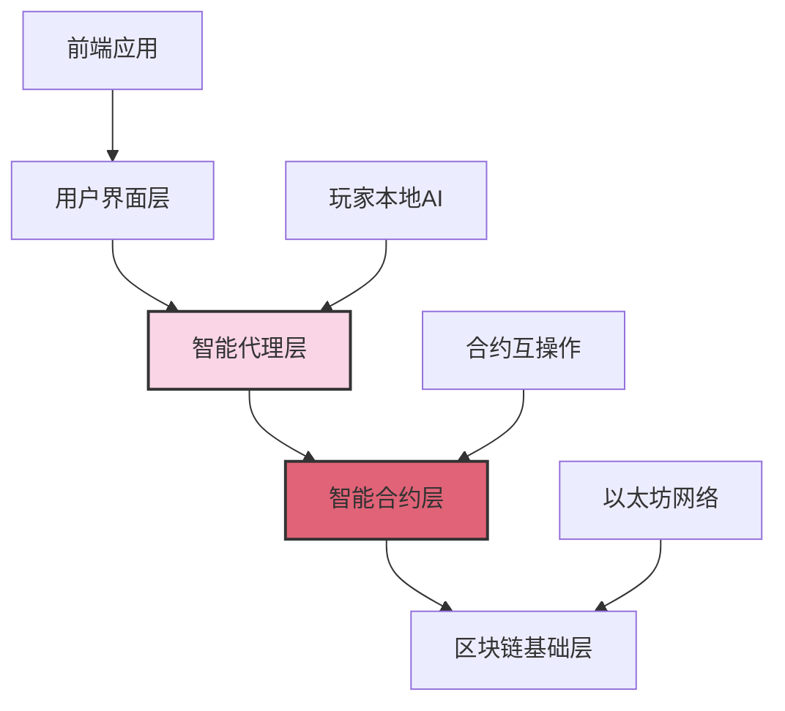
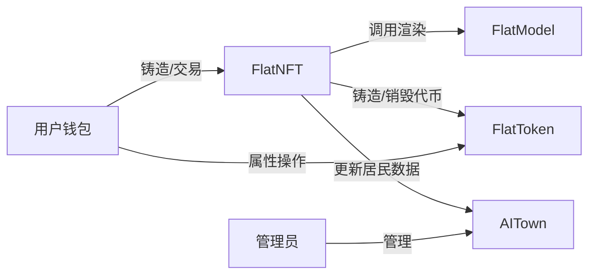

# Flatworld AI 技术架构

## 🏗️ 技术架构概述

Flatworld AI 采用了领先的区块链技术和AI代理技术，构建了一个去中心化的AI游戏平台。本文档详细介绍了系统的技术架构、智能合约设计和核心实现机制。

### 架构层次

Flatworld AI 的技术架构分为以下几个核心层次：



1. **用户界面层**：玩家与游戏交互的前端应用
2. **智能代理层**：运行在玩家本地的 AI 代理系统
3. **智能合约层**：部署在区块链上的游戏逻辑和数据存储
4. **区块链基础层**：提供去中心化基础设施的底层区块链网络

## 💻 合约系统

### 核心合约

Flatworld AI 的核心功能通过以下智能合约实现：

| 合约名称 | 功能描述 | 主要职责 |
|---------|---------|---------|
| **FlatNFT** | 角色 NFT 合约 | 管理角色铸造、属性存储和 NFT 转移 |
| **FlatToken** | 属性代币合约 | 管理属性代币的铸造、销毁和转移 |
| **FlatModel** | 模型渲染合约 | 生成角色可视化和元数据 |
| **AITown** | 小镇管理合约 | 管理小镇创建、繁荣度和人口 |
| **COPYRIGHT** | 版权验证合约 | 管理系统权限和版权信息 |

### 合约关系

核心合约之间通过接口互相调用，形成一个统一的合约生态系统：



## ⚙️ 核心功能实现

### 角色铸造机制

新角色的铸造过程包含以下步骤：

1. **验证条件**：检查小镇是否活跃、是否有可用出生名额
2. **随机生成**：使用安全的随机数生成机制创建角色初始属性
   ```solidity
   bytes32 randomSeed = keccak256(abi.encodePacked(userAddress, tokenId, block.timestamp, block.number, block.prevrandao));
   ```
3. **属性分配**：使用位操作高效地从随机种子中提取各项属性值
4. **状态更新**：更新小镇状态，包括居民数量和繁荣度
5. **事件触发**：触发事件通知前端应用角色创建成功

### 属性转换系统

角色属性与代币之间的转换机制：

#### 属性封装（转化为代币）

```solidity
function packAttrib(uint256 tokenId, uint256 attribIndex, uint256 attribValue) external {}
```

#### 属性解封（代币转回属性）

```solidity
function unpackAttrib(uint256 tokenId, uint256 attribIndex, uint256 attribValue) external {}
```

### 小镇繁荣度计算

小镇繁荣度的计算和更新机制：

```solidity
function updateResidentWisdom(uint256 townId, int256 wisdomDelta) external {}
```

### 角色迁移系统

角色在小镇之间迁移的实现：

```solidity
function migrateTown(uint256 tokenId, uint256 toTownId, uint256 perception, uint256 courage, uint256 wisdom) external returns(uint256) {}
```

## 🌐 区块链整合

### 多链部署支持

系统设计支持多链部署，根据链ID自动调整参数：

```solidity
function MINT_FEE() public view returns (uint256) {
    return ChainID == 130 ? 0.01 ether : 0.001 ether;
}
```

### AI 代理集成

本地 AI 代理通过 MCP 工具与区块链交互：

```javascript
// 示例：AI代理决策
async function aiDecisionMaking(character) {
  // 获取角色数据
  const { courage, wisdom, perception, townId } = character;
  
  // 环境感知
  const currentTown = await getTownInfo(townId);
  const nearbyTowns = await getNearbyTowns(townId, perception);
  
  // 决策逻辑（基于角色属性和环境）
  let decision;
  if (shouldMigrate(character, currentTown, nearbyTowns)) {
    const targetTown = selectBestTown(nearbyTowns, character);
    decision = { type: 'migrate', targetTown: targetTown.id };
  } else {
    decision = { type: 'stay', activities: generateActivities(character, currentTown) };
  }
  
  // 执行决策
  return executeDecision(decision, character);
}
```

## 🔮 未来技术扩展

### 计划扩展

1. **跨链互操作**：增强不同区块链网络间的资产互操作性
2. **Layer 2 整合**：支持更多 Layer 2 解决方案，降低交易成本
3. **AI 代理升级**：增强 AI 代理的决策能力和行为模式
4. **链上治理**：引入 DAO 治理机制，允许社区参与决策
5. **可组合性增强**：支持与其他 Web3 应用的深度集成

### 潜在技术创新

1. **零知识证明**：引入 ZK 技术保护玩家隐私
2. **AI训练数据市场**：允许玩家贡献数据训练更优秀的 AI 代理
3. **链下计算扩展**：优化链下计算与链上验证的结合
4. **动态NFT标准**：开发更适合游戏角色进化的 NFT 标准
5. **跨游戏身份**：建立可在多游戏环境中使用的角色身份系统

---

这份技术架构文档概述了 Flatworld AI 的核心技术实现和设计理念。随着项目的发展，架构将持续优化和扩展，以支持更丰富的游戏体验和更广泛的区块链集成。
