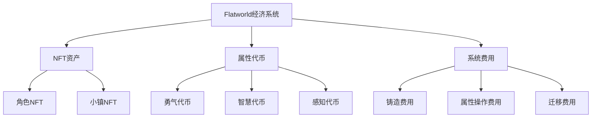
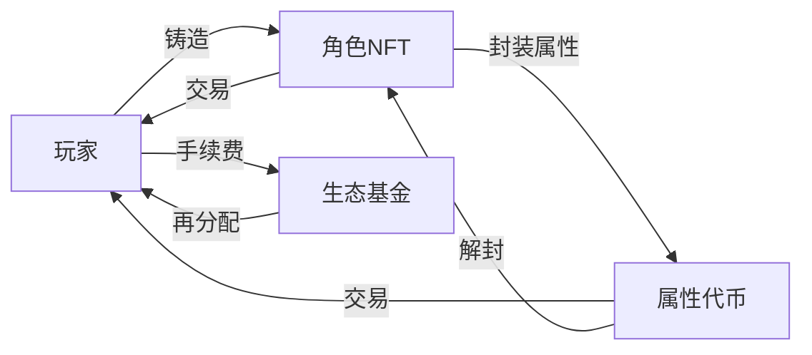

# Flatworld AI 经济与代币系统

## 💰 经济系统概述

Flatworld AI 的经济系统是一个创新的多层次结构，将游戏内资产与区块链代币无缝融合，创造了一个动态且可持续的游戏经济。

### 核心经济理念

Flatworld 经济系统基于以下核心理念设计：

- **资产实体化**：游戏内的各种元素（角色、属性、能力）都以区块链资产的形式存在
- **价值流动性**：价值可以在不同形式的资产之间流动和转换
- **玩家自主权**：玩家对其资产拥有完全所有权和处置权
- **内在价值基础**：所有资产都有真实用途和游戏内功能，而非纯粹的投机工具

## 🪙 代币系统

Flatworld AI 经济中存在多种代币类型，各司其职，共同构成完整的经济生态。

### 主要代币类型

#### 1. 角色属性代币 (ERC20)

游戏实现了三种对应角色基础属性的ERC20代币：

| 代币名称 | 对应属性 | 合约简称 | 功能 |
|---------|---------|---------|------|
| **勇气代币** | 勇气 | COURAGE | 用于角色迁移、社交互动和冒险活动 |
| **智慧代币** | 智慧 | WISDOM | 用于提升小镇繁荣度、决策质量和学习能力 |
| **感知代币** | 感知 | PERCEPTION | 用于探索范围扩展、信息获取和环境适应 |

这些代币具有以下特性：

- **与属性等值**：1个属性点 = 10^18 代币单位（保持精度一致性）
- **安全供应上限**：每种代币的最大供应量为 1,000,000（含18位小数）
- **转账自由**：代币可以在玩家之间自由转账
- **市场交易**：代币可以在开放市场交易，形成市场价值

#### 2. 角色NFT (ERC721)

每个角色都是一个独特的NFT，具有以下特性：

- **唯一性**：每个NFT都代表一个独特的平面居民
- **属性封装**：NFT内部封装了角色的所有属性和状态
- **动态元数据**：NFT的元数据会随着角色发展动态更新
- **跨平台应用**：可用于不同平台和应用的互操作

### 代币互操作性

Flatworld AI 实现了一个创新的属性-代币转换系统：

1. **属性封装**：角色的属性点可以"封装"为ERC20代币
   - 从角色中提取特定属性点
   - 获得等值的ERC20代币
   
2. **代币解封**：ERC20代币可以"解封"转换回角色属性点
   - 销毁特定数量的ERC20代币
   - 为角色增加相应的属性点

这种双向转换机制实现了游戏内属性与区块链资产的无缝连接。

## 🏦 铸造与费用结构

### NFT铸造机制

新角色NFT的铸造遵循以下流程：

1. **支付铸造费用**：用户支付以太坊作为铸造费
   - 主网费用：0.01 ETH
   - 其他网络费用：0.001 ETH
   
2. **选择小镇**：用户选择角色出生的小镇
   - 小镇必须处于活跃状态
   - 小镇必须有可用的出生名额
   
3. **角色生成**：系统随机生成角色的初始属性
   - 基础属性：勇气、智慧、感知（1-89范围内）
   - 社会属性：职业、性别、DNA、爱好等
   
4. **链上注册**：角色被注册到区块链，并与指定小镇关联

### 费用结构

系统收取以下几类费用，用于维持经济平衡：

| 操作类型 | 费用 | 用途 |
|---------|------|------|
| **角色铸造** | 0.01/0.001 ETH | 用于生态系统发展和维护 |
| **颜色更改** | 与铸造费相同 | 角色外观个性化 |
| **属性封装** | Gas费用 | 属性转化为代币 |
| **属性解封** | Gas费用 | 代币转化为属性 |
| **小镇迁移** | 勇气消耗 | 角色在小镇间移动 |

所有收取的费用都流向一个指定的捐赠地址（Donate），用于项目的持续发展与维护。

## 💹 价值创造与流通

### 价值创造机制

Flatworld AI 经济中的价值通过多种途径创造：

1. **角色成长**：随着角色发展，其NFT价值可能增加
2. **属性优化**：战略性地分配属性点可以提升角色价值
3. **小镇繁荣**：提升小镇繁荣度，增加角色机会和价值
4. **稀有组合**：拥有稀有属性组合的角色可能更有价值
5. **社会网络**：在游戏中建立的关系和地位也构成价值

### 价值流通路径

价值在系统内通过以下途径流通：

这种循环流通确保了价值的持续创造和合理分配，避免了经济系统的通胀或通缩。

## 🛡️ 安全与防作弊机制

为确保经济系统的健康运行，实施了多层次的安全机制：

### 属性操作限制

- **最小值保护**：属性封装时必须保留至少1点基础值
- **最大值限制**：单个属性不能超过99点
- **操作验证**：所有属性操作都需验证NFT所有权
- **安全检查**：代币铸造和销毁有多重验证步骤

### 供应上限控制

为防止通胀，实施了严格的供应上限控制：

- **代币供应上限**：每种属性代币的供应上限为1,000,000
- **铸造验证**：每次代币铸造都会检查是否超过安全供应限制
- **动态调整**：系统可根据经济状况调整各种参数

### 交易安全

- **智能合约审计**：所有合约经过专业审计
- **权限管理**：严格的权限控制和访问限制
- **重入攻击防护**：所有关键函数都有重入保护
- **异常处理**：完善的异常处理和回滚机制

## 📈 可持续经济模型

Flatworld AI 采用了可持续的经济模型，确保游戏经济的长期健康发展：

### 通胀控制

- **有限供应**：属性代币总供应有硬性上限
- **代币销毁**：解封属性时销毁代币，保持供需平衡
- **手续费机制**：部分操作收取费用，减少流通量

### 价值锚定

- **实用价值**：所有代币都有明确的游戏内用途
- **内在需求**：角色发展创造了对属性代币的持续需求
- **功能绑定**：代币价值与游戏功能紧密绑定

### 长期激励

- **持续参与**：设计鼓励玩家长期参与游戏
- **渐进发展**：角色和小镇的发展是渐进的，需要时间投入
- **社区贡献**：玩家的活动直接影响游戏世界的发展

## 🔗 跨链互操作

Flatworld AI 设计了跨链互操作机制，扩展了经济系统的边界：

### 多链部署

- **主网部署**：以太坊主网是主要部署网络
- **L2扩展**：支持在各种Layer 2解决方案上部署
- **链ID感知**：合约内置链ID识别，自动适应不同网络

### 资产互操作

- **NFT可移植性**：角色NFT可以在不同平台和游戏中使用
- **代币桥接**：属性代币设计为可以通过桥接在不同链间转移
- **元数据标准**：采用通用元数据标准，确保跨平台兼容性

## 🔮 未来经济扩展

Flatworld AI 的经济系统设计为可扩展的框架，未来可能加入以下功能：

### 经济扩展计划

- **属性进阶**：引入更高级的属性和能力系统
- **商品与服务**：允许角色提供虚拟商品和服务
- **土地所有权**：引入小镇土地细分和所有权系统
- **治理代币**：引入用于社区治理的代币
- **跨游戏资产**：与其他游戏和平台建立资产互操作性

### 玩家经济角色

- **开发者**：创建扩展小镇功能的工具和应用
- **商人**：专注于角色和代币交易的中间商
- **培训师**：帮助其他玩家优化角色发展路径
- **探险家**：发掘和共享小镇世界的秘密和机会
- **社区领袖**：组织和引导社区活动和发展

通过这个多层次的经济系统，Flatworld AI 不仅创造了一个游戏内的虚拟经济，更构建了一个与现实经济对接的价值网络，为玩家提供了丰富的经济参与和价值创造机会。
