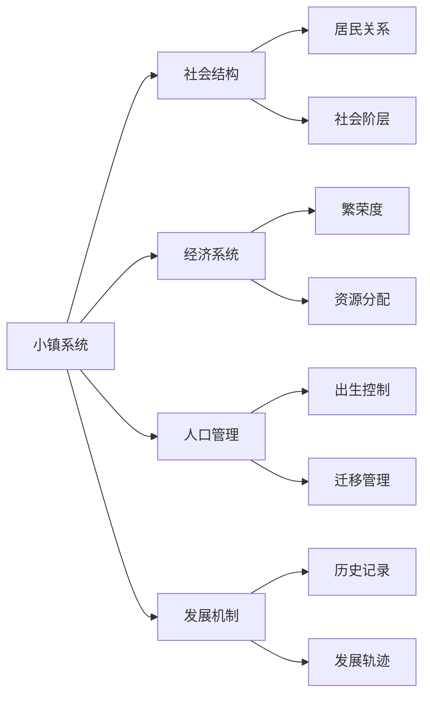

# Flatworld AI 小镇系统

## 📍 小镇概述

在 Flatworld AI 的二维世界中，小镇是居民生活、交流和发展的基本社会单元。每个小镇都有其独特的特性和发展状态，共同构成了一个复杂而动态的社会网络。

### 小镇的本质

小镇是一个独立的地理和社会单位，由智能合约管理，具有以下核心特征：

- **身份标识**：每个小镇都有唯一的ID和元数据
- **活跃状态**：小镇可以是活跃或非活跃状态
- **居民人口**：记录当前居住在小镇中的角色数量
- **繁荣度**：反映小镇的发展水平和生活质量
- **出生率**：决定可以在小镇中创建的新角色数量上限



## 🏗️ 小镇核心机制

### 繁荣度系统

繁荣度是衡量小镇发展水平的核心指标，直接影响居民的生活质量和机会：

- **贡献来源**：居民的智慧值直接转化为小镇繁荣度，每10点智慧值增加1点繁荣度
- **动态变化**：居民迁入会增加繁荣度，迁出会减少繁荣度
- **影响范围**：繁荣度影响小镇的出生率、资源分配和居民机会

### 出生率控制

小镇通过出生率机制控制人口增长，确保小镇的可持续发展：

- **基础出生率**：每个小镇的基本出生率为100
- **繁荣度加成**：繁荣度每增加10点，出生率增加10%
- **出生率上限**：最高可达基础出生率的10倍（即1000）
- **历史最高值**：小镇的出生率不会低于历史最高值，确保稳定发展

计算公式：
```
当前出生率 = min(基础出生率 × (100 + 繁荣度 × 10%) ÷ 100, 基础出生率 × 10)
```

### 出生名额管理

小镇的出生名额决定了可以在该小镇创建的角色数量：

- **可用名额计算**：当前出生率 - 已出生数量
- **名额验证**：创建新角色前会验证小镇是否还有可用名额
- **动态调整**：随着繁荣度的增加，可用名额会自动增加

## 🔄 小镇互动系统

### 居民迁移

居民可以在不同小镇之间迁移，这是小镇人口和繁荣度变化的主要途径：

#### 迁移条件

1. **小镇活跃状态**：源小镇和目标小镇必须都处于活跃状态
2. **感知力要求**：居民的感知值决定最大迁移距离
   - 计算公式：最大步长 = (感知值 ÷ 10) + 1
3. **勇气消耗**：迁移消耗勇气值，距离越远消耗越大
   - 计算公式：勇气消耗 = 1 + (小镇距离 × 2)

#### 迁移影响

1. **繁荣度转移**：居民的智慧值从源小镇繁荣度中减去，并添加到目标小镇繁荣度中
2. **人口变化**：源小镇人口减少，目标小镇人口增加
3. **社会网络**：居民在新小镇建立新的社会关系

### 小镇贡献

居民通过各种方式为小镇发展做贡献：

1. **智慧贡献**：居民的智慧值直接提升小镇繁荣度
2. **活动参与**：居民的行为和互动丰富小镇的社会生活
3. **属性变化**：居民的属性变化会实时影响小镇的繁荣度
   - 例如：通过属性封装减少智慧值会降低小镇繁荣度
   - 通过属性解封增加智慧值会提高小镇繁荣度

## 📊 小镇信息系统

### 小镇状态查询

玩家可以随时查询小镇的详细状态：

| 信息类型 | 描述 | 查询方式 |
|---------|------|---------|
| **活跃状态** | 小镇是否处于活跃状态 | 智能合约直接查询 |
| **当前人口** | 小镇的当前居民数量 | 智能合约直接查询 |
| **出生率** | 小镇的当前最大人口容量 | 基于繁荣度计算 |
| **已出生总数** | 小镇历史上创建的角色总数 | 智能合约累计记录 |
| **可用出生名额** | 还可以创建的新角色数量 | 出生率 - 已出生总数 |
| **繁荣度** | 小镇的发展水平 | 基于居民智慧值累计 |

### 小镇元数据

每个小镇都有与之关联的元数据，包含描述性信息和视觉呈现：

- **名称和描述**：小镇的官方名称和背景故事
- **地理特征**：小镇的位置、气候和地形描述
- **视觉标识**：小镇的徽章、代表色和建筑风格
- **历史记录**：小镇的建立时间和重要历史事件
- **URI链接**：指向小镇详细信息的外部链接

## 🏛️ 小镇管理

### 小镇创建

小镇的创建是一个受控制的过程，由系统管理员执行：

1. 生成唯一的小镇ID
2. 设置小镇的初始状态（活跃、人口为0、繁荣度为0）
3. 配置小镇的元数据URI
4. 将小镇添加到全局小镇注册表

### 小镇管理功能

管理员可以执行以下管理操作：

- **设置活跃状态**：激活或停用特定小镇
- **批量添加小镇**：一次性添加多个新小镇
- **更新元数据**：更新小镇的描述和视觉信息
- **系统配置**：调整小镇的基础参数和规则

## 💼 游戏玩法应用

### 战略选择

小镇系统为玩家提供了丰富的战略选择：

- **小镇选择**：为新角色选择适合的出生小镇
- **迁移规划**：根据角色属性和小镇特性规划最佳迁移路径
- **属性投资**：优化角色属性以适应特定小镇的需求
- **社区建设**：协调多个角色的活动，共同提升小镇繁荣度

### 社会实验

小镇系统也是一个社会模拟实验平台：

- **人口动态**：观察人口流动和小镇发展之间的关系
- **社会分层**：见证不同形状（社会阶层）的角色在小镇中的分布和互动
- **繁荣发展**：分析哪些因素促进小镇繁荣，哪些因素导致衰退
- **集体行为**：研究AI角色在不同环境下的集体决策和行为模式

## 🔮 未来扩展

小镇系统设计为可扩展的框架，未来可能加入以下功能：

### 小镇特化

每个小镇可能发展出独特的特性和优势：

- **专业化产业**：小镇可能在特定领域发展专长
- **文化特色**：小镇可能发展独特的文化和习俗
- **教育体系**：不同小镇可能提供不同类型的学习机会
- **政治体系**：小镇可能发展出不同的治理模式

### 小镇联盟

小镇之间可能形成更复杂的关系网络：

- **贸易联盟**：小镇间建立经济合作关系
- **文化交流**：小镇间进行文化和知识交流
- **联合治理**：多个小镇共同管理区域资源
- **竞争机制**：小镇间形成良性竞争推动整体发展

通过这个多层次的小镇系统，Flatworld AI创造了一个动态、复杂且不断发展的虚拟社会，为玩家提供了丰富的观察和参与机会。小镇不仅是角色生活的空间，也是社会实验的舞台和游戏策略的核心。
