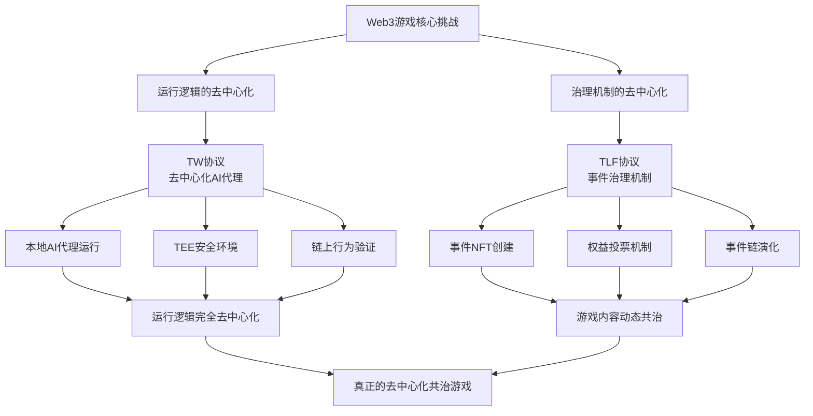

# 1.3 TW 和 TLF 协议的提出

针对 Web2 游戏的局限性和现有 Web3 游戏的不足，我们提出了 **织网者协议（The Weavers Protocol TW）** 和 **命运织机协议（The Loom of Fate Protocol TLF）** 这两个创新性协议，旨在实现真正的去中心化共治游戏。

## TW 和 TLF 协议解决方案框架

- **TW 协议**将游戏角色的行为逻辑从中心化服务器迁移到玩家本地，通过去中心化的 AI 代理（"织网者"）实现游戏逻辑的去中心化运行，同时利用 TEE 技术确保安全性和公平性。

- **TLF 协议**通过事件 NFT 和投票机制，让玩家共同决定游戏世界的动态变化，实现了游戏内容的去中心化治理。事件链系统使游戏世界能够根据玩家的集体决策持续演化。

这两个协议的结合为下一代 Web3 游戏提供了全新的技术框架和治理模式，实现了从资产所有权到运行逻辑和治理机制的全面去中心化。
