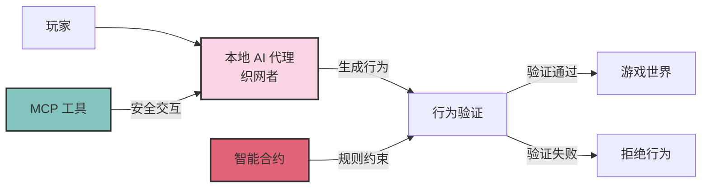

# 2.1 核心理念

TW 协议（The Weavers Protocol）的核心理念是将游戏角色的行为逻辑从中心化服务器迁移到玩家本地运行。在 TW 协议中，每个玩家本地运行一个去中心化的 AI 代理（称为"织网者"），负责控制其游戏角色的行为。智能合约则负责验证 AI 代理生成的行为是否合法，并将合法行为应用到游戏世界中。

这种设计彻底改变了传统游戏的运行模式，实现了游戏逻辑层面的去中心化，解决了中心化服务器带来的单点故障风险，同时保证了游戏的高可用性和持续性。

## TW 协议概念模型

在这个模型中：

1. **玩家**启动本地 AI 代理（"织网者"）。
2. **本地 AI 代理**根据角色特性、游戏规则和环境状态生成角色行为。
3. **行为验证**由区块链上的智能合约执行，确保行为符合游戏规则和角色状态。
4. **验证通过**的行为将被应用到游戏世界中，更新世界状态。
5. **验证失败**的行为将被拒绝，不会对游戏世界产生影响。
6. **MCP 工具**提供了 AI 代理与区块链之间的安全交互通道。

这种架构确保了游戏逻辑的去中心化运行，同时通过区块链的共识机制维护了游戏世界的一致性和公平性。
