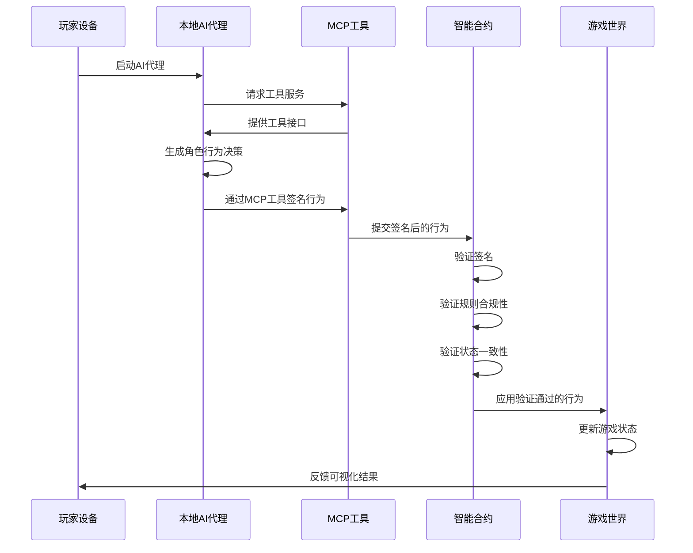

# 2.2 技术架构

TW 协议的技术架构由三层组成：AI 代理层（本地运行层）、智能合约层（验证层）和游戏世界层（执行层）。这种分层架构确保了去中心化、安全性和高效执行的平衡。

## 2.2.1 运行架构

```
+-------------------+      +----------------------+      +-------------------+
|    AI 代理层      |      |     智能合约层       |      |    游戏世界层     |
| (本地运行层)      | ---> | (链上验证层)         | ---> | (执行层)          |
+-------------------+      +----------------------+      +-------------------+
| - 角色行为生成    |      | - 行为签名验证       |      | - 状态更新        |
| - 行为签名        |      | - 规则合规性验证     |      | - 事件触发        |
| - MCP工具交互     |      | - 状态一致性验证     |      | - 视觉渲染        |
+-------------------+      +----------------------+      +-------------------+
```

## 2.2.2 核心组件

1. **AI 代理层（本地运行层）**：
   - **织网者 AI**：根据角色属性、环境状态和游戏规则生成角色行为
   - **行为签名模块**：使用玩家私钥对行为进行签名
   - **MCP 交互模块**：通过MCP工具与区块链智能合约进行交互

2. **智能合约层（验证层）**：
   - **签名验证模块**：验证行为签名的真实性
   - **规则验证模块**：验证行为是否符合游戏规则
   - **状态验证模块**：验证行为是否与角色当前状态一致
   - **激励分配模块**：计算和分配运行奖励

3. **游戏世界层（执行层）**：
   - **状态更新模块**：根据验证通过的行为更新游戏状态
   - **事件触发模块**：触发与行为相关的游戏事件
   - **渲染模块**：将游戏状态渲染为可视化界面

## 2.2.3 数据流动



这个数据流动图展示了从玩家启动 AI 代理到最终游戏状态更新的完整流程。整个过程中，行为生成在本地完成，而验证则在区块链上进行，确保了去中心化和安全性的平衡。MCP 工具作为连接本地 AI 代理和区块链的桥梁，提供了安全、高效的交互通道。
