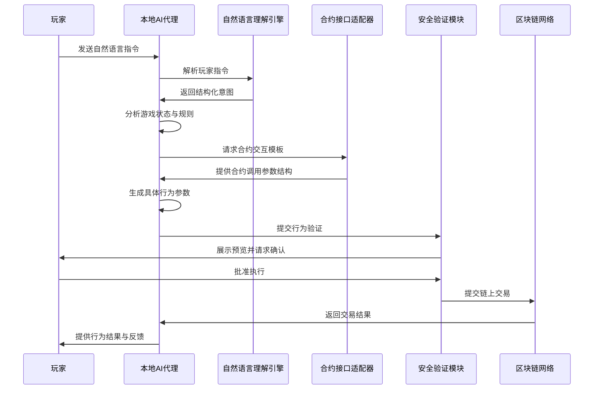

# 2.4 MCP 工具的应用

不同于传统的 TEE（可信执行环境）方案，TW 协议创新性地引入了 MCP（Model Context Protocol）工具作为 AI 代理与区块链智能合约交互的桥梁。这一设计使得 AI 可以无缝融入 Web3 生态系统，真正成为玩家在游戏世界中的代理人。

## 2.4.1 为什么选择 MCP 工具

MCP 工具为 TW 协议提供了以下关键优势：

| **优势类型** | **MCP 工具实现方式** | **对 TW 协议的意义** |
|--------------|------------------|----------------------|
| **自然语言交互** | 语义理解与意图识别 | 玩家可通过自然语言与 AI 代理沟通，降低了 Web3 交互的复杂性 |
| **智能合约集成** | 合约 ABI 解析与调用封装 | AI 代理可直接读取和调用链上合约，无需用户了解合约细节 |
| **多链适配能力** | 跨链接口与协议转换 | 支持 AI 代理在不同区块链网络间无缝切换，提高互操作性 |
| **意图验证** | 操作预览与确认机制 | 确保 AI 代理行为符合玩家意图，防止潜在风险 |
| **行为透明性** | 行为记录与追溯 | 提供完整的行为日志，便于审计和验证 |

## 2.4.2 MCP 工具体系架构

TW 协议中的 MCP 工具体系由以下核心组件构成：

1. **自然语言理解引擎**：
   - 解析玩家指令，提取核心意图
   - 将复杂指令转化为具体的链上操作

2. **合约接口适配器**：
   - 动态加载游戏相关智能合约的 ABI
   - 生成针对特定合约的调用模板

3. **安全验证模块**：
   - 检查 AI 生成的交易是否符合预定义的安全规则
   - 提供交易预览和风险评估

4. **多链连接器**：
   - 维护与多个区块链网络的连接
   - 处理不同链的签名和交易格式转换

## 2.4.3 MCP 工具在 TW 协议中的工作流程



## 2.4.4 自然语言到链上行为的转换示例

下面展示了玩家通过自然语言指令如何被转换为链上行为的过程：

1. **玩家输入**：
   ```
   "让我的角色去探索北部森林，寻找珍稀草药"
   ```

2. **意图识别**：
   ```json
   {
     "action": "explore",
     "location": "north_forest",
     "purpose": "find_herbs",
     "priority": "rare_items"
   }
   ```

3. **合约交互参数生成**：
   ```json
   {
     "contract": "GameWorld",
     "method": "submitCharacterAction",
     "params": {
       "characterId": "0x1a2b...",
       "actionType": 3,
       "targetLocation": [2145, 873],
       "actionParams": {
         "searchFocus": 2,
         "timeAllocation": 4
       }
     }
   }
   ```

4. **预览与确认**：
   ```
   准备执行：角色移动到北部森林(2145,873)并执行草药搜寻行动
   预估消耗：2.3能量点
   预期收益：发现珍稀草药概率约34%，普通草药概率约87%
   是否确认执行？
   ```

通过这种方式，MCP 工具极大地简化了玩家与区块链游戏的交互过程，使得复杂的链上操作变得直观易懂，同时保证了交互的安全性和透明性。
