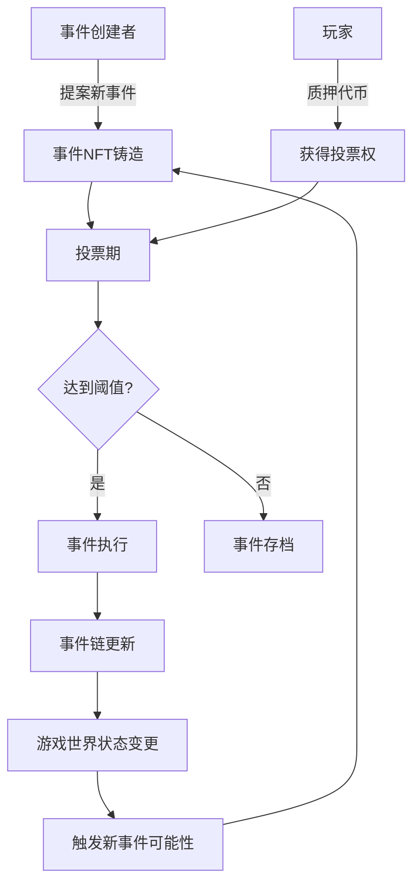

# 3.1 核心理念

TLF 协议（The Loom of Fate Protocol）通过创新的事件 NFT 和投票机制，让玩家共同治理游戏世界的动态变化。在 TLF 协议中，每个事件都被表示为一个 NFT，玩家通过质押代币获得投票权，决定哪些事件会被发布到游戏世界中。

这种设计不仅实现了游戏内容的去中心化治理，还为游戏世界提供了持续的动态性和自我演化能力。事件链系统使游戏剧情和世界状态能够根据玩家的集体决策不断演进，创造出真正玩家共创的游戏体验。

## TLF 协议事件治理流程

在这个流程中：

1. **事件创建者**（可以是玩家、开发者或 AI）提出新的事件提案，并铸造为事件 NFT。
2. **玩家**通过质押代币获得投票权，并对事件进行投票。
3. **投票期**结束后，系统根据投票结果决定事件是否执行。
4. **达到阈值**的事件将被执行，并影响游戏世界状态。
5. **事件链更新**记录已执行事件的历史和影响。
6. **游戏世界状态变更**可能触发新的事件可能性，形成持续的演化循环。

这种设计确保了游戏内容的去中心化治理，使玩家能够真正参与塑造游戏世界的未来，同时保持游戏的动态性和不可预测性。
