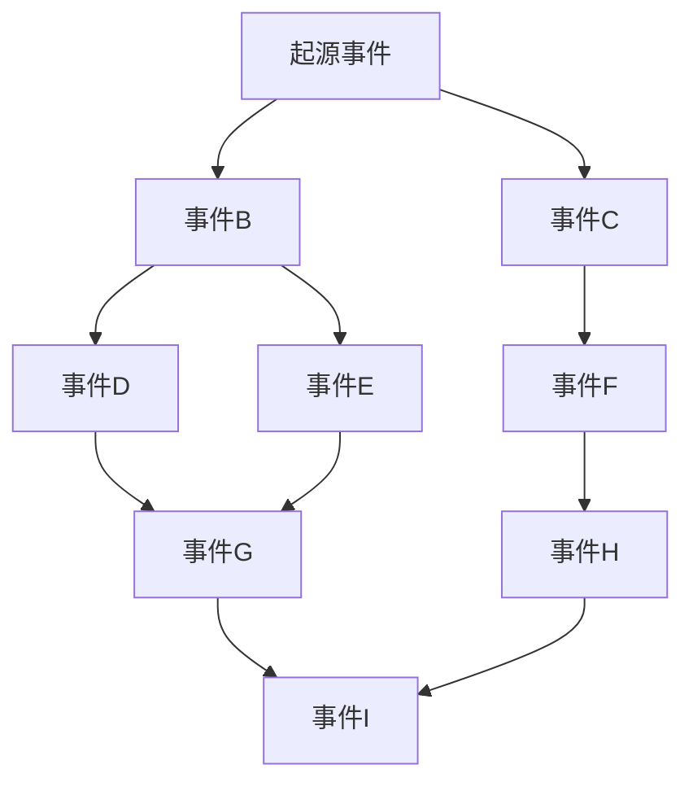

# 3.4 事件链与演化系统

TLF 协议的核心创新之一是事件链系统，它使游戏世界能够在玩家治理下持续演化，形成一个自组织的动态叙事网络。

## 3.4.1 事件链结构

事件链是由玩家投票选出的事件按时间顺序和因果关系形成的有向图网络：

每个事件包含以下属性：

1. **前置条件**：触发该事件需要满足的游戏状态条件
2. **事件内容**：描述事件的具体内容、选择项和结果
3. **影响系数**：事件对游戏世界各方面的影响程度
4. **后续可能性**：事件可能引发的后续事件集合

## 3.4.2 事件类型与范式

TLF 协议定义了多种事件类型，以丰富游戏体验：

| **事件类型** | **描述** | **影响范围** | **示例** |
|--------------|----------|--------------|----------|
| **世界事件** | 影响整个游戏世界的重大变化 | 全局 | 大陆板块移动、新大陆发现 |
| **地区事件** | 影响特定地区的变化 | 区域 | 城市建立、自然灾害 |
| **阵营事件** | 影响特定阵营或组织的变化 | 组织 | 政权更迭、联盟形成 |
| **个体事件** | 影响特定角色或小群体的变化 | 个人 | 英雄崛起、传奇诞生 |
| **混沌事件** | 随机性高的特殊事件 | 随机 | 次元裂缝、神秘现象 |

## 3.4.3 事件演化算法

TLF 协议使用复杂的演化算法，根据已发生事件和当前游戏状态生成新的可能事件：

$$P(E_{new}|S_t, E_{history}) = f(S_t, E_{history}, R, \theta)$$

其中：
- $P(E_{new}|S_t, E_{history})$ 是在当前状态 $S_t$ 和历史事件 $E_{history}$ 条件下，新事件 $E_{new}$ 产生的概率
- $f$ 是复杂的生成函数，综合考虑多种因素
- $S_t$ 是当前游戏世界状态
- $E_{history}$ 是历史事件集合
- $R$ 是游戏规则和约束
- $\theta$ 是系统参数集

这种演化算法能够根据游戏世界的发展历程，智能地提出符合世界观和逻辑的新事件，同时保留足够的创新性和惊喜感。

## 3.4.4 案例：事件链演化示例

以下是一个简化的事件链演化案例，展示了 TLF 协议如何推动游戏世界的自组织演化：

**起始状态**：和平的大陆，分为三个主要王国

**事件1**（由玩家投票选出）：北方王国发现神秘矿物
- **结果**：北方王国科技迅速发展，经济提升20%
- **新状态**：地区实力不平衡

**事件2**（由玩家投票选出）：中央王国与南方王国结盟
- **结果**：形成对抗北方的联盟，地区紧张局势升级
- **新状态**：形成两极对抗局面

**事件3**（系统生成多个候选，玩家投票选出）：
- 选项A：战争爆发（30%选择率）
- 选项B：商业封锁（45%选择率）
- 选项C：和平谈判（25%选择率）

**执行事件3B**：商业封锁
- **结果**：北方王国资源短缺，但科技继续发展，开始探索海域
- **新状态**：地区冷战，海域探索兴起

通过这种持续的演化，游戏世界形成了丰富的历史脉络和独特的发展路径，每个服务器的游戏世界可能走向完全不同的方向，创造出多样化的游戏体验。

## 3.4.5 事件链的长期影响

事件链系统的长期运行将导致以下特性：

1. **历史感**：游戏世界积累真实的历史，而非设计脚本
2. **文化形成**：特定事件组合可能导致独特文化的出现
3. **涌现复杂性**：简单规则和投票决策产生复杂、难以预测的世界状态
4. **社区塑造**：社区投票行为直接反映在游戏世界的演化方向上

这些特性使 TLF 协议下的游戏世界具有真实世界般的复杂性和深度，创造出前所未有的沉浸式体验。
