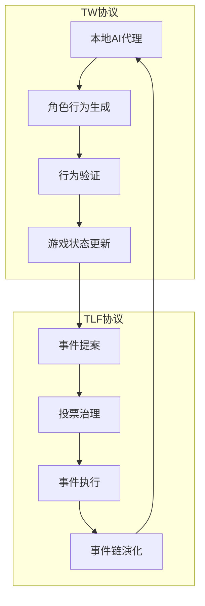

# 4.1 协议交互模型

TW 和 TLF 协议间的交互形成了一个自我强化的循环系统，使游戏世界在高度去中心化的环境中持续演化。

## 4.1.1 整体架构

在这个结合模型中，TW 协议负责游戏角色的去中心化行为控制，而 TLF 协议则负责游戏事件和内容的去中心化治理。两者相互补充，协同工作：

1. **TW → TLF**：角色行为影响游戏状态，创造新的事件可能性
2. **TLF → TW**：事件执行改变游戏世界规则和环境，影响 AI 代理的行为决策

## 4.1.2 数据流与状态转换

两个协议间的数据流转可表示为以下状态转换方程：

$$S_{t+1} = F(S_t, A_t, E_t)$$

其中：
- $S_t$ 是时间 $t$ 的游戏世界状态
- $A_t$ 是由 TW 协议生成的角色行为集合
- $E_t$ 是由 TLF 协议选出的事件集合
- $F$ 是状态转换函数，定义游戏世界如何演化

这种状态转换模型确保了游戏世界的一致性和连续性，同时允许两个协议在各自的领域独立运作。

## 4.1.3 协议同步机制

为了确保 TW 和 TLF 协议的协调运行，系统实现了以下同步机制：

| **同步层面** | **实现方式** | **功能说明** |
|--------------|--------------|--------------|
| **状态同步** | 区块链状态同步 | 确保所有 AI 代理和事件系统基于相同的游戏世界状态 |
| **时间同步** | 共识时间窗口 | 设定行为提交和事件执行的时间窗口，确保顺序性 |
| **规则同步** | 智能合约验证 | 通过链上规则验证保证所有行为和事件符合当前游戏规则 |
| **冲突解决** | 优先级机制 | 定义事件执行和行为应用的优先级顺序，解决潜在冲突 |

## 4.1.4 交互案例流程

以下是 TW 和 TLF 协议交互的典型流程示例：

1. **初始状态**：游戏世界处于状态 $S_t$，包含多个玩家控制的角色和环境元素。

2. **角色行为生成**：
   - 玩家本地的 AI 代理根据当前状态 $S_t$ 生成角色行为 $a_i$
   - 行为经过签名后提交至链上验证
   - 验证通过的行为集合 $A_t = \{a_1, a_2, ..., a_n\}$ 更新游戏状态

3. **新事件触发**：
   - 角色行为可能触发新的事件候选 $e_j$
   - 这些事件作为 NFT 被铸造并进入投票池

4. **事件投票与执行**：
   - 玩家对事件候选进行投票
   - 投票结果决定执行事件集合 $E_t = \{e_1, e_2, ..., e_m\}$
   - 事件执行改变游戏世界规则和环境

5. **AI 行为适应**：
   - AI 代理感知环境变化，调整行为策略
   - 新的行为生成考虑了事件执行后的游戏规则

6. **状态更新循环**：
   - 游戏状态从 $S_t$ 演化到 $S_{t+1}$
   - 新的状态触发新一轮的行为生成和事件选择

这种循环交互模式使游戏世界能够不断演化，同时保持去中心化特性，创造了一个自组织、自演化的生态系统。

## 4.1.5 边界情况处理

TW 和 TLF 协议结合时，有几种特殊的边界情况需要特别处理：

1. **事件与行为冲突**：
   - 当 TLF 执行的事件可能使某些正在进行的 TW 行为无效时
   - 解决方案：实施事件优先级系统，大型事件可中断当前行为并触发补偿机制

2. **世界状态分叉**：
   - 当网络延迟或分区导致不同节点看到不同状态时
   - 解决方案：实施共识回滚和状态合并算法，确保最终一致性

3. **快速状态变化**：
   - 当大量 AI 行为和事件在短时间内同时发生时
   - 解决方案：实施批处理和排队机制，确保有序处理

4. **协议版本更新**：
   - 当其中一个协议需要升级时
   - 解决方案：兼容性层确保新旧版本可以共存，平滑过渡

通过这些机制，TW 和 TLF 协议能够在各种情况下保持协调运行，共同支撑起一个真正去中心化的游戏世界。
