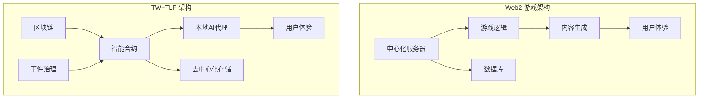

# 5.1 与 Web2 游戏的差异

TW 和 TLF 协议与传统 Web2 游戏在架构、技术和用户体验等方面存在根本性差异。

## 5.1.1 核心架构对比

下图展示了 TW+TLF 与传统 Web2 游戏的架构差异：

这个架构对比清晰地展示了两种模式的根本差异：Web2 游戏围绕中心化服务器构建，而 TW+TLF 游戏建立在区块链和本地 AI 代理的基础上。

## 5.1.2 系统性对比

| **特性** | **Web2 游戏** | **TW+TLF 游戏** |
|----------|---------------|-----------------|
| **服务器架构** | 中心化服务器集群 | 分布式节点网络 |
| **数据存储** | 中心化数据库 | 区块链+分布式存储 |
| **运行逻辑** | 服务器端执行 | 本地 AI 代理+链上验证 |
| **内容更新** | 开发者决定 | 玩家共同治理投票 |
| **资产所有权** | 公司所有 | 玩家真正拥有 |
| **游戏寿命** | 取决于运营公司 | 社区驱动，理论无限 |
| **盈利模式** | 付费内容+内购 | 价值捕获+创作者经济 |
| **数据隐私** | 公司控制用户数据 | 用户控制个人数据 |
| **可扩展性** | 需要增加服务器容量 | 分布式横向扩展 |
| **互操作性** | 封闭生态，难以互通 | 开放协议，天然互操作 |

## 5.1.3 用户体验差异

尽管技术架构存在巨大差异，TW+TLF 游戏致力于提供平滑的用户体验过渡：

1. **无缝登录**：利用钱包连接和 MCP 工具，实现一键登录
2. **延迟优化**：通过本地计算和状态通道减少区块链确认等待
3. **简化复杂性**：AI 代理隐藏了区块链的技术细节，用户只需关注游戏内容
4. **渐进式采用**：支持不同程度的去中心化参与，允许新用户平滑过渡

## 5.1.4 角色控制模式转变

Web2 游戏和 TW+TLF 游戏在玩家控制游戏角色的方式上有根本性区别：

| **控制维度** | **Web2 游戏** | **TW+TLF 游戏** |
|--------------|---------------|-----------------|
| **直接操作** | 玩家直接控制角色行动 | AI 代理根据玩家意图执行行动 |
| **决策层次** | 微观操作决策 | 宏观战略决策 |
| **技能要求** | 取决于玩家的反应速度和操作技巧 | 取决于玩家的战略思维和意图表达 |
| **沉浸方式** | 操作沉浸 | 观察和引导沉浸 |
| **互动节奏** | 实时反馈 | 引导-观察-调整循环 |

## 5.1.5 商业模式转变

TW+TLF 游戏的商业模式与传统 Web2 游戏截然不同：

1. **价值分配**：
   - Web2：大部分价值由开发商和发行商捕获
   - TW+TLF：价值在创作者、玩家和平台间公平分配

2. **收入来源**：
   - Web2：前期购买、内购、订阅、广告
   - TW+TLF：事件创作奖励、治理参与奖励、资产增值

3. **生态系统角色**：
   - Web2：开发者、发行商、玩家明确分离
   - TW+TLF：角色流动，玩家可成为创作者和治理者

4. **激励对齐**：
   - Web2：开发者与玩家激励常常不对齐
   - TW+TLF：所有参与者利益通过协议机制对齐

这种新商业模式不仅更加公平，还能创造更大的总体价值，激励更多的创新和参与。
