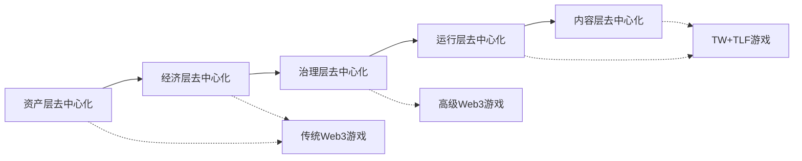

# 5.2 与现有 Web3 游戏的差异

相比现有的 Web3 游戏，TW+TLF 协议提供了更深层次的去中心化体验。

## 5.2.1 去中心化深度对比

如图所示，传统 Web3 游戏主要实现了资产层面的去中心化，高级 Web3 游戏增加了一定程度的治理去中心化，而 TW+TLF 游戏则实现了包括运行层和内容层在内的全面去中心化。

## 5.2.2 不同类型 Web3 游戏的去中心化程度对比

| **去中心化层面** | **NFT 游戏** | **链游/GameFi** | **DAO 游戏** | **TW+TLF 游戏** |
|------------------|--------------|----------------|--------------|-----------------|
| **资产所有权** | ★★★★☆ | ★★★★☆ | ★★★★★ | ★★★★★ |
| **经济系统** | ★☆☆☆☆ | ★★★★☆ | ★★★★☆ | ★★★★★ |
| **治理决策** | ☆☆☆☆☆ | ★★☆☆☆ | ★★★★☆ | ★★★★★ |
| **运行逻辑** | ☆☆☆☆☆ | ★☆☆☆☆ | ★★☆☆☆ | ★★★★★ |
| **内容创建** | ☆☆☆☆☆ | ★☆☆☆☆ | ★★☆☆☆ | ★★★★☆ |
| **社区自主性** | ★☆☆☆☆ | ★★☆☆☆ | ★★★☆☆ | ★★★★★ |

如表所示，TW+TLF 游戏在几乎所有方面都实现了更高程度的去中心化，尤其是在运行逻辑和内容创建方面取得了突破性进展。

## 5.2.3 核心创新点

与现有 Web3 游戏相比，TW+TLF 协议的核心创新在于：

1. **AI 代理驱动的去中心化运行**：摆脱了对中心化服务器的依赖
   - 现有链游：游戏逻辑仍然在中心化服务器上运行
   - TW+TLF：游戏逻辑在玩家本地由 AI 代理执行，链上只负责验证

2. **事件 NFT 与投票机制**：实现了内容层面的去中心化治理
   - 现有 DAO 游戏：治理主要限于参数调整和资源分配
   - TW+TLF：治理延伸到游戏内容本身，玩家共同决定游戏世界的演化

3. **MCP 工具链接**：简化了复杂区块链交互，提高用户友好性
   - 现有 Web3 游戏：用户需要直接面对复杂的区块链操作
   - TW+TLF：MCP 工具提供自然语言接口，降低使用门槛

4. **自组织演化系统**：使游戏世界能够根据玩家决策自我演化
   - 现有 Web3 游戏：内容更新仍依赖开发团队
   - TW+TLF：内容更新由事件链系统根据玩家决策自动生成

5. **多层协议结合**：通过协议分层和互操作性提高系统鲁棒性
   - 现有 Web3 游戏：通常只关注单一层面的区块链集成
   - TW+TLF：全面整合从本地计算到链上验证的完整解决方案

## 5.2.4 用户体验比较

TW+TLF 游戏在用户体验方面也超越了现有 Web3 游戏：

1. **入门门槛**：
   - 现有 Web3 游戏：需要理解加密钱包、Gas费等概念
   - TW+TLF：MCP 工具隐藏了技术复杂性，接近传统游戏的使用体验

2. **游戏节奏**：
   - 现有 Web3 游戏：区块确认时间导致游戏节奏受限
   - TW+TLF：本地 AI 代理提供即时反馈，状态更新异步确认

3. **交互方式**：
   - 现有 Web3 游戏：交互常常被区块链操作打断
   - TW+TLF：自然语言和意图表达创造流畅的交互体验

4. **社区互动**：
   - 现有 Web3 游戏：社区通常仅限于交易和简单投票
   - TW+TLF：深度内容协作和事件创作形成更强社区纽带

## 5.2.5 经济模型创新

TW+TLF 游戏的经济模型也有显著创新：

1. **价值来源**：
   - 现有 Web3 游戏：价值主要来自稀缺性和投机
   - TW+TLF：价值主要来自创意贡献和治理参与

2. **通证设计**：
   - 现有 Web3 游戏：简单的效用代币或治理代币
   - TW+TLF：多层次通证生态，包括主治理通证、角色通证、事件通证和资源通证

3. **激励机制**：
   - 现有 Web3 游戏：激励常常偏向短期投机
   - TW+TLF：设计偏向长期参与和贡献

这些经济模型创新使 TW+TLF 游戏能够建立更可持续的价值创造和分配系统，减少投机性波动，鼓励真实参与。
