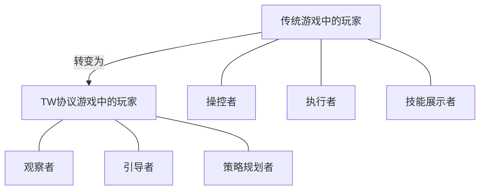

# 6.1 核心理念：AI代理完全掌控角色

## 6.1.1 全新的角色自主性范式

在基于 TW 协议的去中心化 Web3 游戏中，游戏角色的行为完全由运行在玩家本地的 AI 代理（"织网者"）掌控。玩家不再直接操控角色的行动，而是通过观察 AI 代理基于角色特性和游戏环境做出的决策来体验游戏。

这种根本性转变可以通过以下对比来理解：

| **传统游戏模式** | **TW 协议游戏模式** |
|----------------|--------------------|
| 玩家直接操控角色行动 | AI 代理根据角色特性自主行动 |
| 角色是玩家意志的延伸 | 角色是独立的虚拟生命体 |
| 玩家角色行为一致性取决于玩家 | 角色行为一致性由 AI 保证 |
| 角色能力受玩家技巧限制 | 角色能力由其虚拟属性决定 |
| 沉浸感来源于操控感 | 沉浸感来源于故事发展和角色成长 |

这种设计的核心目标包括：

1. **去中心化与自治**：游戏角色的行为逻辑不依赖中心化服务器，完全在本地独立运行。
2. **角色的独立性**：赋予游戏角色真正的"虚拟生命"特性，使其行为基于自身属性和环境情境。
3. **真实的虚拟世界**：创造一个更接近真实世界的游戏环境，其中每个角色都具有独特的行为模式和决策逻辑。

## 6.1.2 玩家的角色转变

在 TW 协议游戏中，玩家的角色发生了根本性转变：

这种转变并非简单地削减了玩家的参与度，而是将玩家的注意力从微观操作转向了宏观决策和战略规划，带来了全新的游戏体验：

1. **从"做什么"到"是什么"**：玩家关注点从操控角色的具体行动转向塑造角色的本质和特性
2. **从"反应"到"预测"**：玩家从对游戏事件做出反应转向预测和引导游戏世界的发展
3. **从"技巧"到"战略"**：游戏挑战从手眼协调的技巧测试转向深思熟虑的战略规划

## 6.1.3 AI 代理的决策自主权

在 TW 协议中，AI 代理拥有高度的决策自主权，但这种自主权是在特定框架和约束下的：

1. **角色属性约束**：AI 代理的决策受到角色预设属性的约束，如性格特征、技能水平等
2. **玩家意图指导**：玩家通过高级意图表达影响 AI 代理的决策倾向
3. **环境反馈调整**：AI 代理根据环境反馈动态调整其决策策略
4. **行为一致性要求**：AI 代理需要保持角色行为的长期一致性

这种设计创造了一种平衡：AI 代理拥有足够的自主性使角色行为真实自然，同时又受到足够的约束确保游戏体验的连贯性和可玩性。

## 6.1.4 从操控到培养

TW 协议带来的最重要转变之一是玩家与游戏角色关系的根本改变：从直接操控转变为培养和引导。

在传统游戏中，角色是玩家的工具或化身；而在 TW 协议游戏中，角色更像是玩家培养的虚拟生命，拥有自己的"性格"和"思想"。玩家通过设定角色的初始特性、长期目标和价值观来影响角色的行为，而非直接控制每一个具体动作。

这种关系转变创造了更深层次的情感连接和更丰富的叙事可能性，使游戏体验更加接近于培养一个虚拟伙伴或观察一个独立生命成长的过程，而非简单的操控和执行。
