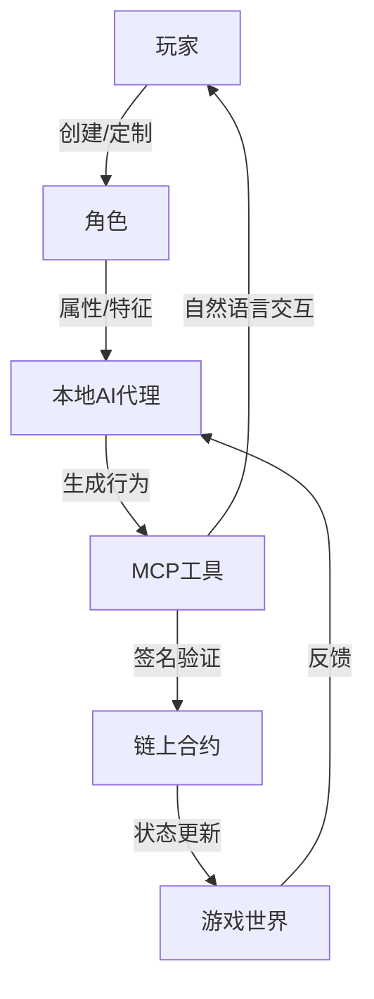

# 6.2 技术实现

实现 AI 代理对角色的完全掌控，需要一套复杂而精密的技术架构，特别是结合了先进的 MCP 工具与智能合约验证机制。

## 6.2.1 AI 代理的行为决策机制

AI 代理的行为决策过程可以分为以下几个关键步骤：

1. **信息收集**：获取角色属性、环境状态、历史行为等数据
2. **意图形成**：根据收集的信息形成行为意图
3. **行为规划**：将意图转化为具体的行为序列
4. **执行验证**：检查行为是否符合角色能力和游戏规则
5. **行为提交**：将验证通过的行为提交至区块链

这个决策过程通过复杂的神经网络模型实现，该模型融合了以下技术：

- **强化学习算法**：通过奖励机制优化角色的决策过程
- **情境感知系统**：评估当前游戏环境和角色状态
- **规则约束层**：确保所有行为符合游戏世界的物理和逻辑规则
- **性格模拟模块**：基于角色的预设性格特征影响决策偏好

## 6.2.2 MCP 工具的关键作用

Model Context Protocol (MCP) 工具在 TW 协议中扮演着至关重要的角色，它是 AI 代理与区块链智能合约之间的桥梁，同时也是确保 AI 行为安全性和一致性的关键技术。



MCP 工具提供了以下核心功能：

1. **行为意图识别**：
   - 理解玩家通过自然语言表达的角色发展意图
   - 将自然语言指令转换为 AI 代理的行为约束条件

2. **区块链接口抽象**：
   - 简化与智能合约的交互流程
   - 管理链上数据的读取和写入

3. **行为验证与签名**：
   - 确保 AI 生成的行为符合角色能力和游戏规则
   - 安全地使用玩家的私钥对行为进行签名

4. **角色行为解释**：
   - 向玩家解释 AI 代理做出特定决策的原因
   - 提供角色行为的可解释性分析

## 6.2.3 MCP 工具与传统 AI 系统的对比

| **特性** | **传统 AI 系统** | **MCP 工具增强的 AI 系统** |
|----------|----------------|-----------------------|
| **区块链集成** | 有限或无 | 原生支持多链交互 |
| **智能合约交互** | 需开发专用接口 | 内置合约 ABI 解析与调用 |
| **隐私保护** | 依赖中心化服务器 | 本地计算与验证 |
| **意图理解** | 限于预定义命令 | 自然语言理解与意图提取 |
| **多模态交互** | 通常单一模态 | 支持文本、语音、图像等多种交互方式 |
| **行为可解释性** | 有限或黑箱 | 高度透明的决策解释 |
| **可扩展性** | 固定功能集 | 可动态扩展的工具集 |

## 6.2.4 行为生成模型

AI 代理的行为生成核心是一个复杂的多层神经网络，其基本架构如下：

```
输入层:
  - 角色属性向量 [a₁, a₂, ..., aₙ]
  - 环境状态向量 [e₁, e₂, ..., eₘ]
  - 历史行为序列 [b₁, b₂, ..., bₖ]
  - 玩家意图约束 [i₁, i₂, ..., iⱼ]

隐藏层:
  - 特征提取层
  - 上下文理解层
  - 行为规划层
  - 结果预测层

输出层:
  - 行为决策向量 [d₁, d₂, ..., dₚ]
  - 决策置信度 [c₁, c₂, ..., cₚ]
```

行为生成的数学模型可表示为：

$$B_t = f_{\theta}(A_t, E_t, H_{t-k:t-1}, I_t)$$

其中：
- $B_t$ 是时间 $t$ 的行为决策
- $A_t$ 是角色属性向量
- $E_t$ 是环境状态向量
- $H_{t-k:t-1}$ 是历史行为序列
- $I_t$ 是玩家意图约束
- $f_{\theta}$ 是参数为 $\theta$ 的神经网络模型

## 6.2.5 自然语言到链上行为的转换流程

以下是玩家通过自然语言与 AI 代理交互，最终转化为链上行为的完整流程示例：

1. **玩家输入**：
   ```
   "我希望我的角色更专注于探索北方的神秘废墟，寻找古代魔法知识，同时保持谨慎避免危险"
   ```

2. **MCP 工具意图提取**：
   ```json
   {
     "primary_goal": "knowledge_acquisition",
     "target_location": "northern_ruins",
     "focus_area": "ancient_magic",
     "risk_tolerance": "low",
     "time_horizon": "medium_term"
   }
   ```

3. **AI 代理行为约束更新**：
   ```json
   {
     "location_preference": {
       "northern_ruins": 0.85,
       "other_locations": 0.15
     },
     "action_weights": {
       "explore": 0.65,
       "study": 0.20,
       "combat": 0.05,
       "social": 0.10
     },
     "risk_avoidance": 0.75,
     "knowledge_priority": {
       "ancient_magic": 0.80,
       "other_knowledge": 0.20
     }
   }
   ```

4. **具体行为生成**（3天游戏时间后）：
   ```json
   {
     "action_type": "EXPLORE",
     "target": {
       "location_id": "ruins_of_alzanir",
       "coordinates": [2145, 873]
     },
     "approach": "STEALTH",
     "focus": "MAGICAL_ARTIFACTS",
     "duration": 4,
     "contingency": {
       "if_danger": "RETREAT",
       "danger_threshold": 35
     }
   }
   ```

5. **MCP 工具链上交互**：
   ```json
   {
     "contract": "GameWorld",
     "method": "submitCharacterAction",
     "params": {
       "characterId": "0x7a2b...",
       "actionType": 3,
       "locationId": "0x45fa...",
       "approachMode": 2,
       "focusTarget": 7,
       "durationHours": 4,
       "contingencyPlan": [1, 35]
     },
     "gasLimit": 150000
   }
   ```

6. **执行结果反馈**：
   ```json
   {
     "success": true,
     "discovered": [
       {
         "item_id": "0x3f7c...",
         "name": "烧焦的魔法卷轴",
         "rarity": "uncommon"
       }
     ],
     "experience_gained": 45,
     "knowledge_increased": {
       "ancient_magic": 12,
       "ruins_lore": 8
     },
     "status_effects": [
       {
         "type": "minor_fatigue",
         "duration": 2
       }
     ]
   }
   ```

7. **MCP 工具提供的玩家反馈**：
   ```
   你的角色小心地探索了北方的阿尔扎尼尔废墟。通过谨慎前进，避开了几处危险陷阱，并发现了一卷烧焦的古代魔法卷轴。虽然卷轴已部分损毁，但仍然增加了对古代魔法的理解。探索持续了四个小时，使角色感到些许疲惫，但获得了宝贵的知识。是否希望继续深入探索，或先返回安全地带研究发现的卷轴？
   ```

这个例子展示了 MCP 工具如何将玩家的高级意图转化为 AI 代理的行为约束，再由 AI 代理生成具体行为，最终通过区块链交互执行并反馈结果的完整流程。
