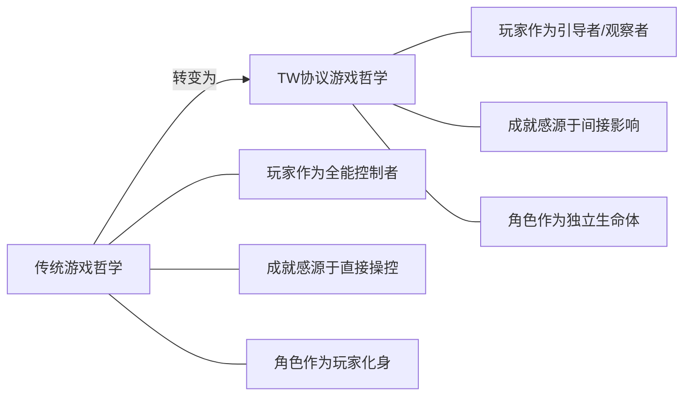

# 6.4 哲学意义：从控制者到观察者

TW 协议的设计不仅是技术上的创新，更代表了游戏哲学的重大转变，挑战了传统游戏中"玩家即控制者"的根本假设。

## 6.4.1 游戏体验的哲学转变

这种哲学转变对游戏设计和玩家体验带来了深远影响：

1. **从"控制"到"共存"**：
   - 传统游戏中玩家完全控制角色，而 TW 协议游戏中玩家与角色建立了一种互动共存关系
   - 游戏体验从支配转变为协作和引导

2. **从"行动"到"观察"**：
   - 游戏乐趣不再仅来源于行动的执行，而是观察角色根据自身特性做出决策
   - 带来类似观看电影或小说的沉浸式体验，但保留互动性和影响力

3. **从"技能测试"到"生命模拟"**：
   - 游戏不再聚焦于测试玩家的反应速度和操作技巧
   - 转而关注角色生命历程的真实模拟和有机发展

## 6.4.2 对传统游戏理论的挑战

TW 协议对几个核心游戏理论概念提出了挑战：

1. **玩家代入感**：
   - 传统理论认为直接控制增强代入感
   - TW 协议证明观察独立生命体可以创造新形式的代入感

2. **游戏与叙事的冲突**：
   - 传统理论中游戏性和叙事性常被视为互相制约
   - TW 协议通过 AI 代理行为实现了游戏性和叙事性的自然统一

3. **挑战与成就感**：
   - 传统游戏中挑战来自于操作难度
   - TW 协议中挑战来自于策略规划和角色培养

4. **玩家自由度**：
   - 传统理论将自由度等同于操作选择的数量
   - TW 协议重新定义自由度为影响力的深度和广度

## 6.4.3 对现实与虚拟关系的思考

TW 协议游戏模式引发了对现实与虚拟世界关系的深层思考：

1. **创造者与被创造物的关系**：
   - 玩家创造了角色，但不直接控制其行为
   - 类似于父母与子女、创作者与作品的关系
   - 引发关于创造责任和自由意志的思考

2. **自由意志的模拟**：
   - AI 代理展现的"自主性"是真实自由意志的模拟
   - 在确定性系统中创造看似非确定性的行为
   - 引发关于意识和自由意志本质的讨论

3. **观察改变被观察者**：
   - 玩家的意图和期望间接塑造了角色的行为
   - 反映了观察行为本身对被观察对象的影响
   - 与量子物理学观测者效应存在哲学共鸣

4. **虚拟身份与真实自我**：
   - 角色不再是玩家的直接映射，而是独立实体
   - 引发关于虚拟身份、自我延伸和数字存在的思考
   - 挑战传统游戏中玩家-角色统一体的概念

## 6.4.4 从拟真到真实体验

TW 协议彻底改变了游戏中"真实"的概念：

1. **机械拟真 vs. 系统真实**：
   - 传统游戏追求感官和物理层面的拟真
   - TW 协议追求系统层面的真实性和涌现行为

2. **预设叙事 vs. 生成体验**：
   - 传统游戏中"真实"是设计师精心编排的错觉
   - TW 协议中"真实"来自系统的自组织和涌现性质

3. **控制幻觉 vs. 影响现实**：
   - 传统游戏提供完全控制的幻觉
   - TW 协议提供有限但深层的影响力，更接近现实生活

## 6.4.5 新型玩家-角色关系的意义

TW 协议开创的新型玩家-角色关系具有深远的文化和社会意义：

1. **从占有到尊重**：
   - 游戏角色从被玩家占有的工具转变为被尊重的主体
   - 培养与虚拟实体的伦理关系，可能影响未来人工智能伦理

2. **从表演到共创**：
   - 游戏体验从玩家单方面表演转变为玩家与AI共同创作
   - 开创人机协作创意的新范式

3. **从控制到适应**：
   - 游戏不再强化控制欲，而是培养适应和引导能力
   - 可能帮助玩家在不确定性日益增强的现实世界中发展有用技能

这些哲学层面的转变使得TW协议不仅是一种游戏技术，更是一种新的数字交互范式，它挑战了我们对游戏、虚拟世界、甚至主体性和自由意志的基本理解。
